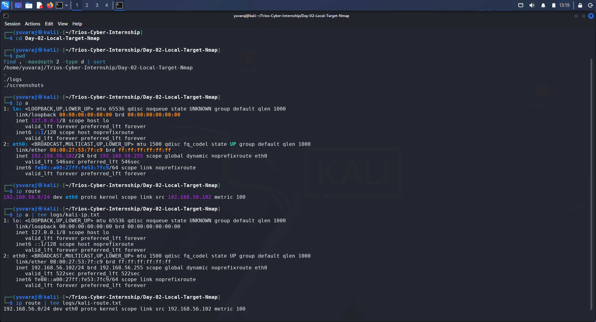
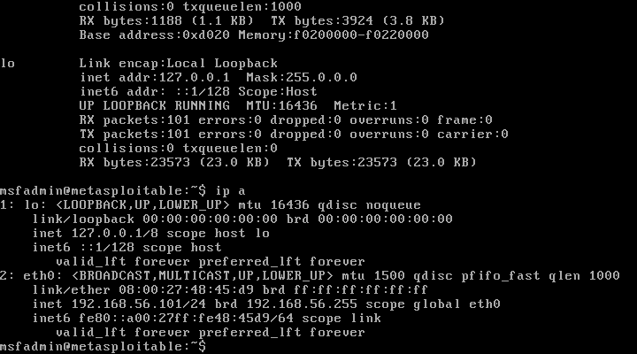
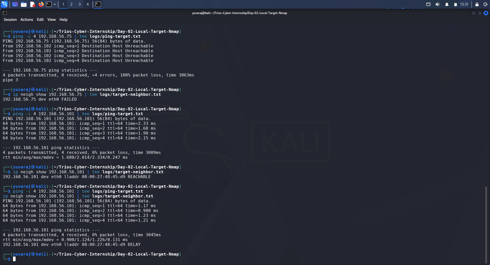
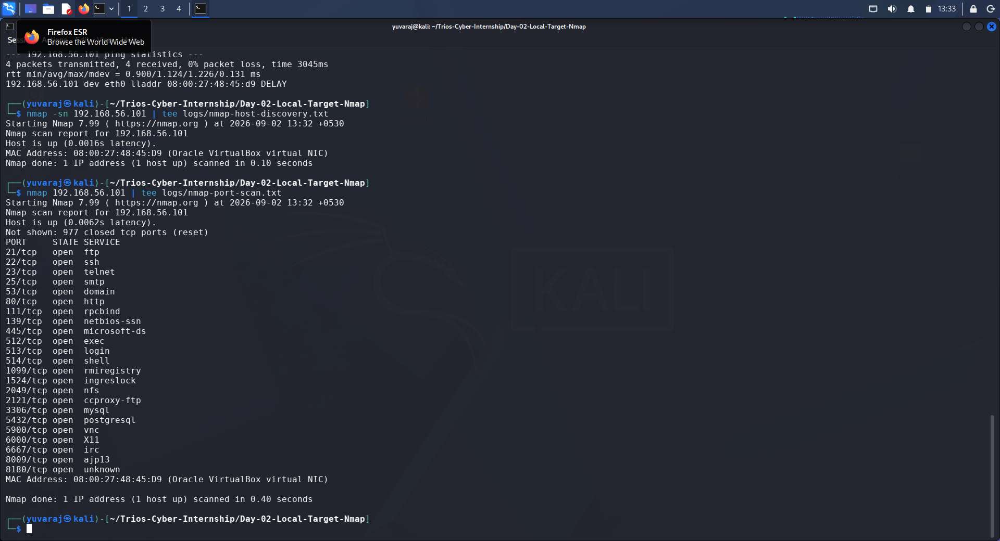
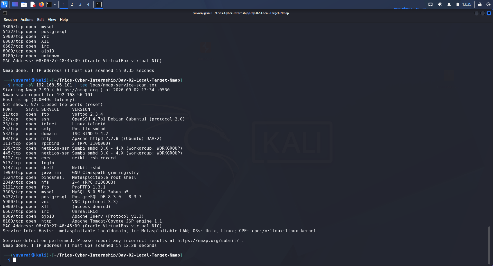

# DAY 02 — Authorized Local Target Lab & Nmap Network Service Assessment

**Organization:** Trios Cyber  
**Assessment:** Day 02 Assessment  
**Date:** 02 September 2026  
**Assessment Type:** Authorized Local Network Enumeration  
**Scanner:** Kali Linux  
**Target:** Metasploitable  
**Target IP:** 192.168.56.101  
**Scanner IP:** 192.168.56.102  
**Network:** 192.168.56.0/24  
**Interface:** eth0  
**Virtualization Platform:** Oracle VirtualBox  

---

## 1. Executive Summary

This assessment was conducted as part of the Day 02 cybersecurity internship activity at Trios Cyber.

The objective was to create and validate an authorized local target lab, verify network connectivity between the Kali Linux assessment machine and a Metasploitable target, identify the target IP address, perform basic Nmap host and TCP port scanning, and document the services and software versions discovered.

The assessment was performed entirely within a controlled VirtualBox lab environment using the private `192.168.56.0/24` network.

Kali Linux was configured with the IP address `192.168.56.102/24`, while the Metasploitable target was identified at `192.168.56.101/24`.

Connectivity was successfully verified using ICMP and neighbour discovery. Nmap subsequently confirmed that the target host was active and identified 23 open TCP ports in the default TCP scan. Service and version detection identified services including FTP, SSH, Telnet, SMTP, DNS, HTTP, SMB/Samba, NFS, MySQL, PostgreSQL, VNC, IRC, Java RMI, and Apache Tomcat.

No exploitation or unauthorized access was performed during this assessment. The activity was limited to network discovery, port enumeration, service identification, and documentation.

---

## 2. Assessment Objectives

The primary objectives of the Day 02 assessment were:

1. Create an authorized local target lab using Metasploitable.
2. Verify connectivity between Kali Linux and the target.
3. Identify and document the target IP address.
4. Perform Nmap host discovery.
5. Perform a basic TCP port scan.
6. Identify services and software versions using Nmap service detection.
7. Document discovered services and security-relevant observations.
8. Preserve command output and screenshots as technical evidence.

---

## 3. Authorization and Scope

All activities described in this report were conducted against a deliberately vulnerable Metasploitable virtual machine under the user's control.

### Authorized Scope

| Parameter | Value |
|---|---|
| Assessment Machine | Kali Linux |
| Scanner IP | 192.168.56.102 |
| Target Machine | Metasploitable |
| Target IP | 192.168.56.101 |
| Network | 192.168.56.0/24 |
| Interface | eth0 |
| Environment | Oracle VirtualBox |
| Assessment Type | Local network enumeration |

### Scope Restriction

The assessment was restricted to the local VirtualBox laboratory environment.

No external, public, third-party, or unauthorized systems were scanned.

No exploitation, credential attacks, persistence, privilege escalation, or destructive actions were performed.

---

## 4. Lab Environment

The assessment consisted of two virtual machines connected through a private VirtualBox network.

### Assessment Machine

**Operating System:** Kali Linux  
**Interface:** `eth0`  
**IPv4 Address:** `192.168.56.102/24`

### Target Machine

**Operating System:** Metasploitable  
**Interface:** `eth0`  
**IPv4 Address:** `192.168.56.101/24`

### Network

Both systems were located on the same IPv4 subnet:

```text
192.168.56.0/24
```

The Kali routing table confirmed that the local subnet was directly reachable through `eth0`.

---

## 5. Network Topology

```text
                 Private VirtualBox Network
                       192.168.56.0/24
                              |
              +---------------+---------------+
              |                               |
              |                               |
        Kali Linux VM                    Metasploitable VM
        Scanner                         Authorized Target
        192.168.56.102                 192.168.56.101
              |                               |
             eth0                            eth0
```

The private lab network provided an isolated environment for performing the assessment.

---

## 6. Kali Linux Network Configuration

The Kali Linux interface configuration was collected using:

```bash
ip a
```

The relevant configuration was:

```text
Interface: eth0
IPv4: 192.168.56.102/24
Broadcast: 192.168.56.255
```

The routing table was collected using:

```bash
ip route
```

The resulting route confirmed:

```text
192.168.56.0/24 dev eth0 proto kernel scope link src 192.168.56.102
```

This confirmed that the target subnet was directly connected to the Kali `eth0` interface.

### Evidence



*Figure 1 — Kali Linux IP configuration.*

---

## 7. Metasploitable Target Identification

The Metasploitable machine was inspected using `ifconfig`.

The target was identified with:

```text
IPv4 Address: 192.168.56.101
Subnet Mask: 255.255.255.0
```

Therefore, the authorized target selected for the assessment was:

```text
192.168.56.101
```

### Evidence



*Figure 2 — Metasploitable network configuration and target IP identification.*

---

## 8. Connectivity Verification

Connectivity between Kali Linux and the Metasploitable target was verified using ICMP.

Command executed:

```bash
ping -c 4 192.168.56.101
```

### Results

| Metric | Result |
|---|---:|
| Packets transmitted | 4 |
| Packets received | 4 |
| Packet loss | 0% |
| Minimum RTT | 0.900 ms |
| Average RTT | 1.124 ms |
| Maximum RTT | 1.226 ms |

The successful ICMP responses confirmed that the target was reachable from Kali.

Neighbour discovery was also performed:

```bash
ip neigh show 192.168.56.101
```

The target MAC address was resolved as:

```text
08:00:27:48:45:d9
```

This confirmed successful Layer 2 neighbour resolution between the two virtual machines.

### Evidence



*Figure 3 — Successful connectivity and neighbour verification.*

---

## 9. Nmap Host Discovery

Nmap host discovery was performed using:

```bash
nmap -sn 192.168.56.101
```

The `-sn` option performs host discovery without performing a conventional port scan.

### Results

```text
Nmap scan report for 192.168.56.101
Host is up (0.0016s latency).
MAC Address: 08:00:27:48:45:D9 (Oracle VirtualBox virtual NIC)
Nmap done: 1 IP address (1 host up) scanned in 0.10 seconds
```

### Findings

- Target host was successfully discovered.
- Target status: **Up**
- Reported latency: **0.0016 seconds**
- MAC address: `08:00:27:48:45:D9`
- MAC vendor: Oracle VirtualBox virtual NIC
- Hosts scanned: 1
- Hosts identified as active: 1

### Evidence



*Figure 4 — Nmap host discovery and basic TCP port scan.*

---

## 10. Basic TCP Port Scan

A basic Nmap TCP scan was performed using:

```bash
nmap 192.168.56.101
```

The scan identified:

- **23 open TCP ports**
- **977 closed TCP ports**

### Discovered Open Ports

| Port | State | Nmap Service |
|---:|---|---|
| 21/tcp | open | ftp |
| 22/tcp | open | ssh |
| 23/tcp | open | telnet |
| 25/tcp | open | smtp |
| 53/tcp | open | domain |
| 80/tcp | open | http |
| 111/tcp | open | rpcbind |
| 139/tcp | open | netbios-ssn |
| 445/tcp | open | microsoft-ds |
| 512/tcp | open | exec |
| 513/tcp | open | login |
| 514/tcp | open | shell |
| 1099/tcp | open | rmiregistry |
| 1524/tcp | open | ingreslock |
| 2049/tcp | open | nfs |
| 2121/tcp | open | ccproxy-ftp |
| 3306/tcp | open | mysql |
| 5432/tcp | open | postgresql |
| 5900/tcp | open | vnc |
| 6000/tcp | open | X11 |
| 6667/tcp | open | irc |
| 8009/tcp | open | ajp13 |
| 8180/tcp | open | unknown |

The result demonstrates that the Metasploitable system exposes a large number of network-accessible services.

---

## 11. Service and Version Detection

Nmap service and version detection was performed using:

```bash
nmap -sV 192.168.56.101
```

The `-sV` option was used to obtain additional information about the services running on the discovered open ports.

### Service Detection Results

| Port | Service | Detected Version / Information |
|---:|---|---|
| 21/tcp | FTP | vsftpd 2.3.4 |
| 22/tcp | SSH | OpenSSH 4.7p1 Debian 8ubuntu1 |
| 23/tcp | Telnet | Linux telnetd |
| 25/tcp | SMTP | Postfix smtpd |
| 53/tcp | DNS | ISC BIND 9.4.2 |
| 80/tcp | HTTP | Apache httpd 2.2.8 (Ubuntu) DAV/2 |
| 111/tcp | RPC | rpcbind 2 |
| 139/tcp | NetBIOS | Samba smbd 3.X–4.X |
| 445/tcp | SMB | Samba smbd 3.X–4.X |
| 512/tcp | rexec | netkit-rsh rexecd |
| 513/tcp | login | OpenBSD or Solaris rlogind |
| 514/tcp | shell | Netkit rshd |
| 1099/tcp | Java RMI | GNU Classpath grmiregistry |
| 1524/tcp | Bindshell | Metasploitable root shell |
| 2049/tcp | NFS | NFS 2–4 |
| 2121/tcp | FTP | ProFTPD 1.3.1 |
| 3306/tcp | MySQL | MySQL 5.0.51a-3ubuntu5 |
| 5432/tcp | PostgreSQL | PostgreSQL 8.3.0–8.3.7 |
| 5900/tcp | VNC | VNC protocol 3.3 |
| 6000/tcp | X11 | Access denied |
| 6667/tcp | IRC | UnrealIRCd |
| 8009/tcp | AJP13 | Apache Jserv Protocol v1.3 |
| 8180/tcp | HTTP | Apache Tomcat/Coyote JSP engine 1.1 |

Nmap also reported Unix/Linux operating system information and the hostnames:

```text
metasploitable.localdomain
irc.Metasploitable.LAN
```

### Evidence



*Figure 5 — Nmap service and version detection results.*

---

## 12. Security Observations

The enumeration results demonstrate that the target exposes a broad range of network services.

The following observations were recorded based strictly on the Nmap results:

### 12.1 Legacy Remote Access Services

Telnet and rsh-related services were identified:

```text
23/tcp   telnet
512/tcp  exec
513/tcp  login
514/tcp  shell
```

These services represent legacy remote-access functionality and increase the network attack surface.

### 12.2 Multiple File Transfer Services

Two FTP services were identified:

```text
21/tcp   vsftpd 2.3.4
2121/tcp ProFTPD 1.3.1
```

The presence of multiple FTP services increases the number of network-accessible application endpoints.

### 12.3 Network File and Windows Interoperability Services

The target exposed:

```text
139/tcp  Samba
445/tcp  Samba
2049/tcp NFS
```

These services provide network file-sharing functionality and should be carefully controlled in production environments.

### 12.4 Database Services

Database services were directly accessible:

```text
3306/tcp  MySQL
5432/tcp  PostgreSQL
```

Database services generally require strict network access controls and should not be unnecessarily exposed to untrusted networks.

### 12.5 Remote Display Services

The scan identified:

```text
5900/tcp  VNC
6000/tcp  X11
```

These services provide remote graphical access functionality and contribute to the exposed attack surface.

### 12.6 Web and Application Services

Several web/application-related services were identified:

```text
80/tcp    Apache HTTP
8009/tcp  Apache Jserv/AJP13
8180/tcp  Apache Tomcat
```

These services would warrant further security assessment in a dedicated authorized vulnerability-assessment phase.

### 12.7 Metasploitable Bindshell

Nmap identified:

```text
1524/tcp open bindshell Metasploitable root shell
```

This is an especially notable observation because the service identification itself indicates a root-shell service exposed by the intentionally vulnerable training target.

No connection or exploitation of this service was performed during this assessment.

---

## 13. Assessment Methodology

The assessment followed a controlled enumeration workflow:

### Step 1 — Network Configuration

The Kali Linux network interface and routing information were inspected using:

```bash
ip a
ip route
```

### Step 2 — Target Identification

The Metasploitable system was inspected locally to identify its assigned IP address.

### Step 3 — Connectivity Verification

Connectivity was tested using:

```bash
ping -c 4 192.168.56.101
```

Neighbour resolution was verified using:

```bash
ip neigh show 192.168.56.101
```

### Step 4 — Host Discovery

Nmap host discovery was performed:

```bash
nmap -sn 192.168.56.101
```

### Step 5 — Basic Port Enumeration

A standard TCP scan was performed:

```bash
nmap 192.168.56.101
```

### Step 6 — Service Detection

Service and version identification was performed:

```bash
nmap -sV 192.168.56.101
```

### Step 7 — Evidence Preservation

Command outputs were saved using `tee` into the `logs/` directory, while screenshots were retained in the `screenshots/` directory.

---

## 14. Evidence Index

| Evidence ID | Description | File |
|---|---|---|
| E01 | Kali IP configuration | `screenshots/01-kali-ip.png` |
| E02 | Metasploitable IP configuration | `screenshots/02-metasploitable-ip.png` |
| E03 | Connectivity verification | `screenshots/03-connectivity-verification.png` |
| E04 | Nmap host discovery and basic port scan | `screenshots/04-nmap-discovery-and-port-scan.png` |
| E05 | Nmap service/version detection | `screenshots/05-nmap-service-detection.png` |

### Raw Command Logs

| Log | Purpose |
|---|---|
| `logs/kali-ip.txt` | Kali interface configuration |
| `logs/kali-route.txt` | Kali routing information |
| `logs/ping-target.txt` | ICMP connectivity results |
| `logs/target-neighbor.txt` | Target neighbour/MAC resolution |
| `logs/nmap-host-discovery.txt` | Nmap host discovery results |
| `logs/nmap-port-scan.txt` | Basic TCP port scan results |
| `logs/nmap-service-scan.txt` | Service/version detection results |

---

## 15. Key Findings Summary

| Category | Result |
|---|---|
| Kali IPv4 | `192.168.56.102/24` |
| Target IPv4 | `192.168.56.101/24` |
| Network | `192.168.56.0/24` |
| Connectivity | Successful |
| Packet Loss | 0% |
| Target Host | Up |
| Open TCP Ports | 23 |
| Closed TCP Ports | 977 |
| Service Detection | Successful |
| Target OS Family | Unix/Linux |
| Exploitation Performed | No |

---

## 16. Conclusion

The Day 02 assessment successfully established and validated an authorized local target lab using Kali Linux and Metasploitable in a private VirtualBox network.

Connectivity between the assessment machine and target was successfully verified, and Nmap confirmed that the Metasploitable host was active.

The basic TCP scan identified 23 open ports, while service/version detection provided detailed information about the applications exposed by the target. The assessment demonstrated practical use of Nmap for host discovery, port enumeration, and service identification.

The results also demonstrated how a deliberately vulnerable training system can expose a large network attack surface through legacy remote-access services, file-sharing protocols, databases, web applications, and remote graphical services.

No exploitation or unauthorized activity was performed. The assessment remained within the defined local laboratory scope.

This assessment establishes the foundation for future authorized security-testing activities by demonstrating the initial reconnaissance and enumeration stage of a penetration-testing workflow.

---

## 17. Appendix — Commands Executed

### Kali Network Identification

```bash
ip a
ip route
```

### Target Connectivity

```bash
ping -c 4 192.168.56.101
ip neigh show 192.168.56.101
```

### Nmap Host Discovery

```bash
nmap -sn 192.168.56.101
```

### Basic TCP Port Scan

```bash
nmap 192.168.56.101
```

### Service and Version Detection

```bash
nmap -sV 192.168.56.101
```

### Evidence Storage

```bash
tee logs/<filename>.txt
```

All commands were executed against the authorized local Metasploitable target at `192.168.56.101`.

---

**End of Day 02 Assessment Report**
