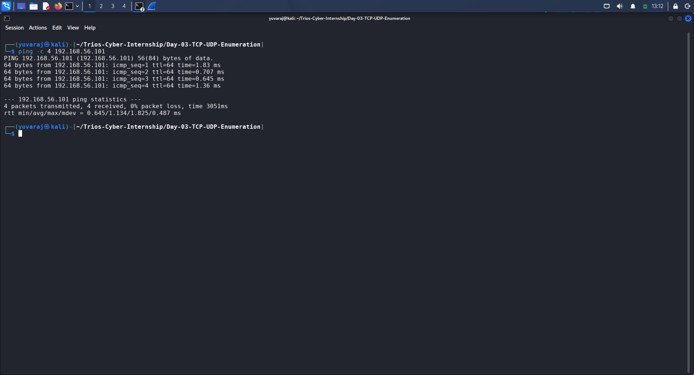
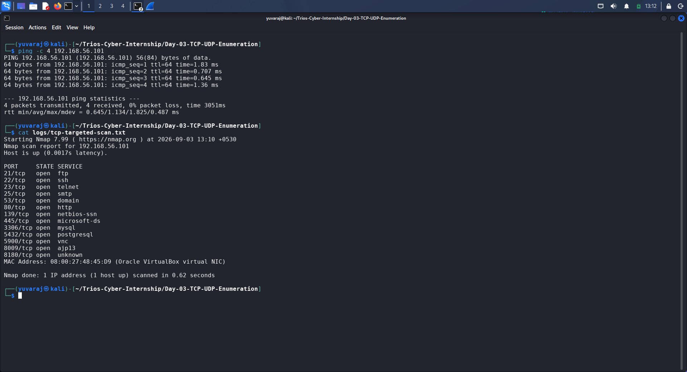
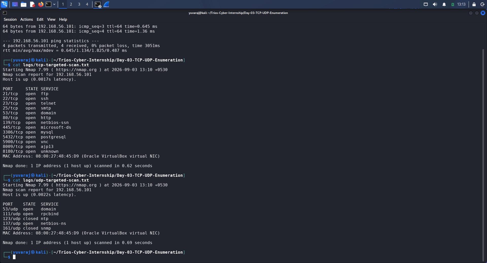
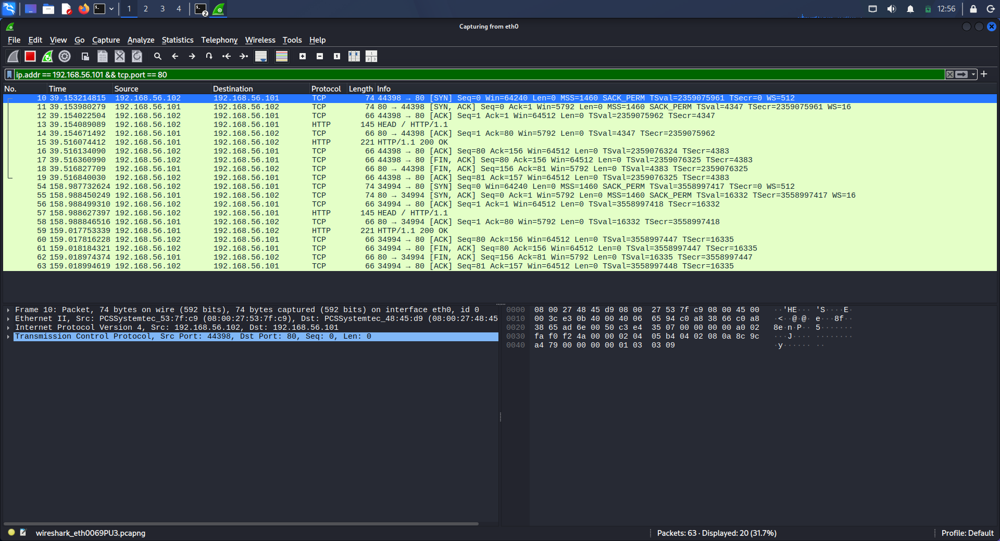
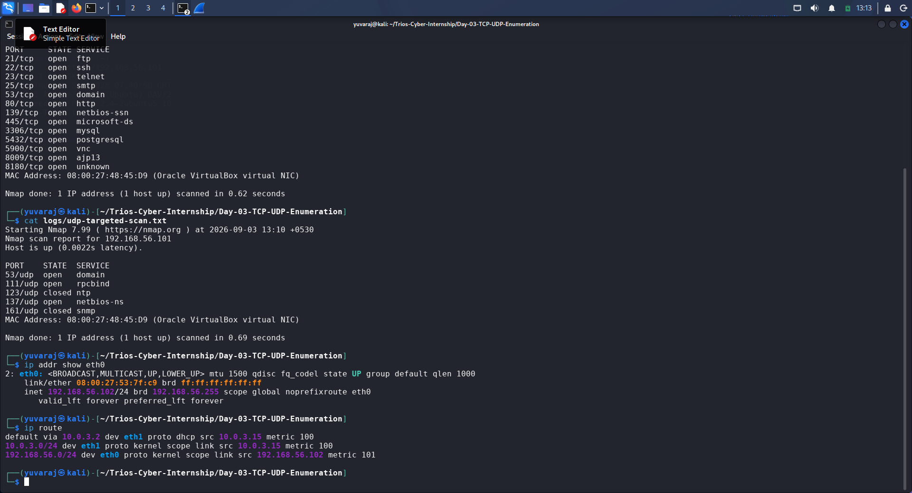

# DAY 03 — TCP/UDP Enumeration & Packet Flow Analysis

## Assessment Information

| Field | Details |
|---|---|
| Organization | Trios Cyber |
| Assessment | Day 03 Assessment |
| Task | TCP/UDP Enumeration |
| Date | 03 September 2026 |
| Platform | Kali Linux |
| Target | Metasploitable |
| Target IP | 192.168.56.101 |
| Kali Linux IP | 192.168.56.102 |
| Lab Interface | eth0 |
| Tools Used | Nmap, Wireshark, curl |

---

## 1. Executive Summary

This assessment focused on targeted TCP enumeration, a small authorized UDP scan, identification of network services, and packet-flow analysis using Wireshark.

The assessment was performed against the intentionally vulnerable Metasploitable virtual machine within an isolated and authorized local VirtualBox laboratory environment.

The TCP assessment identified multiple open services on selected ports, while the UDP assessment identified several accessible UDP services. A relevant HTTP/TCP packet flow between Kali Linux and the Metasploitable target was also captured and examined using Wireshark.

No exploitation or unauthorized activity was performed during this assessment.

---

## 2. Assessment Objectives

The objectives of Day 03 were:

1. Perform targeted TCP port enumeration using Nmap.
2. Perform a small authorized UDP scan against selected ports.
3. Identify at least three services exposed by the target.
4. Capture one relevant packet flow using Wireshark.
5. Analyze the relationship between the network traffic and the identified service.
6. Preserve command output and screenshots as assessment evidence.
7. Document the methodology, findings, and learning outcomes professionally.

---

## 3. Authorization and Scope

All testing was conducted within the authorized local cybersecurity laboratory environment.

### Assessment Scope

- **Attacker/Assessment System:** Kali Linux
- **Assessment IP:** 192.168.56.102
- **Target System:** Metasploitable
- **Target IP:** 192.168.56.101
- **Network:** VirtualBox Host-Only Lab
- **Interface:** eth0
- **Testing Type:** TCP/UDP enumeration and packet capture
- **Authorization:** Local laboratory environment only

The assessment was limited to service enumeration and network traffic observation. No exploitation, credential attacks, denial-of-service activity, or testing against public systems was performed.

---

## 4. Lab Environment

The assessment environment consisted of two virtual machines connected through a VirtualBox Host-Only network.

### Kali Linux

- IP Address: `192.168.56.102/24`
- Interface: `eth0`
- Purpose: Assessment and enumeration system

### Metasploitable

- IP Address: `192.168.56.101`
- Purpose: Intentionally vulnerable laboratory target

The Host-Only network allowed Kali Linux to communicate directly with the Metasploitable target without exposing the assessment traffic to an external network.

---

## 5. Network Connectivity Verification

Before performing enumeration, connectivity between Kali Linux and the Metasploitable target was verified.

### Command

```bash
ping -c 4 192.168.56.101
```



**Evidence:** `screenshots/01-network-connectivity.png`

## 6. Targeted TCP Enumeration

A targeted TCP scan was performed against selected ports commonly associated with network and application services.

### Command

```bash
nmap -sT -p 21,22,23,25,53,80,139,445,3306,5432,5900,8009,8180 192.168.56.101 | tee logs/tcp-targeted-scan.txt
```



**Evidence:** `screenshots/02-tcp-enumeration.png`

**Raw Output:** `logs/tcp-targeted-scan.txt`

## 7. Small UDP Enumeration

A small targeted UDP scan was performed against five selected UDP ports. The scan was intentionally limited to the authorized Metasploitable laboratory target.

```bash
nmap -sU -p 53,111,123,137,161 192.168.56.101 | tee logs/udp-targeted-scan.txt
```



**Evidence:** `screenshots/03-udp-enumeration.png`

**Raw Output:** `logs/udp-targeted-scan.txt`

## 8. Services Identified

The enumeration phase successfully identified multiple services exposed by the Metasploitable target.

### TCP Services

The following TCP services were identified:

- FTP — TCP/21
- SSH — TCP/22
- Telnet — TCP/23
- SMTP — TCP/25
- DNS/Domain — TCP/53
- HTTP — TCP/80
- NetBIOS-SSN — TCP/139
- Microsoft-DS — TCP/445
- MySQL — TCP/3306
- PostgreSQL — TCP/5432
- VNC — TCP/5900
- AJP13 — TCP/8009

TCP/8180 was reported as open, but Nmap recorded the service as `unknown` in the captured output. Therefore, no unsupported service identification is assigned to this port.

### UDP Services

The following UDP services were identified as open:

- DNS/Domain — UDP/53
- RPCBind — UDP/111
- NetBIOS Name Service — UDP/137

The results demonstrate that the target exposes services over both TCP and UDP.

---

## 9. Wireshark Packet Flow Capture

To demonstrate an actual application-layer network flow, HTTP traffic between Kali Linux and the Metasploitable web service was generated and captured using Wireshark.

### Traffic Generation

The following command was used to generate an HTTP request:

```bash
curl -I http://192.168.56.101
```



**Evidence:** `screenshots/04-wireshark-http-flow.png`

## 10. Network Configuration Evidence

The network configuration was reviewed to confirm the assessment interface and laboratory addressing.

The Kali Linux Host-Only interface used for communication with the Metasploitable target was `eth0`.

The assessment network used the `192.168.56.0/24` range, with Kali Linux assigned `192.168.56.102` and the Metasploitable target assigned `192.168.56.101`.



**Evidence:** `screenshots/05-network-configuration.png`

---

## 11. Security Observations

The enumeration results provide several observations relevant to network security.

### 11.1 Multiple Exposed Services

The target exposes numerous TCP services, including FTP, Telnet, HTTP, SMB-related services, database services, and VNC.

A larger number of exposed services increases the potential attack surface of a system and should be reviewed during a security assessment.

### 11.2 Legacy and Remote Access Services

Services such as Telnet and FTP are examples of network services that require careful security evaluation because their presence can introduce additional security concerns depending on configuration and authentication controls.

### 11.3 Database Services

MySQL and PostgreSQL were identified on the selected TCP ports. Database services should generally be restricted to trusted hosts and protected using appropriate authentication and network-access controls.

### 11.4 UDP Exposure

DNS, RPCBind, and NetBIOS Name Service were identified as open on the selected UDP ports. UDP services should also be assessed because they form part of the overall network attack surface.

These observations are limited to enumeration results. No vulnerability exploitation was performed as part of this assessment.

---

## 12. Assessment Methodology

The assessment followed a controlled sequence:

1. Confirm the authorized target and assessment scope.
2. Verify network connectivity between Kali Linux and Metasploitable.
3. Perform targeted TCP enumeration.
4. Record the identified open TCP services.
5. Perform a small targeted UDP enumeration.
6. Record the UDP service states.
7. Generate HTTP traffic toward the identified web service.
8. Capture and filter the HTTP/TCP traffic using Wireshark.
9. Preserve raw scan outputs and screenshots.
10. Document the assessment results and observations.

This methodology provided a controlled demonstration of basic network service enumeration and packet-flow analysis.

---

## 13. Evidence Index

The following evidence was collected during the assessment.

| Evidence | Description |
|---|---|
| `logs/assessment-scope.txt` | Assessment scope and target information |
| `logs/tcp-targeted-scan.txt` | Targeted TCP Nmap scan output |
| `logs/udp-targeted-scan.txt` | Targeted UDP Nmap scan output |
| `screenshots/01-network-connectivity.png` | Successful connectivity verification |
| `screenshots/02-tcp-enumeration.png` | Targeted TCP enumeration results |
| `screenshots/03-udp-enumeration.png` | Targeted UDP enumeration results |
| `screenshots/04-wireshark-http-flow.png` | HTTP/TCP packet-flow capture |
| `screenshots/05-network-configuration.png` | Kali network configuration |

All evidence was collected from the authorized local laboratory environment.

---

## 14. Key Findings Summary

| Category | Finding |
|---|---|
| Connectivity | Kali Linux successfully communicated with the target |
| TCP Enumeration | 13 selected TCP ports were reported open |
| UDP Enumeration | 3 selected UDP ports were reported open |
| Services | Multiple network and application services were identified |
| HTTP | TCP/80 was identified as open |
| Packet Capture | HTTP/TCP traffic was successfully observed in Wireshark |
| Scope | Testing remained within the authorized local lab |

---

## 15. Learning Outcomes

This assessment provided practical experience with:

- Targeted TCP port enumeration using Nmap.
- Basic UDP service enumeration.
- Understanding TCP and UDP service exposure.
- Identifying services from Nmap scan results.
- Using Wireshark to observe network packets.
- Applying Wireshark display filters.
- Correlating an identified service with observed network traffic.
- Preserving raw technical evidence.
- Documenting cybersecurity assessment activities professionally.

---

## 16. Conclusion

Day 03 successfully demonstrated targeted TCP and UDP enumeration against the authorized Metasploitable laboratory system.

The TCP scan identified 13 open ports among the selected targets, including FTP, SSH, Telnet, HTTP, MySQL, PostgreSQL, VNC, and other services. The targeted UDP scan identified DNS, RPCBind, and NetBIOS Name Service as open among the selected UDP ports.

An HTTP/TCP packet flow was also generated and captured using Wireshark, providing practical evidence of communication with the web service identified during enumeration.

The assessment was conducted exclusively within the authorized local VirtualBox laboratory environment. No exploitation or unauthorized testing was performed.

---

## 17. Appendix — Commands Executed

### Connectivity Verification

```bash
ping -c 4 192.168.56.101
```

### Targeted TCP Enumeration

```bash
nmap -sT -p 21,22,23,25,53,80,139,445,3306,5432,5900,8009,8180 192.168.56.101
```

### Targeted UDP Enumeration

```bash
nmap -sU -p 53,111,123,137,161 192.168.56.101
```

### HTTP Traffic Generation

```bash
curl -I http://192.168.56.101
```

### Wireshark Display Filter

```text
ip.addr == 192.168.56.101 && tcp.port == 80
```

---

## Assessment Completion Status

**Assessment Status:** Completed  
**Scope Status:** Authorized Local Laboratory Only  
**Evidence Status:** Complete  
**Report Status:** Ready for PDF Generation and Git Submission

