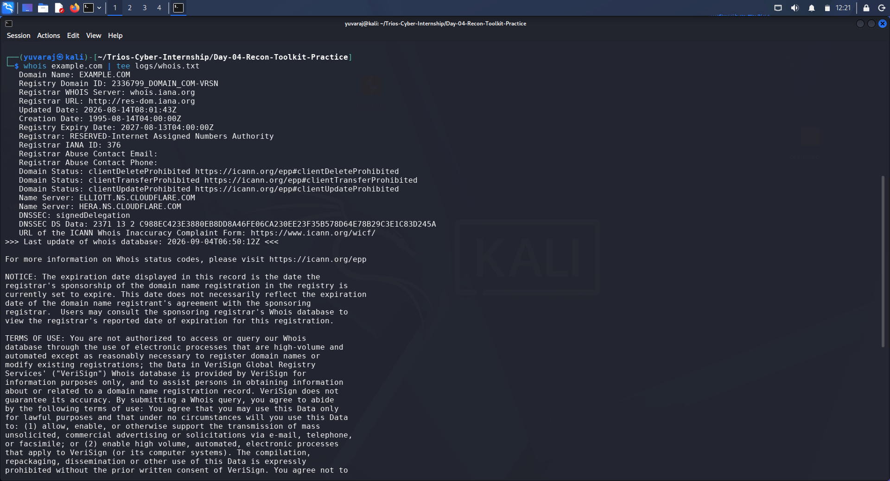
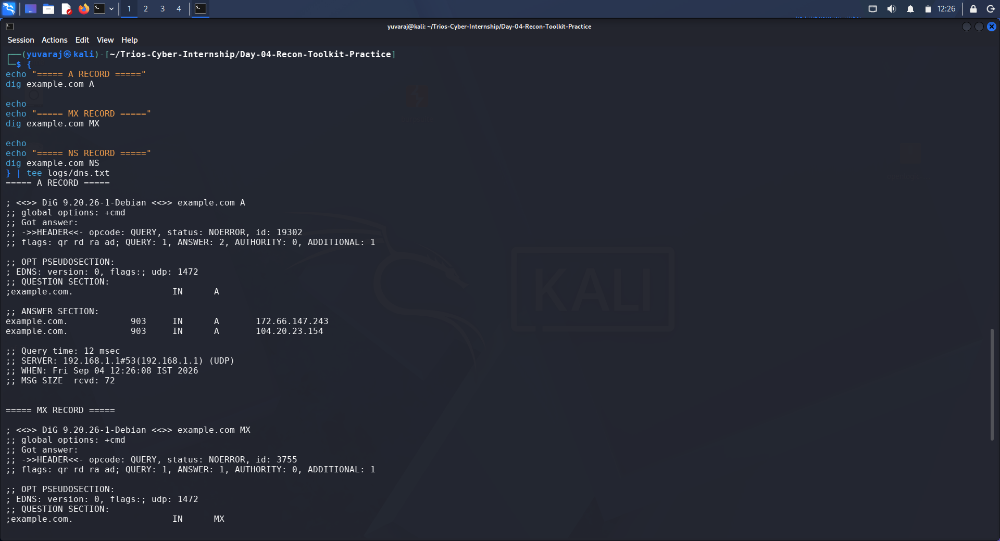
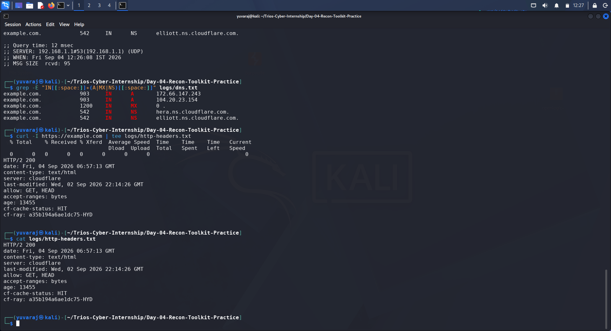
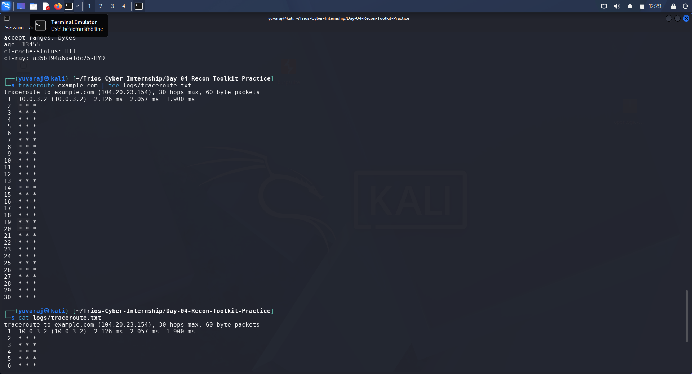
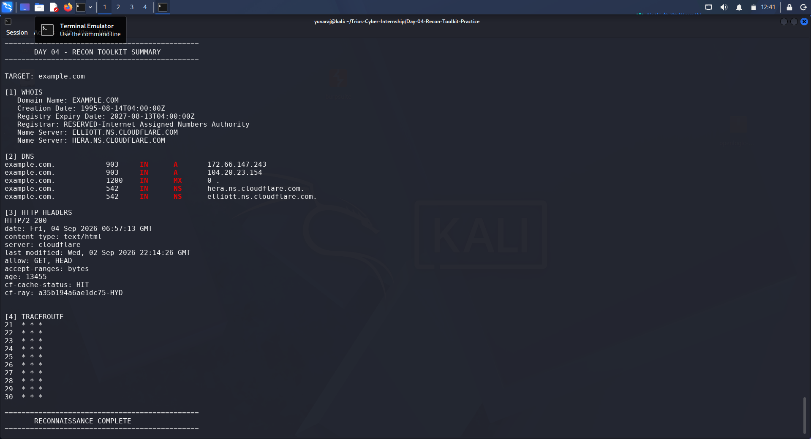

# DAY 04 — Recon Toolkit Practice

**Organization:** Trios Cyber  
**Assessment:** Day 04 Assessment  
**Task:** Recon Toolkit Practice  
**Date:** 04 September 2026  
**Platform:** Kali Linux  
**Target:** example.com  
**Tools:** WHOIS, dig, curl, traceroute  

---

## 1. Executive Summary

This assessment focused on performing basic reconnaissance against the safe public training resource `example.com`.

The assessment used four reconnaissance techniques:

- WHOIS domain information gathering
- DNS record enumeration using `dig`
- HTTP header analysis using `curl`
- Network path observation using `traceroute`

The collected information was preserved in raw log files and supported with terminal screenshots.

No exploitation, credential attacks, brute-force activity, vulnerability exploitation, or destructive activity was performed.

---

## 2. Assessment Objectives

The objectives of Day 04 were:

1. Practice WHOIS reconnaissance.
2. Query DNS records using `dig`.
3. Analyze HTTP response headers using `curl`.
4. Observe the network path using `traceroute`.
5. Identify useful reconnaissance findings.
6. Create a structured reconnaissance worksheet.
7. Preserve technical logs and visual evidence.

---

## 3. Authorization and Scope

The activity was limited to the safe public training resource:

**Target:** `example.com`

The assessment was restricted to basic reconnaissance techniques.

### Out of Scope

The following activities were not performed:

- Exploitation
- Credential attacks
- Brute-force attacks
- Vulnerability exploitation
- Persistence
- Privilege escalation
- Denial-of-service activity
- Destructive actions

---

## 4. Lab Environment

### Reconnaissance Workstation

- Operating System: Kali Linux
- Purpose: Security reconnaissance and analysis
- Tools: WHOIS, dig, curl, traceroute

### Target

- Domain: `example.com`
- Classification: Safe public training resource

---

## 5. WHOIS Reconnaissance

WHOIS was used to collect publicly available domain registration information.

### Command

    whois example.com

### Evidence

**Raw Output:** `logs/whois.txt`

The WHOIS output was preserved for later analysis and documentation.

---

## 6. DNS Reconnaissance

DNS records were queried using `dig`.

### Commands

    dig example.com A
    dig example.com MX
    dig example.com NS

### Evidence

**Raw Output:** `logs/dns.txt`

The DNS investigation examined:

- A record information
- MX record information
- NS record information

These records provide useful information about domain addressing, mail services, and authoritative name servers.

---

## 7. HTTP Header Reconnaissance

HTTP response headers were collected using `curl`.

### Command

    curl -I https://example.com

### Observed Response

The captured response returned:

- HTTP status: `200`
- Content type: `text/html`
- Server: `cloudflare`
- Cache status: `HIT`

Additional response metadata was preserved in the raw log.

### Evidence

**Raw Output:** `logs/http-headers.txt`

---

## 8. Traceroute Reconnaissance

Traceroute was used to observe the network path toward the target.

### Command

    traceroute example.com

### Evidence

**Raw Output:** `logs/traceroute.txt`

The traceroute output provides an observation of network hops between the reconnaissance workstation and the destination.

---

## 9. Reconnaissance Findings

| Category | Tool | Finding |
|---|---|---|
| Domain information | WHOIS | Public registration information collected |
| DNS | dig | A, MX, and NS records queried |
| HTTP | curl | HTTP 200 response and HTTP metadata observed |
| Network path | traceroute | Network hops toward the destination observed |

---

## 10. Final Reconnaissance Summary

The reconnaissance exercise demonstrated how multiple tools can be combined to build an initial understanding of a target's publicly observable infrastructure.

WHOIS provided domain registration information, DNS queries provided records associated with the domain, curl exposed HTTP response metadata, and traceroute provided network-path information.

### Evidence

---

## 11. Security Observations

Reconnaissance is an important phase of cybersecurity assessment because it helps identify information that may be publicly observable before deeper security testing begins.

Information such as:

- Domain registration details
- DNS records
- IP addressing information
- HTTP server and response metadata
- Network routing information

can contribute to an understanding of an organization's externally visible footprint.

This exercise remained limited to basic reconnaissance and did not attempt to exploit any identified information.

---

## 12. Assessment Methodology

The assessment followed this sequence:

1. Define the authorized target and scope.
2. Collect WHOIS information.
3. Query A, MX, and NS DNS records.
4. Collect HTTP response headers.
5. Perform traceroute.
6. Preserve raw command output.
7. Capture visual evidence.
8. Consolidate findings into a reconnaissance worksheet.
9. Document the assessment in a professional report.

---

## 13. Evidence Index

| Evidence | Description |
|---|---|
| `logs/assessment-scope.txt` | Assessment scope and authorization information |
| `logs/whois.txt` | WHOIS reconnaissance output |
| `logs/dns.txt` | DNS query output |
| `logs/http-headers.txt` | HTTP response headers |
| `logs/traceroute.txt` | Traceroute output |
| `screenshots/01-whois-recon.png` | WHOIS reconnaissance evidence |
| `screenshots/02-dns-recon.png` | DNS reconnaissance evidence |
| `screenshots/03-curl-http-headers.png` | HTTP header evidence |
| `screenshots/04-traceroute-recon.png` | Traceroute evidence |
| `screenshots/05-recon-summary.png` | Final reconnaissance summary |

---

## 14. Learning Outcomes

By completing Day 04, the following concepts were practiced:

- Understanding the purpose of WHOIS.
- Querying DNS records with `dig`.
- Analyzing HTTP response headers with `curl`.
- Observing network paths using `traceroute`.
- Preserving raw reconnaissance output.
- Organizing findings into a structured worksheet.
- Maintaining an evidence-based cybersecurity assessment workflow.

---

## 15. Conclusion

Day 04 successfully demonstrated a basic reconnaissance workflow using WHOIS, `dig`, `curl`, and `traceroute`.

The exercise showed how different reconnaissance tools provide different categories of information and how those findings can be combined into a structured security assessment.

All collected logs and screenshots were preserved as evidence, and the activity remained within the defined reconnaissance scope.

---

## Assessment Completion Status

**Assessment Status:** Completed  
**Scope Status:** Basic Reconnaissance Only  
**Evidence Status:** Complete  
**Worksheet Status:** Complete  
**Report Status:** Ready for PDF Generation and Git Submission
