# DAY 05 — HTTP Request Inspection

## Assessment Information

**Organization:** Trios Cyber  
**Assignment:** HTTP Request Inspection  
**Day:** 05  
**Application:** Damn Vulnerable Web Application (DVWA)  
**Target:** `192.168.56.101`  
**Tool:** Burp Suite  
**Environment:** Authorized local VirtualBox laboratory

---

## 1. Executive Summary

Day 05 focused on understanding HTTP request and response traffic using Burp Suite.

Burp Suite was configured as a proxy between the browser and the authorized DVWA laboratory application. HTTP traffic generated during normal application navigation and login activity was captured and inspected.

A total of 10 HTTP requests were documented. The captured traffic was analyzed for HTTP methods, request paths, parameters, headers, cookies, and response status codes.

No exploitation, brute-force activity, payload testing, or destructive actions were performed.

---

## 2. Assessment Objectives

The objectives of this assessment were to:

1. Configure Burp Suite as an HTTP proxy.
2. Configure the browser to send traffic through Burp Suite.
3. Capture at least 10 HTTP requests from DVWA.
4. Identify HTTP request methods.
5. Identify request paths and parameters.
6. Inspect HTTP headers.
7. Identify cookies used by the application.
8. Identify HTTP response status codes.
9. Document the captured traffic professionally.

---

## 3. Authorization and Scope

The activity was performed exclusively against the authorized local DVWA laboratory system.

**Target:** `192.168.56.101`

### In Scope

- Burp Suite proxy configuration
- Browser proxy configuration
- Normal DVWA navigation
- HTTP request inspection
- HTTP response inspection
- Header and cookie analysis

### Out of Scope

- Exploitation
- Brute-force attacks
- SQL injection testing
- Command injection
- File inclusion exploitation
- Credential attacks
- Vulnerability exploitation
- Persistence
- Privilege escalation
- Denial-of-service activity
- Destructive actions

---

## 4. Lab Environment

### Workstation

- Operating System: Kali Linux
- Network Interface: `eth0`
- Kali IP: `192.168.56.102/24`

### Target

- Application: Damn Vulnerable Web Application (DVWA)
- Target IP: `192.168.56.101`
- Network: VirtualBox Host-Only laboratory network

### Tool

- Burp Suite

---

## 5. Burp Suite Proxy Configuration

Burp Suite was configured to operate as the interception proxy for browser traffic.

**Evidence:** Burp Suite proxy setup

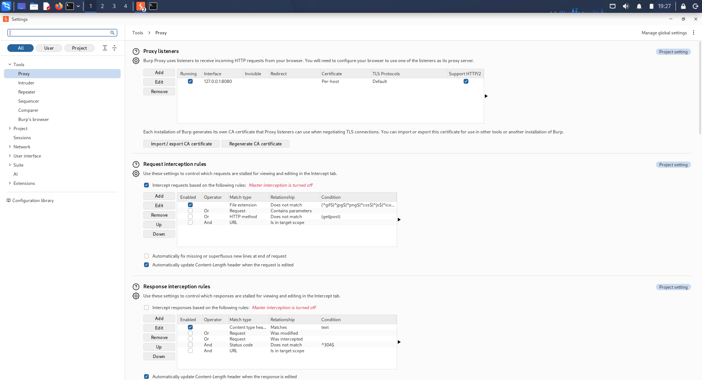

The browser was configured to route HTTP traffic through the Burp Suite proxy.

**Evidence:** Browser proxy configuration

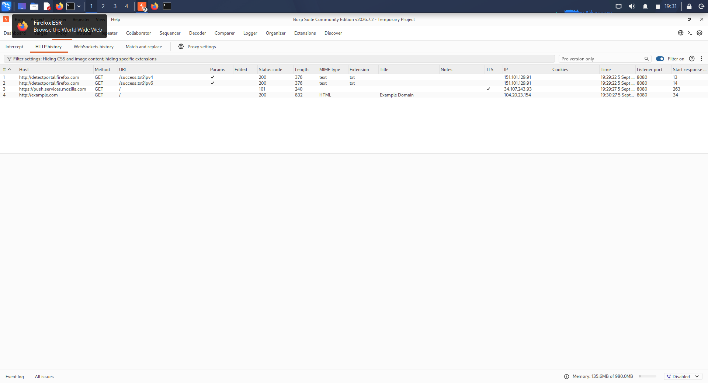

---

## 6. HTTP Request Capture

Ten HTTP requests were captured from the DVWA application during normal navigation.

### Request 1

**Method:** GET  
**Path:** `/`  
**Response:** 200 OK

**Evidence:** HTTP request 1

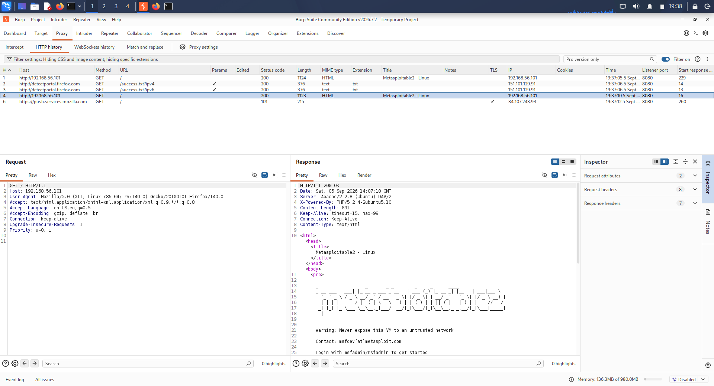

### Request 2

**Method:** GET  
**Path:** `/`  
**Response:** 200 OK

**Evidence:** HTTP request 2

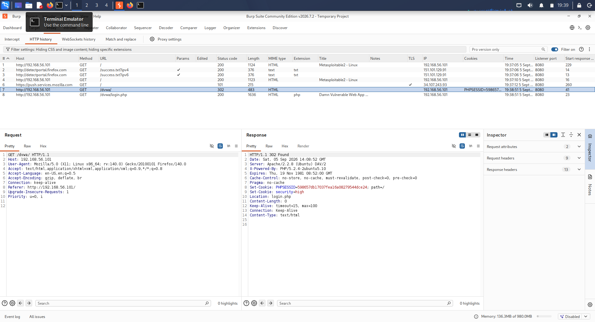

### Request 3

**Method:** GET  
**Path:** `/dvwa/login.php`  
**Response:** 200 OK

**Evidence:** DVWA login page request

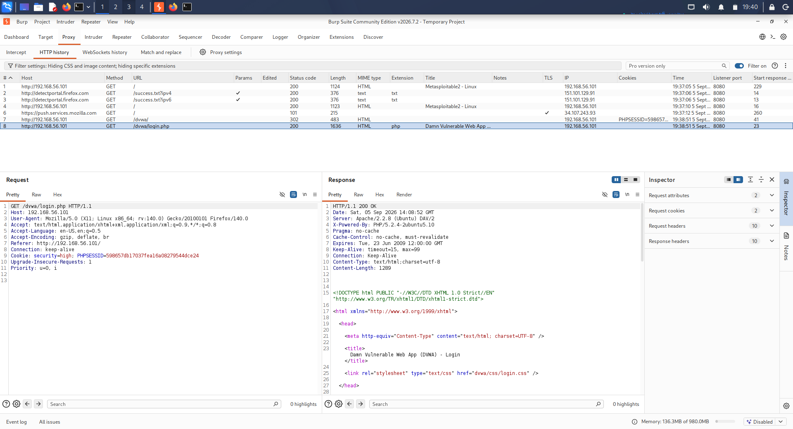

### Request 4

**Method:** POST  
**Path:** `/dvwa/login.php`  
**Response:** 302 Found

The login request demonstrated the use of a POST method and form parameters.

**Evidence:** Login POST request

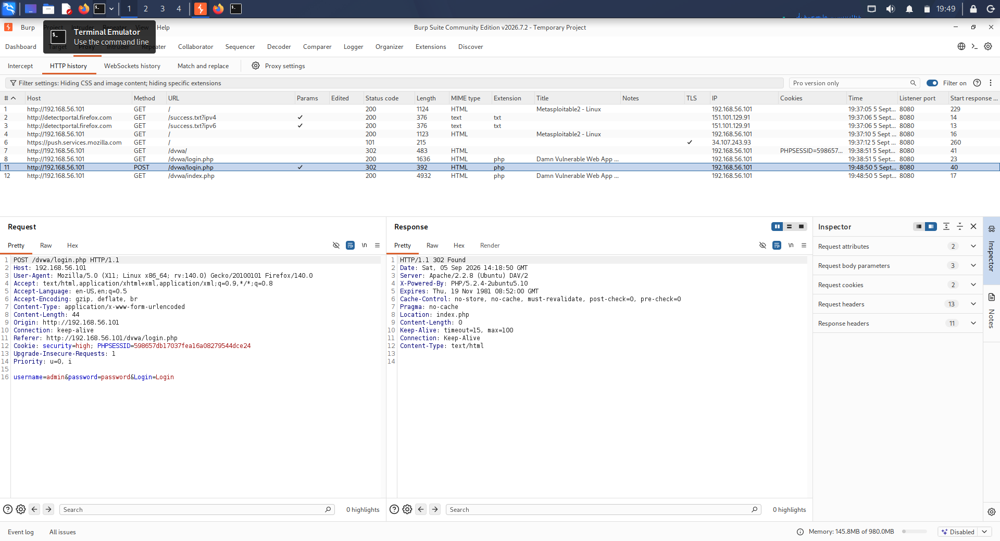

### Request 5

**Method:** GET  
**Path:** `/dvwa/index.php`  
**Response:** 200 OK

**Evidence:** DVWA index request

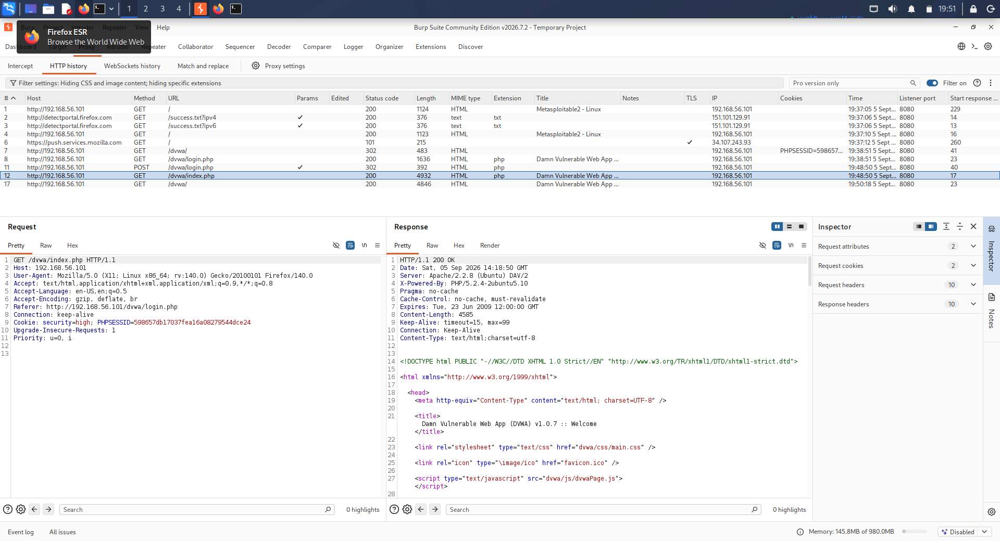

### Request 6

**Method:** GET  
**Path:** `/dvwa/instructions.php`  
**Response:** 200 OK

**Evidence:** Instructions request

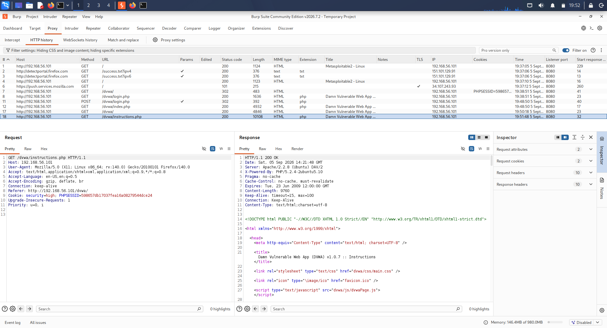

### Request 7

**Method:** GET  
**Path:** `/dvwa/vulnerabilities/brute/`  
**Response:** 200 OK

The page was accessed only for normal request inspection. No brute-force activity was performed.

**Evidence:** Brute Force page request

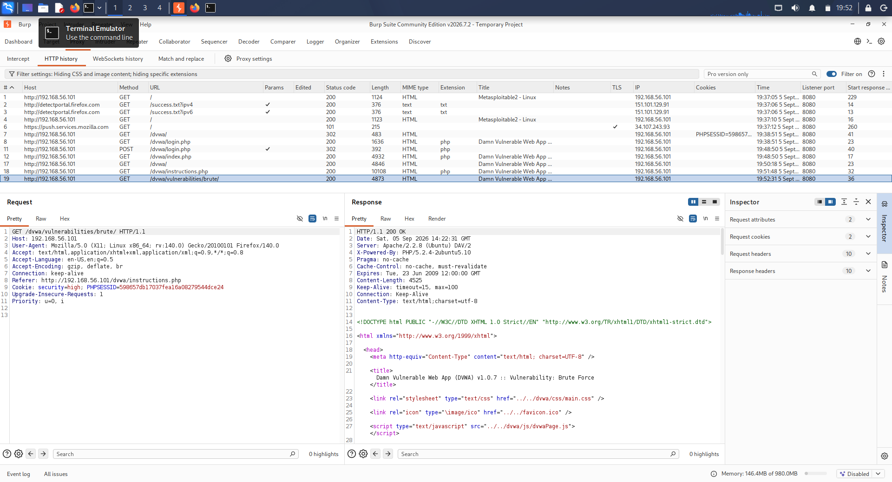

### Request 8

**Method:** GET  
**Path:** `/dvwa/vulnerabilities/exec/`  
**Response:** 200 OK

The page was accessed only for normal HTTP inspection. No command injection payloads were submitted.

**Evidence:** Command Injection page request

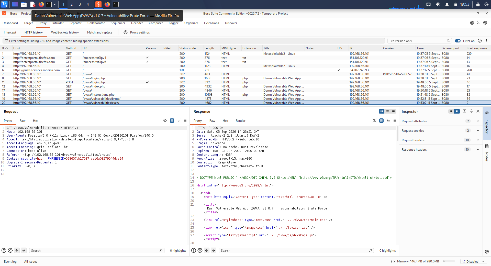

### Request 9

**Method:** GET  
**Path:** `/dvwa/vulnerabilities/fi/`  
**Response:** 200 OK

The page was accessed only for normal HTTP inspection. No file inclusion payloads were submitted.

**Evidence:** File Inclusion page request

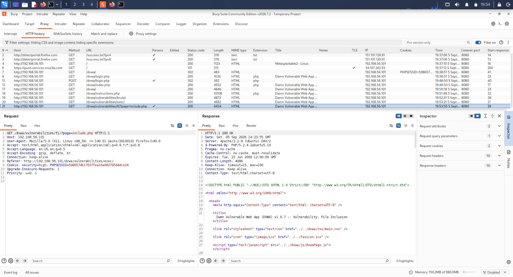

### Request 10

**Method:** GET  
**Path:** `/dvwa/vulnerabilities/sqli/`  
**Response:** 200 OK

The page was accessed only for normal HTTP inspection. No SQL injection payloads were submitted.

**Evidence:** SQL Injection page request

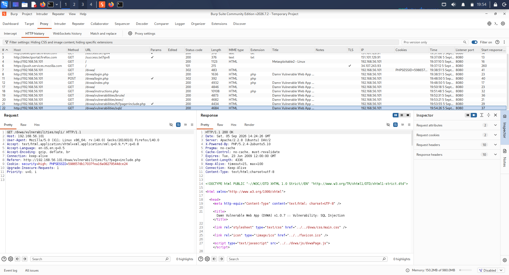

---

## 7. HTTP Methods Observed

The captured traffic demonstrated two HTTP methods.

### GET

GET requests were used to retrieve web pages and application resources.

### POST

A POST request was observed during the DVWA login process:

`POST /dvwa/login.php`

The POST request contained form parameters associated with the login process.

---

## 8. Parameters

Burp Suite allowed request parameters to be inspected.

The login POST request contained authentication form parameters. Sensitive session values and credentials are not reproduced in this report.

---

## 9. HTTP Headers

Burp Suite provided visibility into HTTP request and response headers.

Examples include:

- Host
- User-Agent
- Accept
- Content-Type
- Referer
- Cookie
- Content-Length

Headers provide information about the client, requested resource, request format, and session state.

---

## 10. Cookies

The DVWA application used session-related cookies during authenticated navigation.

A session cookie was observed in the captured traffic.

Actual session cookie values are not reproduced in this report.

---

## 11. Response Status Codes

| Status Code | Meaning | Observed Use |
|---:|---|---|
| 200 | OK | Successful page requests |
| 302 | Found / Redirect | Login/navigation redirect |

---

## 12. Request Summary

| # | Method | Path | Response |
|---:|---|---|---:|
| 1 | GET | `/` | 200 |
| 2 | GET | `/` | 200 |
| 3 | GET | `/dvwa/login.php` | 200 |
| 4 | POST | `/dvwa/login.php` | 302 |
| 5 | GET | `/dvwa/index.php` | 200 |
| 6 | GET | `/dvwa/instructions.php` | 200 |
| 7 | GET | `/dvwa/vulnerabilities/brute/` | 200 |
| 8 | GET | `/dvwa/vulnerabilities/exec/` | 200 |
| 9 | GET | `/dvwa/vulnerabilities/fi/` | 200 |
| 10 | GET | `/dvwa/vulnerabilities/sqli/` | 200 |

---

## 13. Evidence Index

| Evidence | Description |
|---|---|
| `screenshots/01-burp-proxy-setup.png` | Burp Suite proxy setup |
| `screenshots/02-browser-proxy.png` | Browser proxy configuration |
| `screenshots/03-request-01.png` | HTTP request 1 |
| `screenshots/04-request-02.png` | HTTP request 2 |
| `screenshots/05-request-03-login.png` | DVWA login page request |
| `screenshots/06-request-04-login-post.png` | Login POST request |
| `screenshots/07-request-05-index.png` | DVWA index request |
| `screenshots/08-request-06-instructions.png` | Instructions request |
| `screenshots/09-request-07-brute-force-page.png` | Brute Force page request |
| `screenshots/10-request-08-command-injection.png` | Command Injection page request |
| `screenshots/11-request-09-file-inclusion.png` | File Inclusion page request |
| `screenshots/12-request-10-sql-injection.png` | SQL Injection page request |

---

## 14. Learning Outcomes

- Configured Burp Suite as an HTTP proxy.
- Configured browser proxy settings.
- Captured browser traffic with Burp Suite.
- Identified GET and POST methods.
- Inspected request paths.
- Identified request parameters.
- Inspected HTTP request and response headers.
- Understood session cookies.
- Interpreted HTTP response status codes.
- Practiced analyzing web application traffic in an authorized laboratory environment.

---

## 15. Security and Ethical Considerations

All testing was performed against the authorized local DVWA laboratory environment.

The vulnerable application was used strictly for educational HTTP traffic inspection.

No unauthorized systems were targeted, and no exploitation or destructive testing was performed.

Session information and sensitive values were not reproduced in the final report.

---

## 16. Conclusion

Day 05 successfully demonstrated HTTP request inspection using Burp Suite.

Burp Suite was configured between the browser and DVWA, allowing HTTP traffic to be captured and analyzed. Ten requests were documented and examined for methods, paths, parameters, headers, cookies, and response status codes.

The exercise provided practical understanding of how web browsers communicate with web applications and how a security analyst can inspect that communication using a proxy.

---

## Assessment Completion Status

**Assessment Status:** Completed  
**Requests Captured:** 10  
**Evidence Status:** Complete  
**Scope Status:** Authorized Local Laboratory Only  
**Report Status:** Ready for PDF Generation and Git Submission
