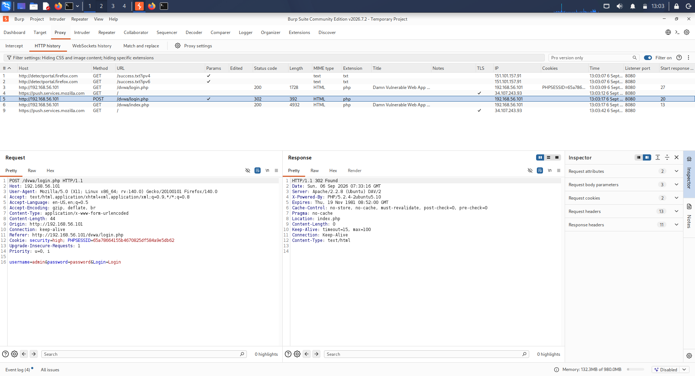
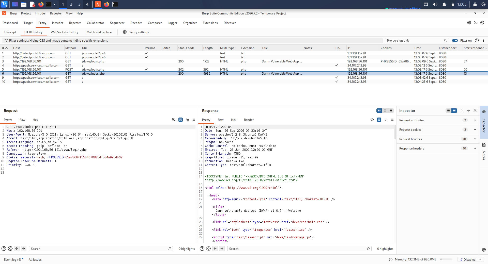
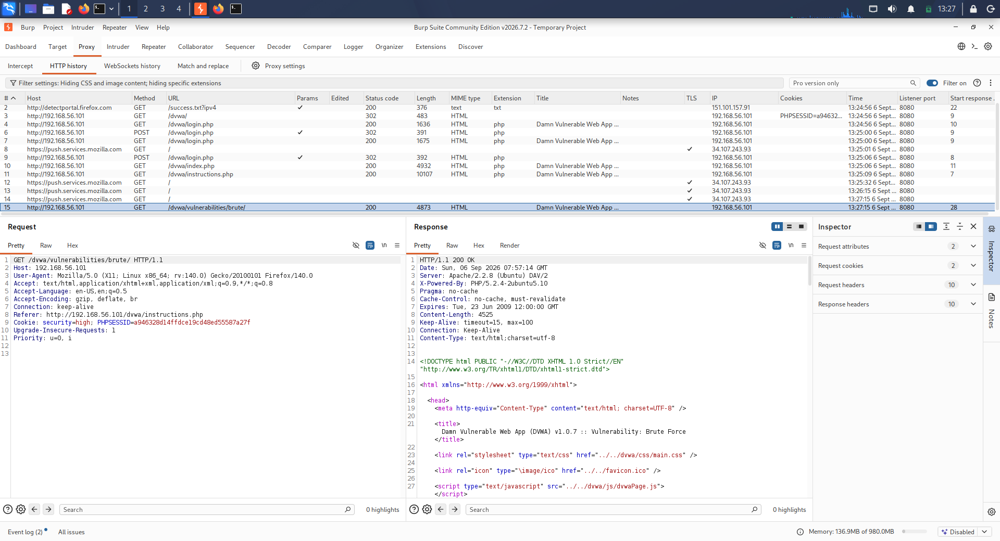
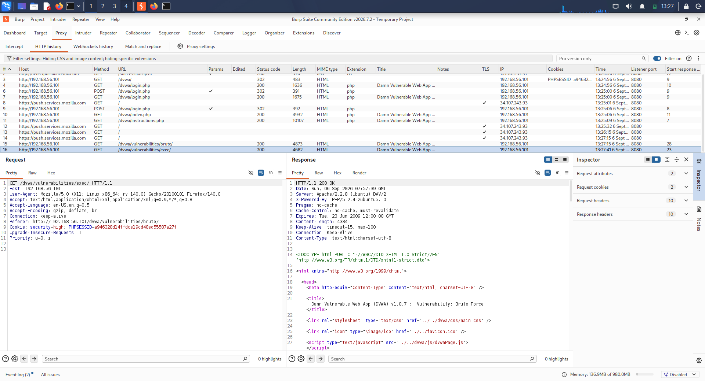
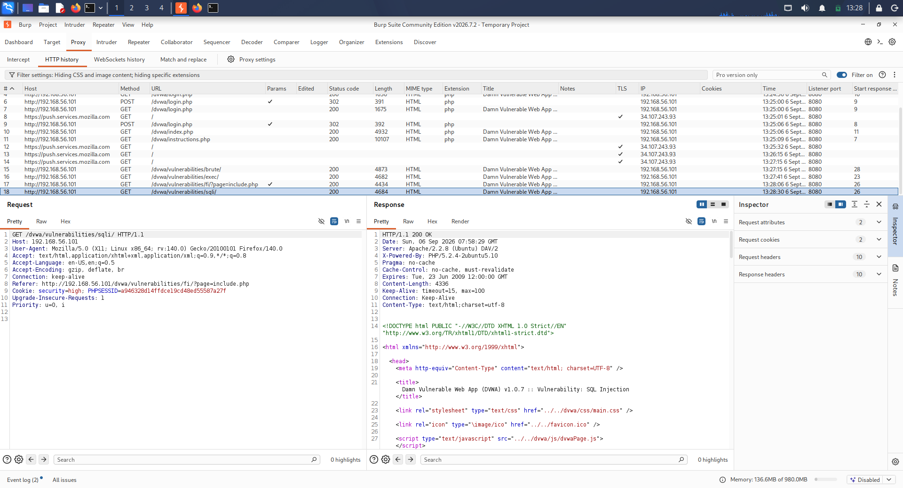
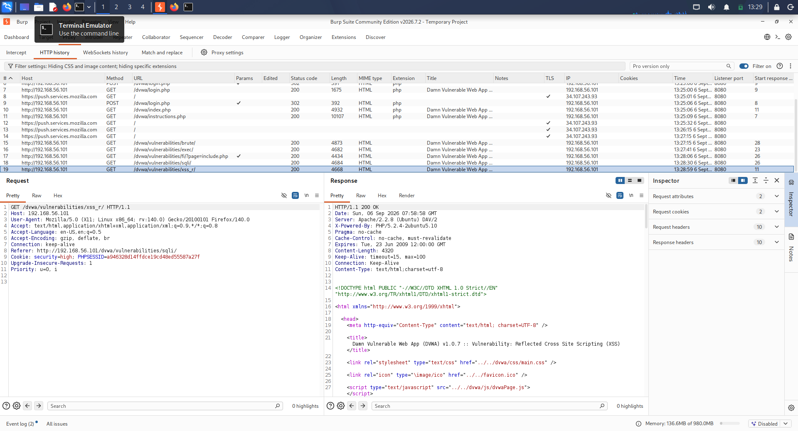

# Day 06 – Attack Surface Mapping

## Trios Cyber Internship

**Task:** Map at least five features/endpoints in DVWA  
**Application:** Damn Vulnerable Web Application (DVWA)  
**Target:** `http://192.168.56.101/dvwa/`  
**Tools:** Browser, Burp Suite  
**Environment:** Authorized local VirtualBox laboratory  
**Date:** 06 September 2026

---

## 1. Objective

The objective of this assessment was to identify the attack surface of an intentionally vulnerable web application by mapping application features, endpoints, input fields, authentication functionality, and potential security-sensitive areas.

DVWA was selected as the target because it provides multiple intentionally vulnerable modules suitable for learning web application security concepts in a controlled laboratory environment.

---

## 2. Scope

The assessment was limited to the locally hosted DVWA instance:

`http://192.168.56.101/dvwa/`

The following activities were performed:

- Identified the DVWA login and authentication surface.
- Identified the authenticated dashboard.
- Mapped multiple application features.
- Identified user-controlled input fields and parameters.
- Inspected HTTP request behavior using Burp Suite.
- Documented potential security areas associated with each feature.
- Collected screenshots as evidence.

No external systems were targeted.

---

## 3. Authentication Surface

The DVWA login page contains username and password input fields and is responsible for establishing an authenticated application session.

### Evidence

### Authentication Components Identified

- Username field
- Password field
- Login functionality
- Session cookie
- Authenticated application access

---

## 4. Authenticated Application Surface

After successful authentication, the DVWA dashboard provides access to multiple security-testing modules.

### Evidence

The dashboard acts as an entry point to several application functions, increasing the number of accessible attack surfaces available to an authenticated user.

---

# 5. Attack-Surface Mapping

## 5.1 Brute Force

The Brute Force module contains username and password input fields.

### Identified Inputs

- Username
- Password

### Security Area

Authentication security and rate limiting.

### Evidence

---

## 5.2 Command Injection

The Command Injection module accepts user-controlled input associated with a network/host operation.

### Identified Input

- Host/IP-related user input

### Security Area

OS command injection and input validation.

### Evidence

---

## 5.3 File Inclusion

The File Inclusion module contains a user-controlled file/page selection mechanism.

### Identified Input

- File/page parameter

### Security Area

File inclusion and path validation.

### Evidence

---

## 5.4 SQL Injection

The SQL Injection module accepts user-controlled input that is processed by the application's database functionality.

### Identified Input

- User-supplied ID/input parameter

### Security Area

SQL query handling and input validation.

### Evidence

---

## 5.5 Reflected XSS

The Reflected XSS module accepts user-controlled input that can be reflected in the application's response.

### Identified Input

- User-supplied text/input parameter

### Security Area

Output encoding and cross-site scripting prevention.

### Evidence

---

# 6. Attack-Surface Table

| # | Feature / Endpoint | Input / Parameter | Authentication | Security Area | Evidence |
|---|---|---|---|---|---|
| 1 | Login | Username, Password | Authentication endpoint | Authentication / Session Management | `01-dvwa-login-attack-surface.png` |
| 2 | Dashboard | Navigation / session | Authenticated | Session / Access Control | `02-dvwa-dashboard.png` |
| 3 | Brute Force | Username, Password | Authenticated | Authentication / Rate Limiting | `03-brute-force-surface.png` |
| 4 | Command Injection | Host/IP input | Authenticated | OS Command Injection | `04-command-injection-surface.png` |
| 5 | File Inclusion | File/page parameter | Authenticated | File Inclusion / Path Validation | `05-file-inclusion-surface.png` |
| 6 | SQL Injection | ID/input parameter | Authenticated | SQL Injection | `06-sql-injection-surface.png` |
| 7 | Reflected XSS | User-controlled input | Authenticated | Cross-Site Scripting | `07-xss-reflected-surface.png` |

---

# 7. Input Fields Identified

The assessment identified the following user-controlled input surfaces:

1. Username
2. Password
3. Brute Force credentials
4. Command Injection host/IP input
5. File Inclusion parameter
6. SQL Injection input
7. Reflected XSS input

These inputs represent important areas for security testing because user-controlled data may influence authentication logic, operating-system commands, file handling, database queries, or HTML responses.

---

# 8. Authentication Functionality

The authentication flow consists of:

1. Accessing the DVWA login page.
2. Providing username and password credentials.
3. Submitting the login request.
4. Establishing an authenticated session.
5. Accessing the DVWA dashboard and application modules.

Authentication and session behavior were inspected as part of the attack-surface mapping exercise.

---

# 9. Burp Suite Usage

Burp Suite was used as an HTTP inspection tool during the assessment.

The purpose of using Burp Suite was to understand how browser interactions correspond to HTTP requests and to identify application-controlled parameters.

The assessment focused on observation and mapping rather than exploitation.

---

# 10. Findings Summary

The DVWA application exposes multiple security-sensitive features after authentication.

The main attack-surface categories identified were:

| Category | Examples |
|---|---|
| Authentication | Login, Brute Force |
| Session Management | Login session, authenticated dashboard |
| Command Processing | Command Injection |
| File Handling | File Inclusion |
| Database Interaction | SQL Injection |
| Output Handling | Reflected XSS |
| Access Control | Authenticated application modules |

A total of **seven application surfaces** were documented, exceeding the minimum requirement of five.

---

# 11. Learning Outcomes

Through this exercise, the following concepts were practiced:

- Web application attack-surface identification
- Endpoint and feature mapping
- Identifying user-controlled inputs
- Understanding authentication surfaces
- Understanding authenticated application areas
- HTTP request inspection using Burp Suite
- Recognizing common web application vulnerability categories
- Documenting security observations professionally

---

# 12. Evidence Summary

| Screenshot | Description |
|---|---|
| `01-dvwa-login-attack-surface.png` | DVWA authentication/login surface |
| `02-dvwa-dashboard.png` | Authenticated DVWA dashboard |
| `03-brute-force-surface.png` | Brute Force feature |
| `04-command-injection-surface.png` | Command Injection feature |
| `05-file-inclusion-surface.png` | File Inclusion feature |
| `06-sql-injection-surface.png` | SQL Injection feature |
| `07-xss-reflected-surface.png` | Reflected XSS feature |

---

# 13. Conclusion

The Day 06 attack-surface mapping exercise successfully identified and documented seven DVWA application surfaces, including authentication, session-related functionality, input-processing features, database interaction, file handling, command processing, and reflected output.

The exercise demonstrated how an application can be systematically mapped before performing deeper security testing. Burp Suite provided visibility into the HTTP communication between the browser and the application, while screenshots provided supporting evidence for the documented observations.

**Assessment Status: COMPLETED**
