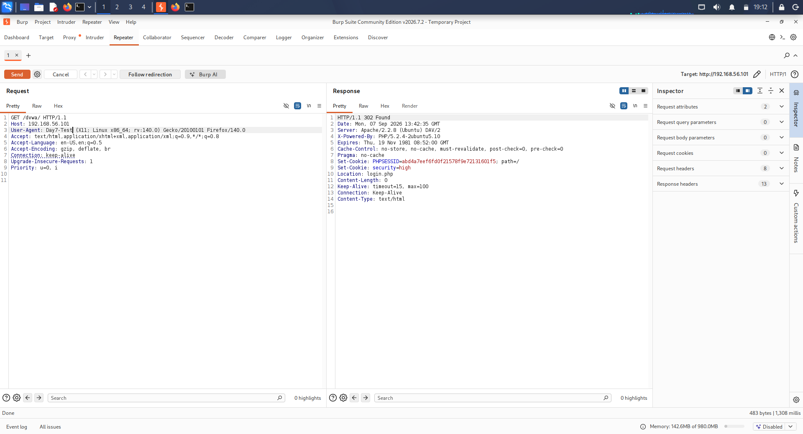
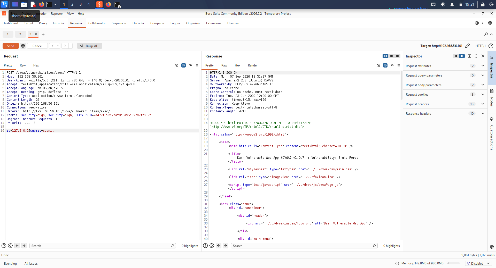
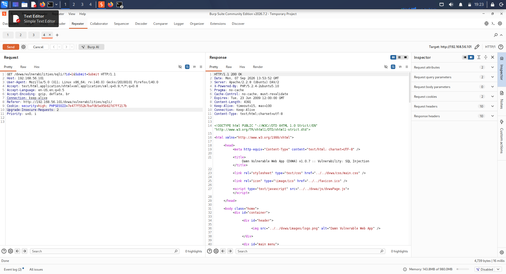

# DAY 07 – Burp Repeater Practical

## Trios Cyber Internship

**Task:** Burp Repeater Practical  
**Day:** 07  
**Application:** Damn Vulnerable Web Application (DVWA)  
**Target:** `http://192.168.56.101/dvwa/`  
**Environment:** Authorized local VirtualBox laboratory  
**Primary Tool:** Burp Suite Repeater  

---

## 1. Objective

The objective of this practical was to understand how Burp Suite Repeater can be used to capture, modify, resend, and compare HTTP requests and responses.

Three different requests generated by the DVWA application were captured and sent to Burp Repeater. A safe parameter or HTTP header was modified in each request before resending it.

---

## 2. Lab Environment

| Component | Details |
|---|---|
| Attacker/Test System | Kali Linux |
| Target Application | DVWA |
| Target IP | `192.168.56.101` |
| Target URL | `http://192.168.56.101/dvwa/` |
| Proxy Tool | Burp Suite |
| Testing Component | Repeater |
| Browser | Firefox |
| Network | Local VirtualBox laboratory |

All testing was performed against the intentionally vulnerable local DVWA instance.

---

## 3. Practical Methodology

The following workflow was followed:

1. Started Burp Suite on the Kali Linux system.
2. Verified that Burp Proxy was listening on the configured local proxy port.
3. Configured Firefox to route traffic through Burp Suite.
4. Accessed the DVWA application.
5. Generated HTTP requests through normal application interaction.
6. Located the requests in Burp Proxy HTTP history.
7. Sent three different requests to Repeater.
8. Modified one safe parameter or HTTP header in each request.
9. Resent the modified requests.
10. Compared the resulting responses with the original requests.
11. Captured screenshots for each Repeater test.

---

## 4. Burp Repeater Test 1

The first captured DVWA request was sent to Burp Repeater.

A safe request parameter or header was modified and the request was resent to the local DVWA server.

### Evidence

### Observation

The request could be modified manually in Repeater and resent independently of the browser. This demonstrates how individual HTTP request components can be tested without repeatedly navigating through the application.

---

## 5. Burp Repeater Test 2

A second different DVWA request was captured and transferred to Repeater.

One safe parameter or header was modified before sending the request again.

### Evidence

### Observation

Repeater made it possible to isolate the request and evaluate how a controlled modification affected the server response.

---

## 6. Burp Repeater Test 3

A third different DVWA request was captured and transferred to Repeater.

A safe parameter or header was modified and the resulting request was resent.

### Evidence

### Observation

The third test further demonstrated the usefulness of Repeater for manually manipulating HTTP requests and comparing server responses.

---

## 7. Request and Response Comparison

| Test | Request | Modification | Purpose | Evidence |
|---|---|---|---|---|
| 1 | DVWA Request 1 | Safe parameter/header | Observe response after controlled modification | `01-repeater-request-01.png` |
| 2 | DVWA Request 2 | Safe parameter/header | Compare modified request behavior | `02-repeater-request-02.png` |
| 3 | DVWA Request 3 | Safe parameter/header | Validate repeatable manual testing | `03-repeater-request-03.png` |

The exercise demonstrated that HTTP requests can be captured once and repeatedly modified and resent from Burp Repeater.

---

## 8. Key Learning Outcomes

Through this practical, the following concepts were practiced:

- HTTP request interception
- Burp Proxy HTTP history
- Sending requests to Repeater
- Manual request modification
- HTTP headers and parameters
- Request/response comparison
- Reproducible web application testing
- Understanding the difference between browser-driven requests and manually replayed requests

---

## 9. Security Relevance

Burp Repeater is useful during authorized web application security testing because it allows individual HTTP requests to be isolated and tested repeatedly.

It can help security testers understand:

- How applications process user-controlled input
- How HTTP headers influence application behavior
- How parameters affect server-side processing
- How authentication and session information are transmitted
- How changes to requests influence responses

---

## 10. Evidence Summary

Three screenshots were captured during the practical:

1. `01-repeater-request-01.png`
2. `02-repeater-request-02.png`
3. `03-repeater-request-03.png`

All screenshots were copied from the Windows physical machine through the VirtualBox shared folder into the Day 07 project directory.

---

## 11. Scope and Ethics

This practical was conducted exclusively against the intentionally vulnerable DVWA application running inside an authorized local VirtualBox laboratory.

No external systems, websites, or unauthorized infrastructure were targeted.

---

## 12. Conclusion

The Burp Repeater practical successfully demonstrated the process of capturing HTTP requests, transferring them to Repeater, making controlled modifications, resending them, and comparing the resulting behavior.

The exercise provided practical experience with manual HTTP request analysis and established a foundation for further authorized web application security testing.

