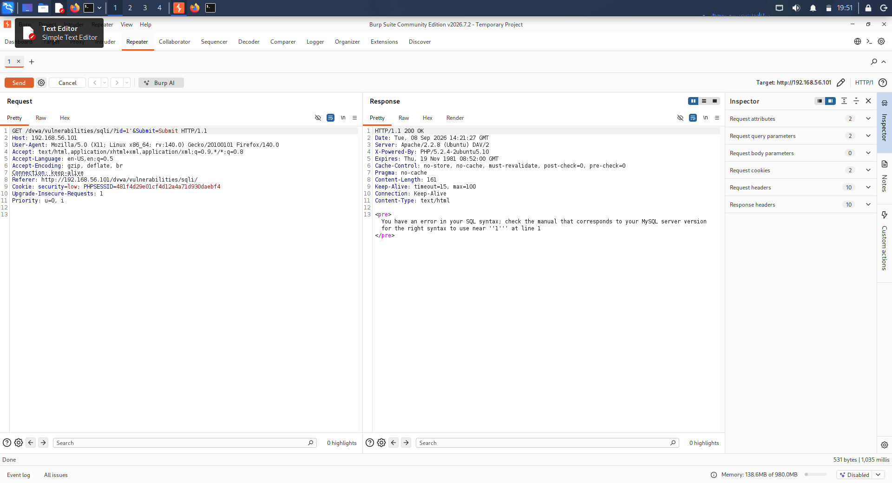
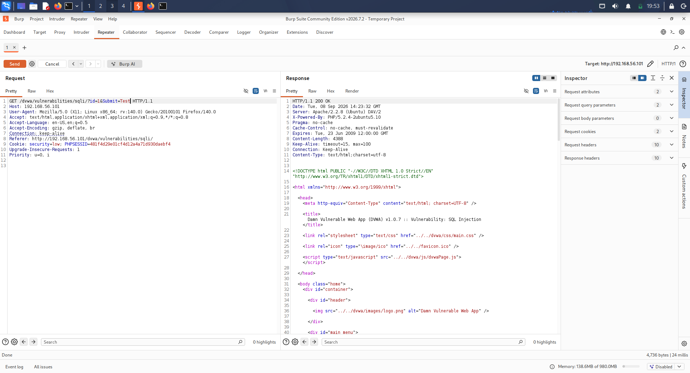
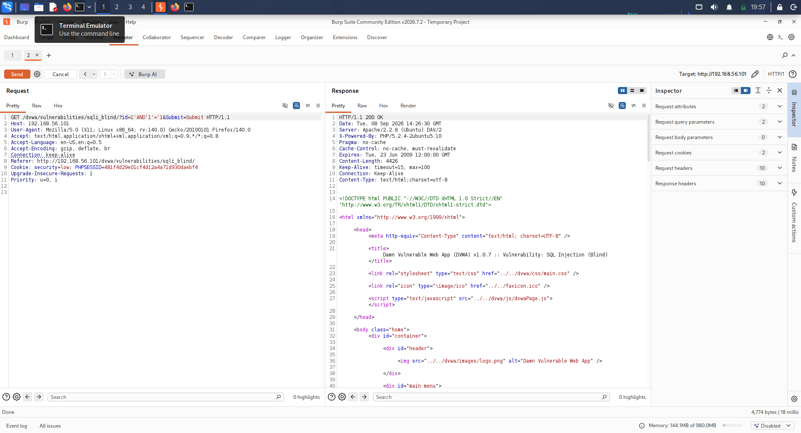

# Day 08 – SQL Injection Beginner Lab Worksheet

## Objective

Complete two beginner SQL injection exercises against the authorized DVWA laboratory environment using Burp Suite. Identify vulnerable parameters, capture HTTP requests, modify the parameters, and compare the resulting responses.

## Target

- Application: Damn Vulnerable Web Application (DVWA)
- Target: `http://192.168.56.101/dvwa/`
- Environment: Authorized local VirtualBox laboratory
- Tool: Burp Suite Repeater
- Security Level: Low

## Exercises

| # | DVWA Exercise | Vulnerable Parameter | Modification | Evidence |
|---|---|---|---|---|
| 1 | SQL Injection | `id` | Modified `id` parameter | `01-sqli-exercise-01.png` |
| 2 | SQL Injection (Blind) | `id` | Modified `id` parameter with a boolean condition | `03-sqli-blind-exercise.png` |

## Additional Repeater Test

A second Repeater request was also tested by modifying a non-security-sensitive request parameter to observe how the application response changes.

Evidence:

`02-sqli-exercise-02.png`

## Methodology

1. Accessed the authorized DVWA instance.
2. Set the DVWA security level to Low.
3. Opened the SQL Injection functionality.
4. Captured the HTTP request using Burp Suite.
5. Sent the request to Burp Repeater.
6. Established a baseline response using a normal parameter value.
7. Modified the vulnerable `id` parameter.
8. Sent the modified request and compared the response.
9. Repeated the process using the SQL Injection (Blind) functionality.
10. Preserved screenshots as evidence.

## Findings

The exercises demonstrated that user-controlled parameters can influence backend SQL queries when input validation and parameterized database queries are not properly implemented.

The SQL Injection exercise demonstrated a change in application behavior after modifying the `id` parameter.

The Blind SQL Injection exercise demonstrated how a boolean SQL condition can be used to observe differences in application behavior without necessarily displaying a database error.

## Security Learning

SQL injection occurs when untrusted user input is incorporated into SQL statements without adequate protection.

Recommended defenses include:

- Prepared statements / parameterized queries
- Strict server-side input validation
- Least-privilege database accounts
- Safe error handling
- Avoiding dynamic SQL construction with untrusted input

## Evidence

### Exercise 1 – SQL Injection

### Additional Repeater Test

### Exercise 2 – Blind SQL Injection

## Scope and Ethics

All testing was performed against the intentionally vulnerable DVWA application hosted inside the authorized local VirtualBox laboratory.

No external systems were targeted.
