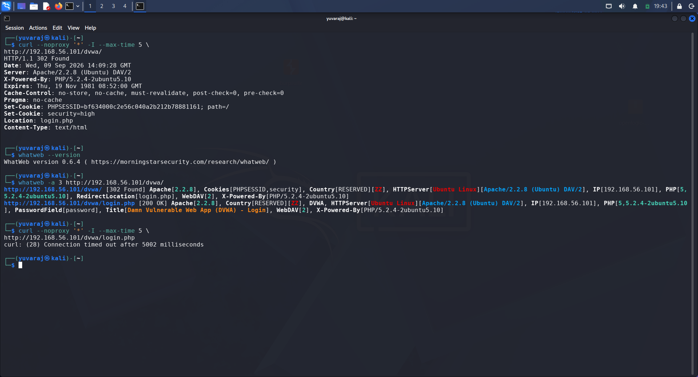
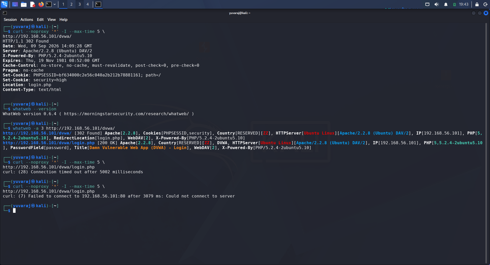
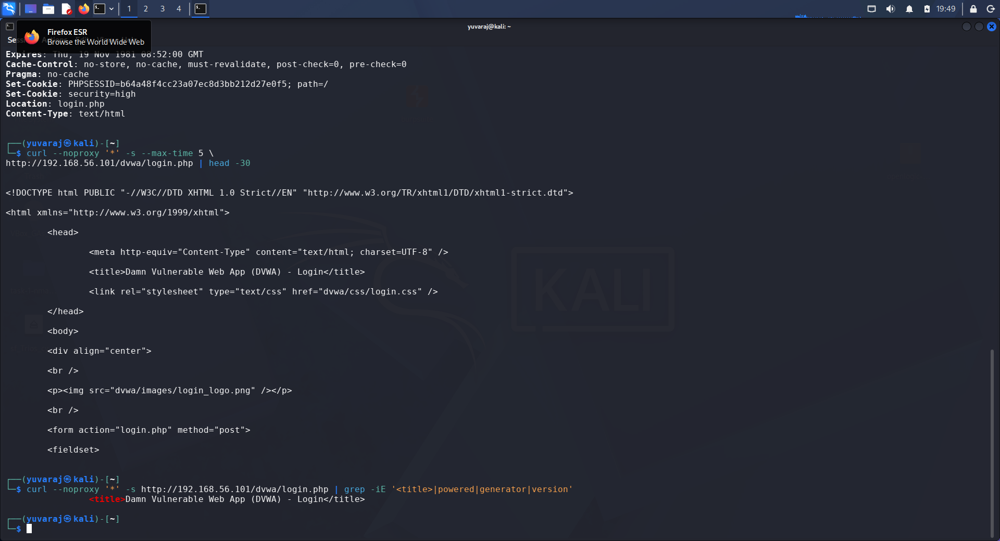

# Day 09 – Technology Fingerprinting Report

## Trios Cyber Internship

**Assignment:** Technology Fingerprinting  
**Day:** 09  
**Target:** Damn Vulnerable Web Application (DVWA)  
**Target IP:** `192.168.56.101`  
**Target URL:** `http://192.168.56.101/dvwa/`  
**Environment:** Authorized Local VirtualBox Laboratory  
**Tools:** WhatWeb, curl, Burp Suite

---

## 1. Objective

The objective of this exercise was to perform technology fingerprinting against an authorized local web application.

The assessment focused on identifying technologies and components exposed through HTTP responses, response headers, and application content.

The exercise included:

- Running WhatWeb against DVWA.
- Reviewing HTTP response headers using curl.
- Identifying the web server and version.
- Identifying operating system information.
- Identifying PHP and its version.
- Identifying the DVWA application.
- Reviewing cookies and redirect behavior.
- Building a technology inventory.
- Collecting screenshots as supporting evidence.

---

## 2. Scope

Testing was performed only against the intentionally vulnerable DVWA instance hosted inside the authorized local VirtualBox laboratory.

**Target IP:** `192.168.56.101`

**Target URL:** `http://192.168.56.101/dvwa/`

No external systems were targeted.

---

## 3. Tools Used

### WhatWeb

WhatWeb was used to identify technologies and application characteristics exposed by the target.

Command:

```bash
whatweb -a 3 http://192.168.56.101/dvwa/

---

## 4. Initial HTTP Response Analysis

The target was tested using curl to manually inspect the HTTP response headers.

Command used:

curl --noproxy '*' -I --max-time 5 http://192.168.56.101/dvwa/

The target returned an HTTP 302 Found response.

Important information observed:

HTTP/1.1 302 Found
Server: Apache/2.2.8 (Ubuntu) DAV/2
X-Powered-By: PHP/5.2.4-2ubuntu5.10
Set-Cookie: PHPSESSID=...
Set-Cookie: security=high
Location: login.php
Content-Type: text/html

The 302 status indicates that the requested resource redirected the client to another location. The Location header identified login.php as the redirect destination.

---

## 5. WhatWeb Fingerprinting Results

The following command was executed:

whatweb -a 3 http://192.168.56.101/dvwa/

WhatWeb identified the following technologies and characteristics:

- Apache 2.2.8
- Ubuntu Linux
- PHP 5.2.4
- PHP package version 5.2.4-2ubuntu5.10
- WebDAV 2
- Damn Vulnerable Web App (DVWA)
- PHPSESSID cookie
- Security cookie
- X-Powered-By header
- Redirect to login.php

WhatWeb also identified the DVWA login page:

http://192.168.56.101/dvwa/login.php

The login page was identified as Damn Vulnerable Web App and returned HTTP 200 OK.

### Evidence



---

## 6. Manual HTTP Response Header Review

The HTTP response headers were manually reviewed using curl.

Command used:

curl --noproxy '*' -I --max-time 5 http://192.168.56.101/dvwa/

### Server Header

Server: Apache/2.2.8 (Ubuntu) DAV/2

This disclosed the Apache web server, its version, Ubuntu Linux information, and WebDAV support.

### X-Powered-By Header

X-Powered-By: PHP/5.2.4-2ubuntu5.10

This disclosed PHP as the server-side scripting technology and exposed the PHP version.

### Set-Cookie Headers

The server returned PHPSESSID and security cookies.

PHPSESSID indicates PHP-based session management.

The security=high cookie reflected the DVWA security level observed during the assessment.

### Location Header

Location: login.php

This indicated that the initial request was redirected to the DVWA login page.

### Content-Type Header

Content-Type: text/html

This indicated that the server returned HTML content.

### Evidence



---

## 7. DVWA Login Page Inspection

The DVWA login page was inspected directly using curl.

Command used:

curl --noproxy '*' -s --max-time 5 http://192.168.56.101/dvwa/login.php | head -30

The returned HTML contained the following title:

<title>Damn Vulnerable Web App (DVWA) - Login</title>

A focused search was also performed using:

curl --noproxy '*' -s http://192.168.56.101/dvwa/login.php | grep -iE '<title>|powered|generator|version'

The output confirmed:

<title>Damn Vulnerable Web App (DVWA) - Login</title>

This confirmed the identity of the web application as Damn Vulnerable Web App.

### Evidence



---

## 8. Technology Inventory

| Category | Identified Technology / Information | Evidence |
|---|---|---|
| Web Application | Damn Vulnerable Web App (DVWA) | WhatWeb / HTML title |
| Web Server | Apache 2.2.8 | HTTP response / WhatWeb |
| Operating System | Ubuntu Linux | WhatWeb / Server header |
| Server Module | WebDAV 2 | Server header / WhatWeb |
| Server-Side Technology | PHP 5.2.4 | X-Powered-By / WhatWeb |
| PHP Package Version | 5.2.4-2ubuntu5.10 | X-Powered-By |
| Session Management | PHPSESSID | Set-Cookie |
| DVWA Security Level | High | Security cookie |
| Authentication Endpoint | login.php | Location header |
| Response Format | text/html | Content-Type |
| Application Title | DVWA Login | HTML title |

---

## 9. Key Findings

### Finding 1 – Apache Version Disclosure

The target disclosed the Apache web server version 2.2.8.

### Finding 2 – Ubuntu Linux Disclosure

WhatWeb identified Ubuntu Linux as the operating system associated with the web server.

### Finding 3 – PHP Version Disclosure

The X-Powered-By header disclosed PHP version 5.2.4-2ubuntu5.10.

### Finding 4 – WebDAV Support Disclosure

The Server header contained DAV/2, indicating WebDAV support.

### Finding 5 – Application Identification

WhatWeb identified the application as Damn Vulnerable Web App (DVWA).

The login page title also confirmed the application identity.

### Finding 6 – Session Management

The server issued a PHPSESSID cookie, indicating PHP session management.

### Finding 7 – Authentication Redirect

The /dvwa/ endpoint redirected unauthenticated requests to login.php.

---

## 10. Security Observations

Technology fingerprinting is useful during security assessments because applications and servers may disclose implementation details through HTTP headers and application responses.

The target disclosed:

- Web server software
- Web server version
- Operating system information
- PHP runtime
- PHP version
- WebDAV support
- Application identity
- Session-management information
- Authentication endpoint

The Apache and PHP versions identified during the assessment are legacy software versions and should be reviewed in a modern production environment.

The Server and X-Powered-By headers also expose technology and version information.

From a defensive perspective, unnecessary technology and version disclosure should generally be minimized on production systems.

---

## 11. Learning Outcomes

This exercise provided practical experience with:

1. Using WhatWeb for web technology fingerprinting.
2. Reviewing HTTP response headers using curl.
3. Identifying web server software and versions.
4. Identifying operating system information.
5. Identifying server-side scripting technologies.
6. Identifying web application technologies.
7. Understanding HTTP status codes and redirects.
8. Recognizing information disclosure through HTTP headers.
9. Building a structured technology inventory.
10. Collecting screenshots as supporting evidence.
11. Documenting technical security findings.
12. Understanding the importance of minimizing unnecessary technology disclosure.

---

## 12. Evidence Summary

| Evidence | File | Purpose |
|---|---|---|
| Screenshot 1 | 01-whatweb-fingerprint.png | WhatWeb technology fingerprinting |
| Screenshot 2 | 02-http-response-headers.png | Manual HTTP response header analysis |
| Screenshot 3 | 03-technology-details.png | Application and technology details |

All three screenshots were captured during the authorized laboratory exercise and copied into the Day 09 project directory.

---

## 13. Conclusion

The Day 09 Technology Fingerprinting assessment was successfully completed against the authorized DVWA laboratory target.

WhatWeb identified Apache 2.2.8, Ubuntu Linux, PHP 5.2.4, WebDAV 2, and the Damn Vulnerable Web App application.

Manual HTTP header analysis using curl confirmed the server information, PHP version, session cookies, DVWA security cookie, redirect behavior, and content type.

The assessment demonstrated how technology fingerprinting can help security professionals understand a web application's technology stack and identify information that may require additional security review.

The exercise also highlighted the security importance of reviewing information disclosure through HTTP headers and application responses.

---

## 14. Scope and Ethics

All testing was performed against the intentionally vulnerable DVWA application hosted inside the authorized local VirtualBox laboratory environment.

Target:

192.168.56.101

No external systems were targeted.

The assessment was limited to technology identification, HTTP response header review, application-content inspection, and documentation as required by the Day 09 assignment.

---

## 15. Final Status

Day 09 – Technology Fingerprinting: COMPLETED

The required technology fingerprinting, manual HTTP header review, technology inventory, evidence collection, and technical documentation were completed successfully.
