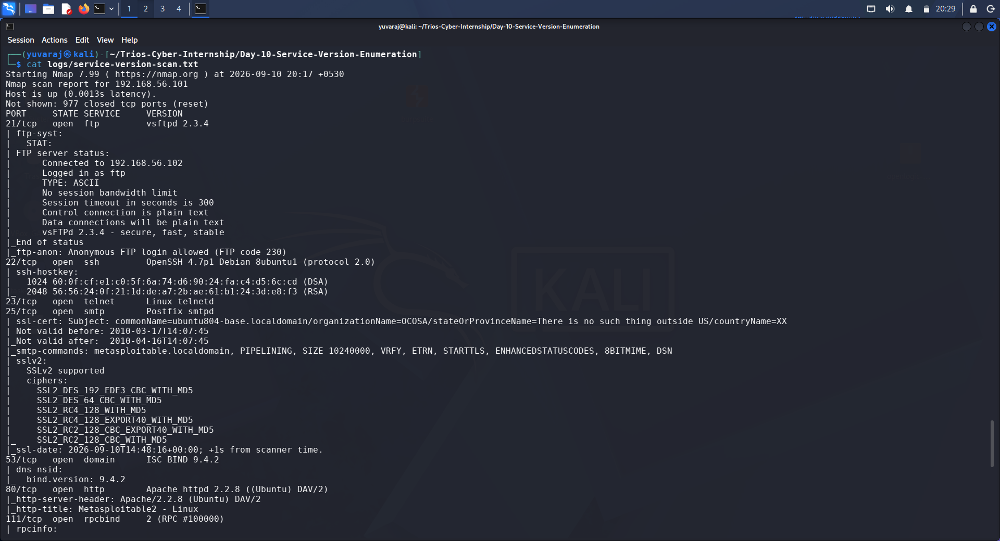
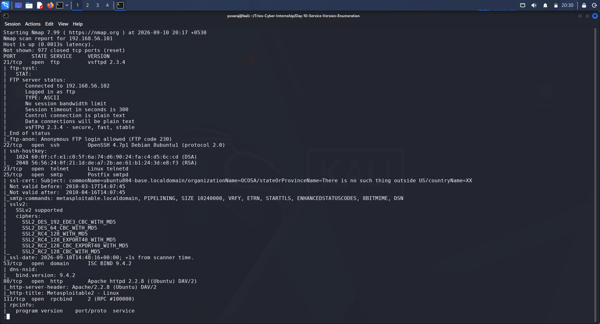
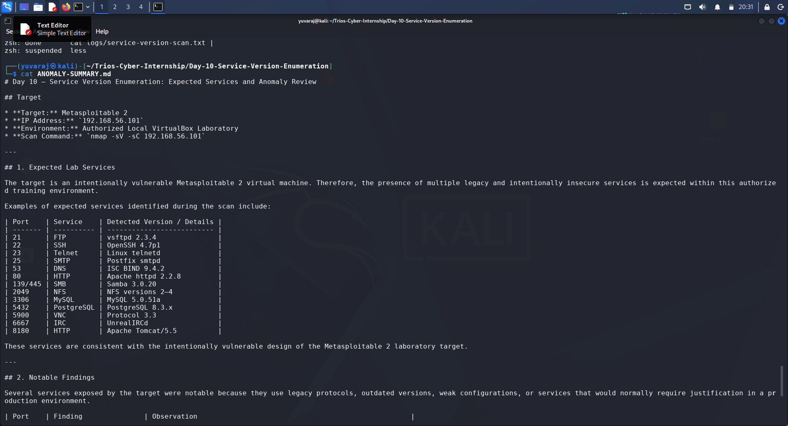

# Day 10 – Service Version Enumeration Report

## Trios Cyber Internship

**Assignment:** Service Version Enumeration
**Date:** 10 September 2026
**Target:** Metasploitable 2
**Target IP:** `192.168.56.101`
**Environment:** Authorized Local VirtualBox Laboratory
**Tool:** Nmap 7.99
**Status:** Completed

---

## 1. Objective

The objective of this assessment was to perform service and version enumeration against an authorized local laboratory target using Nmap.

The assessment focused on:

* Identifying open TCP services.
* Detecting the service and software versions running on those ports.
* Running Nmap's safe default NSE scripts.
* Reviewing service-specific information returned by the scripts.
* Building a technology and service inventory.
* Comparing the discovered services with the expected Metasploitable 2 laboratory attack surface.
* Identifying notable or anomalous services and configurations.
* Documenting the findings professionally.

No exploitation was performed as part of this assignment.

---

## 2. Scope and Authorization

Testing was performed exclusively against the intentionally vulnerable Metasploitable 2 virtual machine in the local VirtualBox laboratory environment.

| Item          | Details                                                |
| ------------- | ------------------------------------------------------ |
| Target        | Metasploitable 2                                       |
| IP Address    | `192.168.56.101`                                       |
| Scanner       | Kali Linux                                             |
| Scanner IP    | `192.168.56.102`                                       |
| Network       | VirtualBox Host-Only Network                           |
| Authorization | Local cybersecurity training laboratory                |
| Testing Type  | Service/version enumeration and safe default scripting |

The assessment was limited to the authorized laboratory target.

---

## 3. Methodology

The following Nmap command was used:

```bash
nmap -sV -sC 192.168.56.101
```

### Nmap Options

| Option    | Description                                |
| --------- | ------------------------------------------ |
| `-sV`     | Performs service and version detection     |
| `-sC`     | Runs Nmap's default NSE scripts            |
| Target IP | Specifies the authorized laboratory system |

The scan was executed from Kali Linux and the complete output was preserved as raw evidence in:

`logs/service-version-scan.txt`

---

## 4. Scan Result

The target was reachable and identified as an active Metasploitable 2 system.

The scan reported:

* **1 host up**
* **977 closed TCP ports**
* **23 open TCP ports**
* Multiple service and software versions
* Additional information from Nmap default NSE scripts

The target's MAC address was identified as an Oracle VirtualBox virtual NIC.

---

## 5. Discovered Service Inventory

| Port     | Service     | Version / Details                 |
| -------- | ----------- | --------------------------------- |
| 21/tcp   | FTP         | vsftpd 2.3.4                      |
| 22/tcp   | SSH         | OpenSSH 4.7p1 Debian 8ubuntu1     |
| 23/tcp   | Telnet      | Linux telnetd                     |
| 25/tcp   | SMTP        | Postfix smtpd                     |
| 53/tcp   | DNS         | ISC BIND 9.4.2                    |
| 80/tcp   | HTTP        | Apache httpd 2.2.8 (Ubuntu) DAV/2 |
| 111/tcp  | RPCbind     | RPC #100000                       |
| 139/tcp  | NetBIOS/SMB | Samba 3.X–4.X                     |
| 445/tcp  | SMB         | Samba 3.0.20-Debian               |
| 512/tcp  | rexec       | netkit-rsh rexecd                 |
| 513/tcp  | rlogin      | login service                     |
| 514/tcp  | rsh         | Netkit rshd                       |
| 1099/tcp | Java RMI    | GNU Classpath grmiregistry        |
| 1524/tcp | Bind shell  | Metasploitable root shell         |
| 2049/tcp | NFS         | Versions 2–4                      |
| 2121/tcp | FTP         | ProFTPD 1.3.1                     |
| 3306/tcp | MySQL       | 5.0.51a-3ubuntu5                  |
| 5432/tcp | PostgreSQL  | 8.3.0–8.3.7                       |
| 5900/tcp | VNC         | Protocol 3.3                      |
| 6000/tcp | X11         | Access denied                     |
| 6667/tcp | IRC         | UnrealIRCd                        |
| 8009/tcp | AJP13       | Apache Jserv Protocol v1.3        |
| 8180/tcp | HTTP        | Apache Tomcat 5.5                 |

---

## 6. Screenshot Evidence – Service and Version Detection

The following screenshot provides evidence of the Nmap service and version detection results.



**Figure 1:** Nmap `-sV -sC` service and version enumeration results.

---

## 7. Default NSE Script Findings

Nmap's default scripts provided additional service-level information.

### FTP

The scan reported that anonymous FTP login was allowed on port `21`.

### SMTP

The SMTP service exposed capabilities including:

* `PIPELINING`
* `VRFY`
* `ETRN`
* `STARTTLS`
* Other SMTP extensions

The default scripts also identified legacy SSLv2 support.

### RPC and NFS

RPC enumeration identified:

* `rpcbind`
* NFS
* `mountd`
* `nlockmgr`
* `status`

This demonstrated that additional RPC-associated services were available on the target.

### SMB

Samba was detected on ports `139` and `445`.

The default scripts identified:

* Computer name: `metasploitable`
* Domain: `localdomain`
* Samba version: `3.0.20-Debian`
* Authentication level: user
* Challenge-response support
* SMB message signing disabled
* SMB2 negotiation failure

### MySQL

The MySQL service on port `3306` was identified as version `5.0.51a-3ubuntu5`.

### VNC

The VNC service on port `5900` reported protocol version `3.3` and VNC authentication.

### Other Script Information

The scan also returned information related to SSH host keys, HTTP server details, Tomcat, X11, and other services.

---

## 8. Screenshot Evidence – Default Script Findings



**Figure 2:** Nmap default NSE script findings, including SMB security information and other service-level observations.

---

## 9. Expected Services vs. Notable Findings

Metasploitable 2 is intentionally designed as a vulnerable cybersecurity training system. Therefore, the presence of numerous legacy services and outdated software is expected within this laboratory.

### Expected Services

The following services were consistent with the known laboratory attack surface:

* FTP
* SSH
* Telnet
* SMTP
* DNS
* HTTP
* SMB
* RPC/NFS
* MySQL
* PostgreSQL
* VNC
* IRC
* Tomcat
* AJP

### Notable Security Observations

| Port    | Observation              | Security Relevance                                                                  |
| ------- | ------------------------ | ----------------------------------------------------------------------------------- |
| 21      | Anonymous FTP enabled    | Unauthenticated file access may expose resources                                    |
| 23      | Telnet exposed           | Legacy remote access protocol that does not provide modern encrypted administration |
| 25      | SSLv2 support detected   | Legacy cryptographic protocol                                                       |
| 445     | SMB signing disabled     | Reduces protection against certain SMB-related attacks                              |
| 512–514 | rexec/rlogin/rsh exposed | Legacy remote administration services                                               |
| 1524    | Bind shell identified    | Highly sensitive service intentionally present in the lab                           |
| 5900    | VNC protocol 3.3         | Legacy remote desktop protocol                                                      |
| 6000    | X11 exposed              | Remote display service identified, although access was denied                       |

These observations represent security concerns that would require review on a production system.

---

## 10. Screenshot Evidence – Service Inventory and Anomalies



**Figure 3:** Service inventory and anomaly assessment based on the Nmap results.

---

## 11. Anomaly Assessment

No unexpected services were identified relative to the known purpose of the Metasploitable 2 training environment.

However, the scan identified several services and configurations that would be considered significant security concerns in a modern production environment.

The most notable observations were:

1. Anonymous FTP access was enabled.
2. Telnet was exposed.
3. Legacy remote shell services were exposed on ports `512–514`.
4. A bind shell was exposed on port `1524`.
5. Multiple outdated software versions were identified.
6. SMB message signing was disabled.
7. Legacy SSLv2 support was detected.
8. Multiple database and remote administration services were exposed.

Because this system is specifically designed for security training, these conditions are expected and were documented for educational analysis.

---

## 12. Security Recommendations

If equivalent findings were identified on a production system, recommended actions would include:

* Disable unnecessary services.
* Replace Telnet and legacy remote-shell services with secure alternatives.
* Disable anonymous FTP unless explicitly required and controlled.
* Upgrade outdated server software and operating systems.
* Disable obsolete cryptographic protocols such as SSLv2.
* Review SMB security configuration and enable appropriate message signing where required.
* Restrict database services to trusted networks and hosts.
* Restrict remote administration services through appropriate network controls.
* Review exposed services regularly using authorized vulnerability-management processes.
* Apply least-privilege and network-segmentation principles.

These recommendations are provided as defensive security guidance and were not implemented against the laboratory target during this assessment.

---

## 13. Evidence Files

| Evidence                   | Location                                          |
| -------------------------- | ------------------------------------------------- |
| Raw Nmap scan              | `logs/service-version-scan.txt`                   |
| Service/version screenshot | `screenshots/01-nmap-service-version-scan.png`    |
| Default-script screenshot  | `screenshots/02-nmap-default-script-findings.png` |
| Service/anomaly screenshot | `screenshots/03-service-inventory-anomalies.png`  |
| Anomaly assessment         | `ANOMALY-SUMMARY.md`                              |
| Practical worksheet        | `SERVICE-VERSION-ENUMERATION-WORKSHEET.md`        |

---

## 14. Commands Executed

| Command                                                               | Purpose                                                |
| --------------------------------------------------------------------- | ------------------------------------------------------ |
| `nmap -sV -sC 192.168.56.101`                                         | Service/version detection and safe default NSE scripts |
| `nmap -sV -sC 192.168.56.101 \| tee logs/service-version-scan.txt`    | Execute the scan while preserving raw output           |
| `grep -E '^[0-9]+/tcp[[:space:]]+open' logs/service-version-scan.txt` | Extract the discovered open TCP service inventory      |
| `cat logs/service-version-scan.txt`                                   | Review saved scan evidence                             |
| `cat ANOMALY-SUMMARY.md`                                              | Review the service/anomaly assessment                  |

---

## 15. Learning Outcomes

This assessment demonstrated practical understanding of:

* Nmap service and version detection.
* Nmap default NSE scripts.
* Service fingerprinting.
* Port-to-service mapping.
* Version identification.
* Interpretation of service-specific enumeration results.
* Building a technology/service inventory.
* Comparing observed services against an expected laboratory attack surface.
* Identifying security-relevant configurations.
* Maintaining raw evidence and supporting documentation.

---

## 16. Conclusion

The Day 10 Service Version Enumeration assessment was successfully completed against the authorized Metasploitable 2 laboratory target.

Nmap identified **23 open TCP services** and provided detailed service/version information. The default NSE scripts supplied additional information about FTP, SMTP, RPC/NFS, SMB, MySQL, VNC, and other services.

The discovered services were consistent with the intentionally vulnerable design of the Metasploitable 2 training environment. Several services and configurations were nevertheless identified as security concerns that would require remediation or restriction in a production environment.

The assessment was performed strictly within the authorized local laboratory environment. No exploitation or intrusive testing was performed.

**Assessment Status: Completed**
