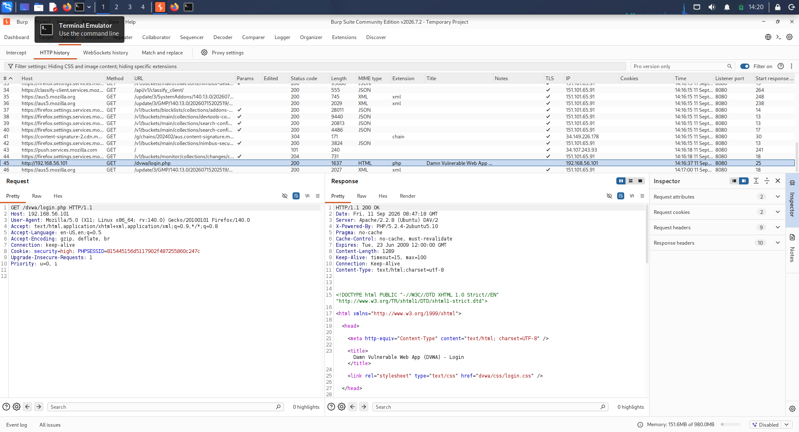
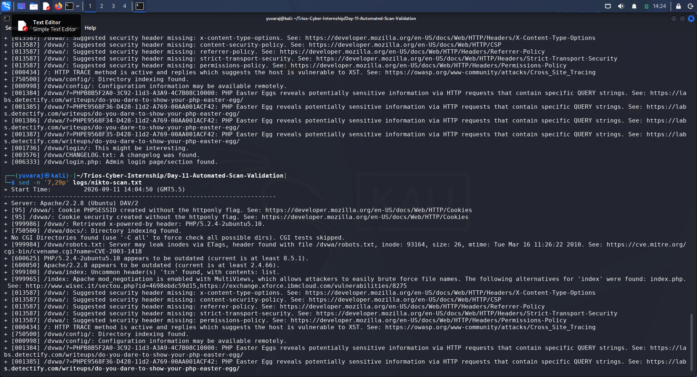
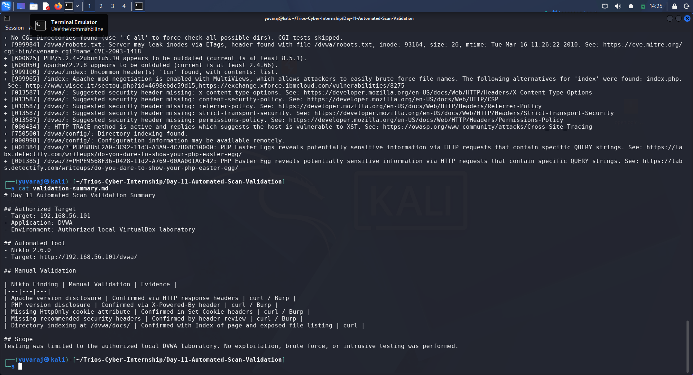

# Day 11 — Automated Scan Validation

## Trios Cyber Internship

**Assessment:** Automated Scan Validation  
**Date:** 11 September 2026  
**Target:** 192.168.56.101  
**Application:** DVWA  
**Environment:** Authorized local VirtualBox laboratory  
**Status:** Completed

---

## 1. Executive Summary

This assessment focused on validating automated web-security scanning results against an authorized local DVWA laboratory environment.

Nikto 2.6.0 was used to perform automated web-server and application reconnaissance against the DVWA HTTP service. Selected findings were subsequently reviewed manually using curl and Burp Suite to determine whether the observations were visible in actual HTTP responses.

The exercise demonstrated the importance of validating automated scanner findings rather than treating every scanner output as independently confirmed evidence.

The Nikto scan was manually interrupted after sufficient meaningful findings had been collected. Therefore, the results documented in this report represent findings observed during the available scan period and should not be considered an exhaustive assessment.

---

## 2. Scope and Authorization

Testing was performed exclusively against the authorized local VirtualBox laboratory environment.

| Item | Details |
|---|---|
| Scanner | Kali Linux |
| Scanner IP | 192.168.56.102 |
| Target IP | 192.168.56.101 |
| Target Application | DVWA |
| Protocol | HTTP |
| Port | 80 |
| Automated Tool | Nikto 2.6.0 |
| Manual Tools | Burp Suite, curl |

No external systems were targeted.

No brute-force attacks, credential attacks, exploitation, denial-of-service activity, or intrusive testing were performed.

---

## 3. Objectives

The objectives of this assessment were:

1. Perform automated web-security reconnaissance using Nikto.
2. Identify potentially relevant server and application configuration issues.
3. Review HTTP response headers manually.
4. Validate selected automated findings using curl and Burp Suite.
5. Document the relationship between automated findings and manually confirmed observations.
6. Preserve command output and screenshot evidence for assessment reporting.

---

## 4. Methodology

The assessment followed this workflow:

1. Confirmed HTTP accessibility of the authorized DVWA target.
2. Ran Nikto against the DVWA application.
3. Saved the scanner output to a raw log file.
4. Reviewed selected Nikto findings.
5. Captured an HTTP request and response through Burp Suite.
6. Manually reviewed response headers using curl.
7. Directly requested the `/dvwa/docs/` directory to validate directory indexing.
8. Compared selected automated findings against manual observations.
9. Preserved screenshots and supporting logs.

---

## 5. Target Verification

The target was first checked using curl:

    curl --noproxy '*' -I --max-time 5 http://192.168.56.101/dvwa/

The response identified the web server as Apache/2.2.8 (Ubuntu) DAV/2 and disclosed the PHP version through the X-Powered-By header.

The application redirected the request to `login.php`.

---

## 6. Automated Nikto Scan

### Command

    nikto -h http://192.168.56.101/dvwa/ | tee logs/nikto-scan.txt

### Scanner Information

- Nikto version: 2.6.0
- Target IP: 192.168.56.101
- Target port: 80
- Application path: `/dvwa/`

### Scan Limitation

The scan was manually interrupted after meaningful findings had been captured because the scan was taking longer than required for the assessment.

Accordingly, this report does not claim that the scan completed all available Nikto tests.

The raw scanner output has been preserved in:

`logs/nikto-scan.txt`

---

## 7. Automated Findings

The following observations were reported during the Nikto scan:

| Category | Finding |
|---|---|
| Server disclosure | Apache/2.2.8 (Ubuntu) DAV/2 |
| PHP disclosure | PHP/5.2.4-2ubuntu5.10 |
| Cookie configuration | `PHPSESSID` created without the `HttpOnly` flag |
| Cookie configuration | `security` cookie created without the `HttpOnly` flag |
| Directory indexing | `/dvwa/docs/` |
| Directory indexing | `/dvwa/config/` |
| Software age | Apache/2.2.8 reported as outdated |
| Software age | PHP/5.2.4 reported as outdated |
| Security headers | Multiple recommended headers reported missing |
| HTTP method | HTTP TRACE reported as active |
| Configuration exposure | `/dvwa/config/` reported as potentially exposing configuration information |
| Information exposure | `/dvwa/CHANGELOG.txt` identified |
| Login endpoint | `/dvwa/login.php` identified |

Nikto also reported an ETag-related inode disclosure observation associated with `/dvwa/robots.txt`, Apache MultiViews, an uncommon `tcn` header, and PHP Easter Egg-related observations.

---

## 8. Manual Validation

Selected findings were manually validated using HTTP response inspection.

### 8.1 Server Version Disclosure

The HTTP response included:

`Server: Apache/2.2.8 (Ubuntu) DAV/2`

**Result:** Confirmed.

---

### 8.2 PHP Version Disclosure

The HTTP response included:

`X-Powered-By: PHP/5.2.4-2ubuntu5.10`

**Result:** Confirmed.

---

### 8.3 Cookie Attribute Review

The response included `Set-Cookie` headers for the DVWA session and security cookies.

The observed cookie attributes did not include the `HttpOnly` attribute.

**Result:** Confirmed for the observed response.

The report does not infer additional cookie attributes that were not observed in the captured response.

---

### 8.4 Recommended Security Headers

The HTTP response was manually reviewed for the security headers reported by Nikto.

The following recommended headers were not observed in the response:

- X-Content-Type-Options
- Content-Security-Policy
- Referrer-Policy
- Strict-Transport-Security
- Permissions-Policy

**Result:** Confirmed for the reviewed HTTP response.

---

### 8.5 Directory Indexing

The `/dvwa/docs/` directory was requested directly.

The server returned:

`HTTP/1.1 200 OK`

The response page displayed:

`Index of /dvwa/docs`

and exposed the file:

`DVWA-Documentation.pdf`

**Result:** Confirmed.

The raw HTML response was preserved in:

`logs/manual-directory-index-validation.html`

---

## 9. Automated vs. Manual Validation

| Nikto Finding | Manual Validation | Result |
|---|---|---|
| Apache version disclosure | HTTP response headers reviewed | Confirmed |
| PHP version disclosure | X-Powered-By header reviewed | Confirmed |
| Missing HttpOnly cookie attribute | Set-Cookie headers reviewed | Confirmed |
| Missing recommended security headers | HTTP response headers reviewed | Confirmed |
| `/dvwa/docs/` directory indexing | Direct request showed Index of page and file listing | Confirmed |

This comparison demonstrates that selected automated observations were reproducible through direct HTTP inspection.

---

## 10. Evidence

### Screenshots

| Evidence | File |
|---|---|
| Burp manual request/response validation | `screenshots/01-burp-manual-validation.png` |
| Nikto automated findings | `screenshots/02-nikto-findings.png` |
| Automated vs. manual comparison | `screenshots/03-validation-comparison.png` |

### Logs and Supporting Files

| Evidence | File |
|---|---|
| Nikto raw scan output | `logs/nikto-scan.txt` |
| Manual HTTP header validation | `logs/manual-header-validation.txt` |
| Directory indexing response | `logs/manual-directory-index-validation.html` |
| Validation comparison | `validation-summary.md` |
| Assessment worksheet | `AUTOMATED-SCAN-VALIDATION-WORKSHEET.md` |

---

## 11. Security Observations

The assessment identified several security-relevant configuration observations in the intentionally vulnerable laboratory application.

The most significant observations included:

1. Legacy Apache and PHP versions were disclosed.
2. Session-related cookies were observed without the HttpOnly attribute.
3. Multiple recommended HTTP security headers were absent.
4. Directory indexing exposed the contents of `/dvwa/docs/`.
5. Directory indexing was also reported for `/dvwa/config/`.
6. HTTP TRACE was reported as active.
7. The server disclosed implementation details through HTTP response headers.

These observations demonstrate why minimizing information disclosure, securely configuring cookies and HTTP headers, disabling unnecessary directory indexing, and maintaining supported software versions are important defensive practices.

---

## 12. Recommendations

For a production environment, the following defensive improvements would be appropriate:

- Upgrade unsupported Apache and PHP versions to maintained releases.
- Remove unnecessary version-disclosure headers.
- Configure session cookies with appropriate security attributes, including `HttpOnly` and, where applicable, `Secure` and `SameSite`.
- Add appropriate security headers based on application requirements.
- Disable directory indexing unless explicitly required.
- Restrict access to configuration directories and sensitive application files.
- Disable unnecessary HTTP methods such as TRACE.
- Review exposed documentation and changelog files before deployment.
- Repeat automated scanning after remediation and manually validate important findings.

These recommendations are provided as defensive remediation guidance and were not performed against the laboratory target during this assessment.

---

## 13. Learning Outcomes

This assessment provided practical experience with:

- Automated web-security reconnaissance using Nikto.
- HTTP response inspection using curl.
- Request and response analysis using Burp Suite.
- Identifying information-disclosure issues.
- Validating automated scanner findings manually.
- Distinguishing scanner-reported observations from confirmed findings.
- Maintaining evidence and reproducible assessment records.
- Documenting limitations rather than overstating scan coverage.

---

## 14. Conclusion

The Day 11 Automated Scan Validation assessment was completed against the authorized local DVWA laboratory.

Nikto identified multiple configuration and information-disclosure observations. Selected findings were independently reviewed using curl and Burp Suite, with the reviewed Apache version, PHP version, cookie configuration, missing security headers, and `/dvwa/docs/` directory indexing manually confirmed.

The assessment demonstrates that automated security tools are valuable for efficient reconnaissance, but manual validation is essential for establishing reliable evidence and understanding the actual behavior of a target.

All relevant logs, screenshots, worksheet material, and validation evidence have been preserved in the Day 11 project directory.

---

## 15. Evidence Screenshots

### 15.1 Burp Manual Validation

### 15.2 Nikto Automated Findings

### 15.3 Automated vs. Manual Validation

