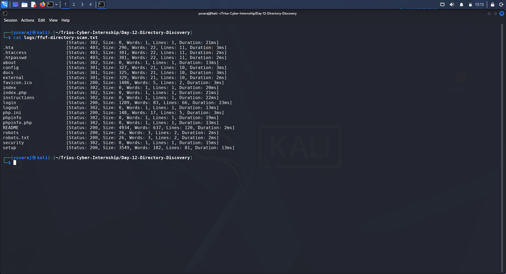
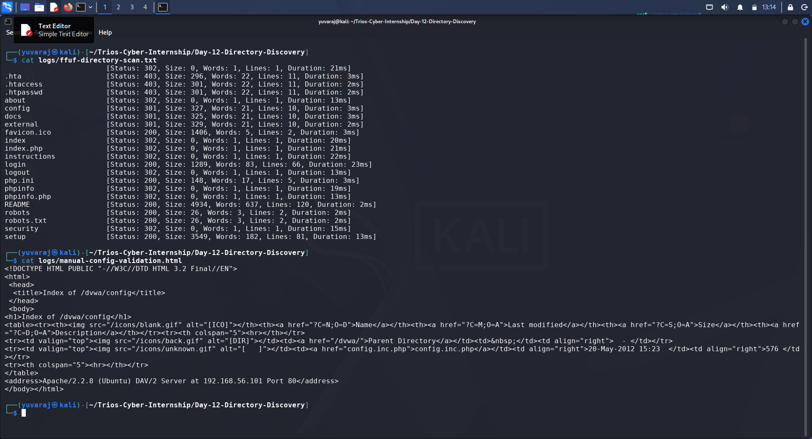
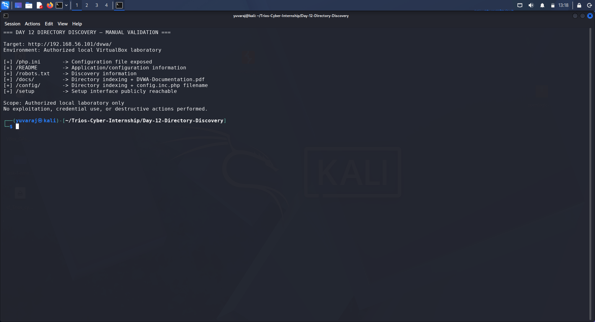

# Day 12 — Directory Discovery Report

## 1. Assessment Information

| Item | Details |
|---|---|
| Assignment | Directory Discovery |
| Organization | Trios Cyber |
| Day | 12 |
| Target | `http://192.168.56.101/dvwa/` |
| Application | Damn Vulnerable Web Application (DVWA) |
| Environment | Authorized local VirtualBox laboratory |
| Scanner | FFUF 2.1.0-dev |
| Wordlist | `/usr/share/dirb/wordlists/common.txt` |
| Scanner IP | `192.168.56.102` |
| Target IP | `192.168.56.101` |
| Date | 12 September 2026 |
| Status | Completed |

---

## 2. Executive Summary

This assessment focused on directory and file discovery against an authorized local DVWA laboratory environment.

FFUF was used to enumerate potentially interesting directories and files using the standard Dirb `common.txt` wordlist. HTTP response filtering was applied to focus on successful, redirect, and forbidden responses.

A total of 4,614 requests were completed with no scanning errors. Several interesting resources were identified, including configuration-related files, documentation directories, a setup interface, a README file, and other application endpoints.

Selected findings were manually validated using `curl`. The validation confirmed directory indexing at `/docs/` and `/config/`, direct access to `/php.ini`, application information disclosure through `/README`, and public access to the DVWA setup interface.

No exploitation, brute-force activity, credential use, destructive actions, or access to the contents of `config.inc.php` was performed.

---

## 3. Objective

The objectives of this assessment were to:

1. Perform directory and file discovery against an authorized local web application.
2. Use FFUF to identify accessible and interesting paths.
3. Filter HTTP responses to reduce irrelevant results.
4. Manually inspect selected findings.
5. Document security-relevant observations and supporting evidence.
6. Demonstrate how directory discovery can identify resources that increase an application's exposed attack surface.

---

## 4. Scope

### In Scope

- Target: `192.168.56.101`
- Application: DVWA
- URL: `http://192.168.56.101/dvwa/`
- Local VirtualBox laboratory environment
- Directory and file discovery
- Manual validation of selected discovered resources

### Out of Scope

- Internet-facing systems
- Unauthorized systems
- Credential attacks
- Brute-force attacks
- Exploitation
- Destructive testing
- Database modification
- Accessing the contents of exposed configuration credentials

---

## 5. Methodology

The assessment followed this workflow:

1. Confirmed the DVWA target was reachable.
2. Identified the FFUF installation and available wordlist.
3. Performed directory and file discovery using FFUF.
4. Filtered results to HTTP status codes `200`, `301`, `302`, and `403`.
5. Reviewed the discovered paths for potentially interesting resources.
6. Manually validated selected paths using `curl`.
7. Recorded raw scanner output and validation responses.
8. Captured screenshots as supporting evidence.
9. Documented the security relevance of the findings.

---

## 6. Target Verification

The target application was verified before directory discovery.

The target responded successfully and redirected the initial DVWA request toward the login interface.

The environment consisted of the Kali Linux scanner and the authorized local DVWA target hosted in the VirtualBox laboratory.

---

## 7. Automated Directory Discovery

### Tool

FFUF version:

`2.1.0-dev`

### Wordlist

`/usr/share/dirb/wordlists/common.txt`

### Discovery Command

    ffuf -w /usr/share/dirb/wordlists/common.txt -u http://192.168.56.101/dvwa/FUZZ -mc 200,301,302,403 -rate 25

### Scan Configuration

| Parameter | Value |
|---|---|
| Wordlist | `common.txt` |
| URL pattern | `/dvwa/FUZZ` |
| Matching codes | 200, 301, 302, 403 |
| Rate limit | 25 requests/second |
| Requests | 4,614 |
| Errors | 0 |

### Raw Evidence

- `logs/ffuf-directory-scan.json`
- `logs/ffuf-directory-scan.txt`

### Screenshot

---

## 8. Automated Discovery Results

The scan identified several accessible or interesting resources.

| Path | Status | Observation |
|---|---:|---|
| `.hta` | 403 | Forbidden resource |
| `.htaccess` | 403 | Forbidden configuration resource |
| `.htpasswd` | 403 | Forbidden authentication-related resource |
| `/about` | 302 | Redirected application endpoint |
| `/config` | 301 | Redirected directory |
| `/docs` | 301 | Redirected documentation directory |
| `/external` | 301 | Redirected directory |
| `/favicon.ico` | 200 | Accessible application resource |
| `/index` | 302 | Redirected application endpoint |
| `/index.php` | 302 | Redirected application entry point |
| `/instructions` | 302 | Redirected application endpoint |
| `/login` | 200 | Accessible login endpoint |
| `/php.ini` | 200 | PHP configuration resource exposed |
| `/phpinfo` | 302 | PHP information endpoint discovered |
| `/phpinfo.php` | 302 | PHP information endpoint discovered |
| `/README` | 200 | Application information exposed |
| `/robots` | 200 | Discovery information |
| `/robots.txt` | 200 | Discovery information |
| `/security` | 302 | Security configuration endpoint |
| `/setup` | 200 | Setup interface publicly reachable |

---

## 9. Manual Validation

Selected automated findings were manually inspected to determine whether they represented meaningful application exposure.

### 9.1 `/php.ini`

The `/php.ini` resource was directly accessible.

The response contained PHP configuration directives, including:

- `magic_quotes_gpc = Off`
- `allow_url_fopen on`
- `allow_url_include on`

This demonstrates that a configuration-related resource was accessible through the web server.

**Security relevance:** Configuration-file exposure can disclose implementation details and configuration settings that may assist further assessment.

**Evidence:**

`logs/manual-php-ini-validation.txt`

---

### 9.2 `/robots.txt`

The `/robots.txt` resource was directly accessible and returned:

`User-agent: *`

`Disallow: /`

This provides information about the application's crawler restrictions.

**Security relevance:** `robots.txt` is not an access-control mechanism. Its contents may reveal application paths or deployment information when used for discovery.

**Evidence:**

`logs/manual-robots-validation.txt`

---

### 9.3 `/README`

The `/README` resource was directly accessible and returned application documentation and configuration-related information.

The response contained information about the DVWA application, installation, configuration, and laboratory setup.

**Security relevance:** Public documentation can disclose implementation and configuration information that may help an attacker understand the application environment.

No credentials disclosed by the file were used during this assessment.

**Evidence:**

`logs/manual-readme-validation.txt`

---

### 9.4 `/docs/`

The `/docs/` directory was manually inspected and confirmed to have directory indexing enabled.

The response displayed:

`Index of /dvwa/docs`

and exposed:

`DVWA-Documentation.pdf`

**Security relevance:** Directory indexing can disclose files and application documentation that were not necessarily intended to be directly browsable.

**Evidence:**

`logs/manual-docs-validation.html`

---

### 9.5 `/config/`

The `/config/` directory was manually inspected and confirmed to have directory indexing enabled.

The listing exposed the filename:

`config.inc.php`

The configuration file itself was **not accessed or downloaded**.

**Security relevance:** Exposing configuration filenames can reveal application structure and may increase the information available to an unauthorized user. Directory indexing should generally be disabled for configuration directories.

**Evidence:**

`logs/manual-config-validation.html`

### Supporting Screenshot

---

### 9.6 `/setup`

The `/setup` endpoint was directly accessible and displayed the DVWA database setup interface.

The page disclosed:

- DVWA version information
- Database setup functionality
- MySQL as the backend database
- Reference to the configuration file
- Current DVWA security level
- PHPIDS status

No database reset or state-changing operation was performed.

**Security relevance:** Publicly accessible setup or administrative interfaces can increase the application's attack surface and should normally be restricted or removed in production environments.

**Evidence:**

`logs/manual-setup-validation.html`

---

## 10. Validation Summary

| Finding | Automated Discovery | Manual Validation | Security Relevance |
|---|---:|---:|---|
| `/php.ini` exposed | Yes | Confirmed | Configuration disclosure |
| `/README` exposed | Yes | Confirmed | Information disclosure |
| `/robots.txt` exposed | Yes | Confirmed | Discovery information |
| `/docs/` indexing | Yes | Confirmed | Directory/file disclosure |
| `/config/` indexing | Yes | Confirmed | Configuration filename disclosure |
| `/setup` exposed | Yes | Confirmed | Administrative/setup attack surface |

### Evidence Summary

---

## 11. Security Observations

The assessment demonstrated that directory discovery can reveal more than ordinary application pages.

The most significant observations were:

1. **Directory indexing at `/docs/`**
   - Documentation files were directly listed.

2. **Directory indexing at `/config/`**
   - The sensitive configuration filename `config.inc.php` was exposed.

3. **Direct exposure of `/php.ini`**
   - PHP configuration directives were accessible through the web server.

4. **Public `/README`**
   - Application and configuration-related information was disclosed.

5. **Public `/setup` interface**
   - Database setup functionality and implementation information were accessible.

These resources increase the amount of information available to an unauthorized visitor and can make subsequent reconnaissance easier.

---

## 12. Recommendations

The following defensive measures are recommended for a production web application:

### 12.1 Disable Directory Indexing

Disable directory listing on directories containing application documentation, configuration files, backups, or other non-public resources.

### 12.2 Restrict Configuration Files

Configuration files and configuration directories should not be directly accessible through the web server.

### 12.3 Remove Development Documentation

Files such as `README`, installation documentation, and development artifacts should not be exposed unnecessarily in production.

### 12.4 Restrict Setup and Administrative Interfaces

Setup, installation, and administrative functionality should be disabled, removed, or protected by appropriate access controls after deployment.

### 12.5 Review Web Server Configuration

Web server rules should prevent direct access to sensitive configuration and development resources.

### 12.6 Apply Least-Exposure Principles

Only resources required for normal application functionality should be publicly accessible.

---

## 13. Evidence Files

### Scanner Output

- `logs/ffuf-directory-scan.json`
- `logs/ffuf-directory-scan.txt`

### Manual Validation

- `logs/manual-php-ini-validation.txt`
- `logs/manual-robots-validation.txt`
- `logs/manual-readme-validation.txt`
- `logs/manual-docs-validation.html`
- `logs/manual-config-validation.html`
- `logs/manual-setup-validation.html`

### Screenshots

- `screenshots/01-ffuf-directory-discovery.png`
- `screenshots/02-manual-interesting-path.png`
- `screenshots/03-discovery-validation-summary.png`

### Supporting Documentation

- `DIRECTORY-DISCOVERY-WORKSHEET.md`
- `discovery-summary.md`

---

## 14. Learning Outcomes

This exercise demonstrated:

- How FFUF performs web directory and file discovery.
- How wordlists are used during content discovery.
- How HTTP status-code filtering reduces scan noise.
- How automated findings can be manually validated.
- Why directory indexing can expose sensitive application resources.
- Why configuration and development files should not be publicly accessible.
- How reconnaissance contributes to understanding an application's attack surface.
- The importance of maintaining a safe and authorized testing scope.

---

## 15. Scope and Safety Statement

All testing was performed against the authorized local DVWA laboratory environment.

No unauthorized systems were targeted.

No exploitation, brute-force activity, credential use, destructive actions, database modification, or access to the contents of the exposed `config.inc.php` file was performed.

The assessment was limited to directory discovery and non-destructive manual validation.

---

## 16. Conclusion

The Day 12 Directory Discovery assessment was completed successfully.

FFUF identified multiple accessible and interesting resources within the authorized DVWA application. Manual validation confirmed several meaningful information-disclosure and attack-surface observations, particularly directory indexing at `/docs/` and `/config/`, direct exposure of `/php.ini`, application information in `/README`, and public access to the setup interface.

The exercise demonstrated the value of combining automated discovery with manual validation to distinguish useful findings from routine application responses.

The complete technical evidence, screenshots, worksheet, raw scan output, validation logs, and this report have been documented in the Trios Cyber Internship repository.
