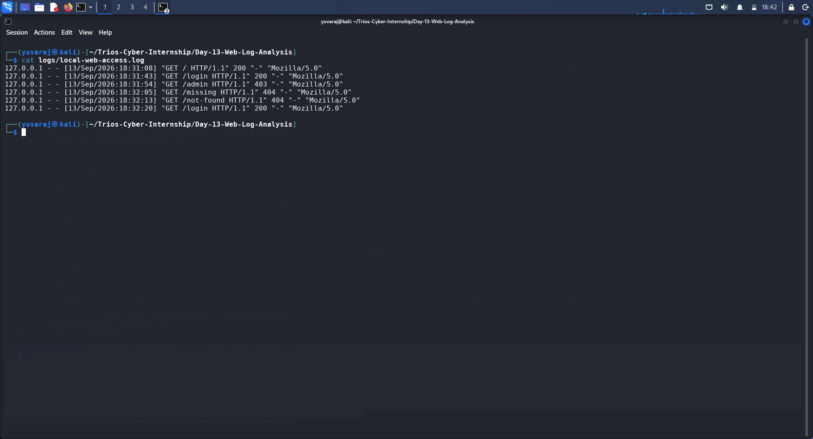
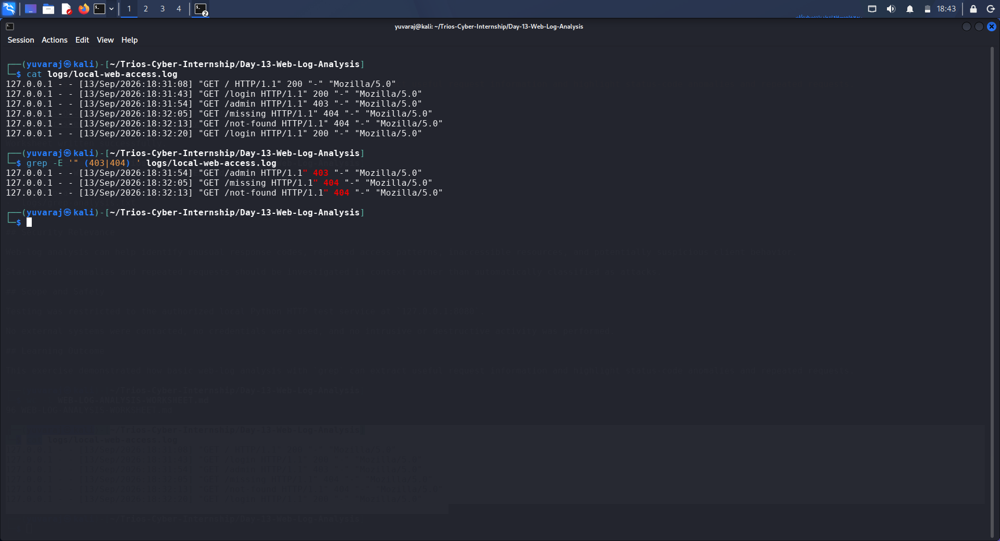
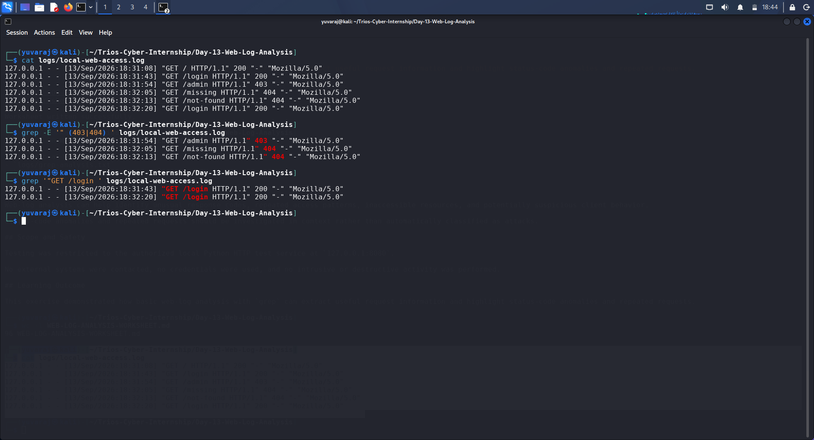

# Day 13 – Web Log Analysis Report

**Organization:** Trios Cyber  
**Assignment:** Day 13 – Web Log Analysis  
**Date:** 13 September 2026  
**Status:** Completed  
**Environment:** Authorized Local Laboratory  
**Client IP:** `127.0.0.1`  
**Test Service:** Local Python HTTP Test Service  
**Service Address:** `127.0.0.1:8080`  
**Analysis Tool:** `grep`

---

## 1. Executive Summary

This assessment focused on basic web access-log analysis using an authorized local HTTP test service.

Controlled HTTP requests were generated against a locally hosted Python web service. The resulting access log was reviewed to identify important request attributes including client IP address, HTTP request method, requested URL/path, HTTP status code, and User-Agent.

The log was then analyzed using `grep` to identify unusual status codes and repeated requests. The analysis identified one `403 Forbidden` response, two `404 Not Found` responses, and two requests to the `/login` endpoint.

Because all requests were intentionally generated as part of a controlled laboratory exercise, the observed repeated request and status-code anomalies were not classified as malicious activity. The exercise demonstrates how basic log analysis can help security analysts identify events that may require further investigation in a real environment.

---

## 2. Objective

The objectives of this assessment were to:

1. Generate HTTP requests against a local test service.
2. Capture the resulting web access-log entries.
3. Identify the client IP address.
4. Identify the HTTP request method.
5. Identify the requested URL/path.
6. Identify HTTP response status codes.
7. Identify the User-Agent.
8. Use `grep` to locate unusual status codes.
9. Identify repeated requests to the same endpoint.
10. Document the observations and their security relevance.

---

## 3. Scope and Authorization

Testing was restricted to the following authorized local environment:

- **Target:** `127.0.0.1:8080`
- **Service:** Local Python HTTP test service
- **Network Scope:** Localhost only
- **Analysis:** Locally generated access logs
- **Tool:** `grep`

No external systems were contacted.

No credentials were used, no authentication attacks were performed, and no intrusive or destructive activity was conducted.

---

## 4. Test Environment

| Component | Details |
|---|---|
| Operating System | Kali Linux |
| Web Service | Python local HTTP test service |
| Address | `127.0.0.1:8080` |
| Client IP | `127.0.0.1` |
| Log File | `logs/local-web-access.log` |
| Analysis Tool | `grep` |
| Python Version | 3.13.14 |

The local service was started using the project test-server script:

`python3 local_test_server.py`

The service confirmed that it was listening on:

`http://127.0.0.1:8080`

---

## 5. Methodology

The assessment followed these steps:

1. Start the local Python HTTP test service.
2. Generate controlled HTTP requests to different endpoints.
3. Record the resulting access-log entries.
4. Review the raw log file.
5. Use `grep` to identify `403` and `404` responses.
6. Use `grep` to identify repeated requests to `/login`.
7. Interpret the results in the context of the controlled laboratory.
8. Preserve the raw log and analysis output as evidence.

---

## 6. Request Generation

The following endpoints were accessed during the controlled exercise:

- `/`
- `/login`
- `/admin`
- `/missing`
- `/not-found`
- `/login`

The requests intentionally included different response conditions so that status-code and repeated-request analysis could be demonstrated.

The `/login` endpoint was requested twice to demonstrate how repeated requests can be identified from access logs.

---

## 7. Web Log Format

The generated log entries contain the following information:

| Field | Description |
|---|---|
| Client IP | IP address of the requesting client |
| Timestamp | Date and time of the request |
| HTTP Method | Request method used by the client |
| URL/Path | Requested resource |
| HTTP Version | HTTP protocol version |
| Status Code | Server response status |
| Response Size | Logged response-size field |
| User-Agent | Client software identification |

Example log structure:

`127.0.0.1 - - [timestamp] "GET /path HTTP/1.1" status "-" "User-Agent"`

---

## 8. Observed Requests

The raw access log contained six HTTP requests.

| # | Client IP | Method | Path | Status Code | User-Agent |
|---:|---|---|---|---:|---|
| 1 | `127.0.0.1` | GET | `/` | 200 | Mozilla/5.0 |
| 2 | `127.0.0.1` | GET | `/login` | 200 | Mozilla/5.0 |
| 3 | `127.0.0.1` | GET | `/admin` | 403 | Mozilla/5.0 |
| 4 | `127.0.0.1` | GET | `/missing` | 404 | Mozilla/5.0 |
| 5 | `127.0.0.1` | GET | `/not-found` | 404 | Mozilla/5.0 |
| 6 | `127.0.0.1` | GET | `/login` | 200 | Mozilla/5.0 |

---

## 9. Unusual Status-Code Analysis

The following command was used to identify `403` and `404` responses:

`grep -E '" (403|404) ' logs/local-web-access.log`

The analysis identified three entries.

### 9.1 HTTP 403 – Forbidden

The `/admin` endpoint returned:

`403 Forbidden`

A `403` response indicates that the server understood the request but refused to provide access to the requested resource.

In a production environment, repeated requests to restricted administrative resources could be worth investigating, particularly when associated with suspicious clients or unusual request patterns.

In this assessment, the request was intentionally generated for testing and therefore does not represent evidence of malicious behavior.

### 9.2 HTTP 404 – Not Found

Two requests returned `404 Not Found`:

- `/missing`
- `/not-found`

A `404` response indicates that the requested resource could not be found.

Repeated requests for multiple nonexistent or sensitive-looking paths can sometimes be associated with directory discovery, scanning, broken links, or application errors. However, a small number of `404` responses alone is not sufficient to classify activity as malicious.

---

## 10. Repeated Request Analysis

The following command was used to identify requests to the `/login` endpoint:

`grep '"GET /login ' logs/local-web-access.log`

The command identified two requests:

| Time | Client IP | Method | Path | Status |
|---|---|---|---|---:|
| 18:31:43 | `127.0.0.1` | GET | `/login` | 200 |
| 18:32:20 | `127.0.0.1` | GET | `/login` | 200 |

The two requests originated from the same local client IP and were approximately 37 seconds apart.

Repeated access to authentication-related endpoints can be security-relevant in real-world environments, especially when there are many requests, failed authentication attempts, unusual source addresses, or other correlated indicators.

In this controlled assessment, the two `/login` requests were intentionally generated and therefore were not treated as suspicious activity.

---

## 11. Security Relevance

Web access logs provide useful information for security monitoring and incident investigation.

Basic log analysis can help identify:

- Unauthorized or denied access attempts
- Requests for nonexistent resources
- Repeated access to sensitive endpoints
- Potential directory or resource discovery
- Suspicious client behavior
- Abnormal response-code patterns
- User-Agent differences
- Requests from unexpected IP addresses

Security analysts should avoid treating individual events as proof of an attack. Events should instead be correlated with frequency, timing, source IP, authentication results, application behavior, and other available telemetry.

---

## 12. Findings

### Finding 1 – Forbidden Resource Request

**Observation:** `/admin` returned HTTP `403`.

**Security Relevance:** Requests to restricted administrative resources may warrant investigation when they occur repeatedly or originate from unexpected clients.

**Assessment:** Not suspicious in this exercise because the request was intentionally generated.

---

### Finding 2 – Nonexistent Resource Requests

**Observation:** `/missing` and `/not-found` returned HTTP `404`.

**Security Relevance:** Multiple requests for nonexistent paths may indicate broken application references, automated discovery, scanning, or user error.

**Assessment:** Not suspicious in isolation because these paths were intentionally requested.

---

### Finding 3 – Repeated Login Endpoint Requests

**Observation:** `/login` was requested twice by `127.0.0.1`.

**Security Relevance:** Repeated authentication-endpoint access can become important when request volume is high or when combined with failed authentication attempts.

**Assessment:** The two requests were intentionally generated for this laboratory exercise and do not constitute evidence of malicious activity.

---

## 13. Recommendations

For a production web application, the following controls are recommended:

1. Centralize web access logs for security monitoring.
2. Monitor repeated requests to authentication and administrative endpoints.
3. Alert on abnormal volumes of `403` and `404` responses.
4. Correlate web logs with authentication and application logs.
5. Monitor unexpected or anomalous User-Agent values.
6. Establish baseline request patterns for normal application traffic.
7. Retain sufficient log history for incident investigation.
8. Use automated detection rules to identify significant deviations from normal behavior.

---

## 14. Evidence Files

The following evidence was collected for this assessment:

### Raw Log

`logs/local-web-access.log`

Contains the six generated HTTP access-log entries.

### Grep Analysis

`logs/grep-analysis.txt`

Contains the results of:

- Unusual status-code analysis
- Repeated `/login` request analysis

### Analysis Summary

`day13-analysis-summary.md`

Contains the structured findings and interpretation.

### Worksheet

`WEB-LOG-ANALYSIS-WORKSHEET.md`

Contains the completed Day 13 assessment worksheet.

---

## 15. Screenshot Evidence

### Screenshot 1 – Raw Web Access Log

Shows the complete generated access log containing client IP, timestamp, HTTP method, path, status code, and User-Agent.

### Screenshot 2 – Unusual Status-Code Analysis

Shows the `grep` analysis identifying the `403` and `404` responses.

### Screenshot 3 – Repeated Request Analysis

Shows the two `/login` requests identified through `grep`.
---

## 16. Limitations

This assessment was intentionally limited to a small number of locally generated HTTP requests.

The dataset was designed for demonstration and does not represent production traffic.

Therefore:

- The log volume was small.
- All requests were intentionally generated.
- No malicious traffic was introduced.
- No conclusions about real-world attack behavior can be made from this dataset alone.
- Repeated requests and unusual status codes were interpreted only within the laboratory context.

---

## 17. Learning Outcomes

This assessment demonstrated how to:

- Generate controlled HTTP requests.
- Understand the structure of web access logs.
- Extract client IP addresses.
- Identify HTTP methods and requested paths.
- Interpret HTTP response status codes.
- Identify repeated requests.
- Use `grep` for basic log analysis.
- Distinguish unusual events from confirmed malicious activity.
- Document security observations professionally.

---

## 18. Conclusion

The Day 13 Web Log Analysis assessment was successfully completed using an authorized local Python HTTP test service.

Six controlled HTTP requests were generated and analyzed. The investigation identified the client IP, request method, requested path, HTTP status code, and User-Agent for each request.

`grep` was then used to identify three unusual status-code entries and two repeated `/login` requests. These events were correctly treated as observations requiring context rather than automatically classified as malicious activity.

The raw logs, analysis output, worksheet, screenshots, and supporting documentation were preserved as evidence for the completed assessment.

**Assessment Status: Completed**
