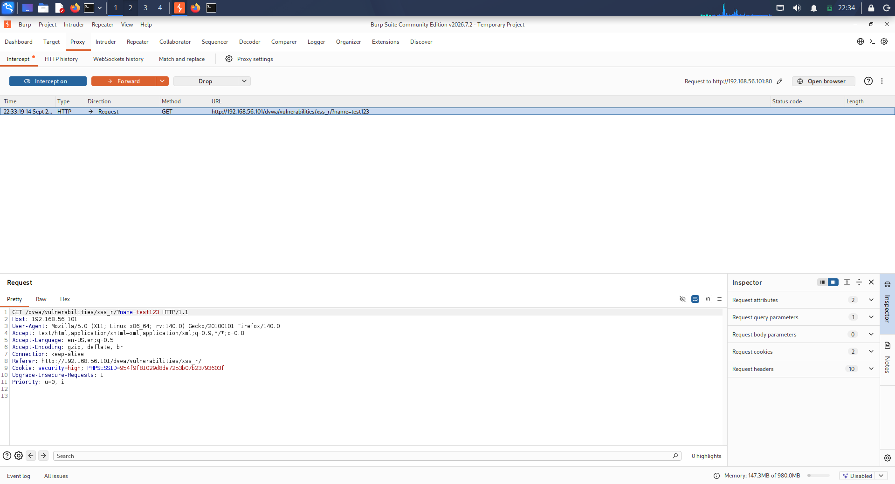
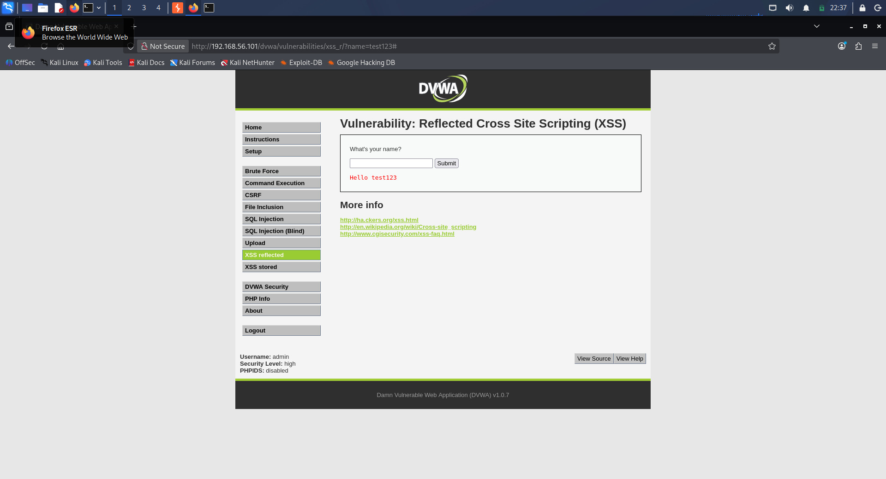
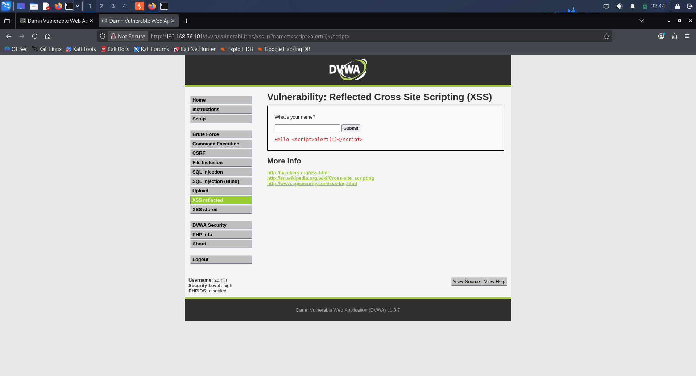
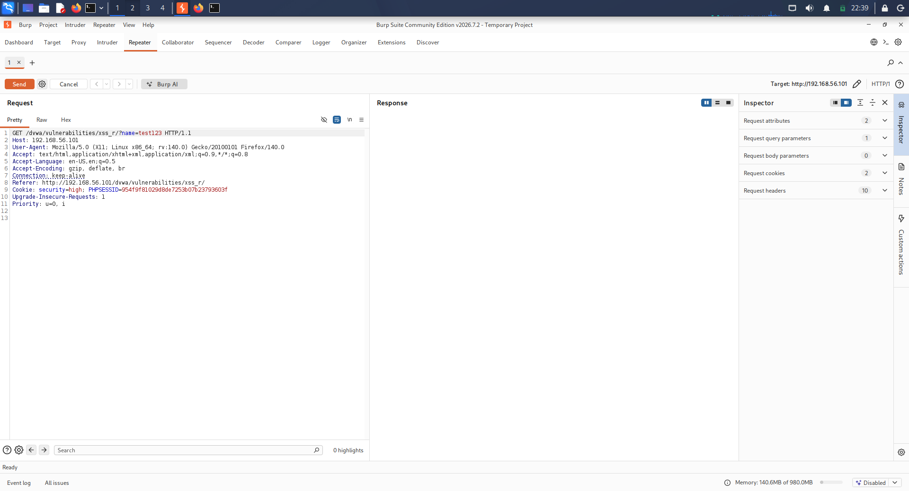
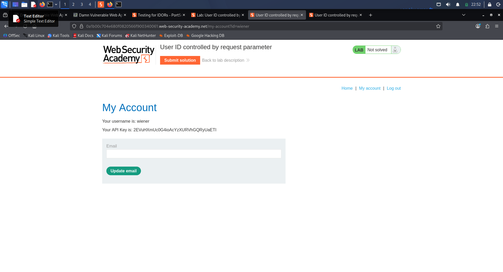
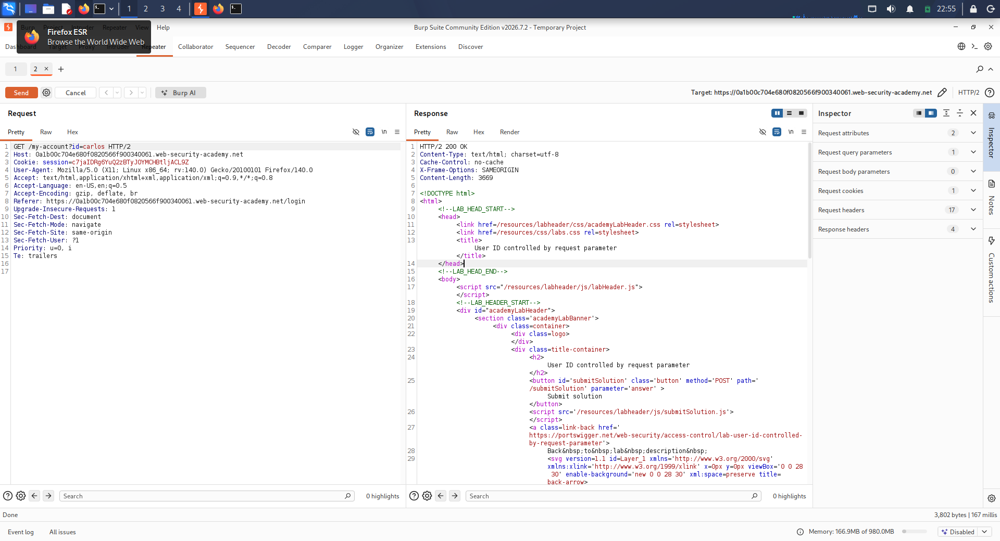

# Day 14 – XSS and Access-Control Testing Report

**Internship:** Trios Cyber
**Student:** Yuvaraj S
**Date:** 14 September 2026
**Status:** Completed

---

## 1. Executive Summary

Day 14 covered two beginner web-application security exercises: reflected Cross-Site Scripting (XSS) and access-control testing using an IDOR-style scenario. Testing was performed exclusively against intentionally vulnerable and authorized laboratory environments.

The first exercise used DVWA to identify a reflected XSS vulnerability. The name parameter reflected user-controlled input into the HTML response, and a harmless alert(1) proof of concept executed successfully in the browser.

The second exercise used a PortSwigger Web Security Academy temporary laboratory. An authenticated request for the authorized test account wiener was modified by changing the user-controlled id parameter to another laboratory user, carlos. The server returned HTTP 200 and disclosed Carlos account information, demonstrating an IDOR-style broken horizontal access-control condition.

---

## 2. Objectives

- Identify and demonstrate a beginner reflected XSS vulnerability.
- Capture the vulnerable input point and successful proof-of-concept evidence.
- Perform a beginner access-control / IDOR-style test.
- Compare an authorized users baseline request with a modified object identifier.
- Document security observations, impact, evidence, and recommended mitigations.

---

## 3. Scope and Authorization

Testing was restricted to the following authorized environments:

- DVWA hosted on the local VirtualBox laboratory at 192.168.56.101.
- PortSwigger Web Security Academy temporary laboratory: User ID controlled by request parameter.

No production systems, real third-party accounts, or unauthorized targets were tested.

---

## 4. Tools Used

| Tool | Purpose |
|---|---|
| Burp Suite | HTTP request interception, inspection, and modification |
| Firefox | Browser-based validation of application behavior and XSS execution |
| DVWA | Authorized vulnerable web-application laboratory |
| PortSwigger Web Security Academy | Authorized access-control laboratory |

---

## 5. Task 1 – Reflected Cross-Site Scripting

### 5.1 Target

- Application: DVWA
- Vulnerability: Reflected XSS
- Endpoint: `/dvwa/vulnerabilities/xss_r/`
- Vulnerable parameter: `name`

### 5.2 Initial Request

The initial request used a harmless test value:

`GET /dvwa/vulnerabilities/xss_r/?name=test123`

The application reflected the supplied value into the response as `Hello test123`.

### 5.3 Proof of Concept

The following harmless proof-of-concept payload was used:

``

The payload was reflected into the HTML response and executed by the browser, producing a JavaScript alert containing the value `1`.

### 5.4 Finding

**Finding:** Reflected Cross-Site Scripting (XSS)

**Affected parameter:** `name`

**Impact:** If an application reflects attacker-controlled input without appropriate output encoding, a crafted link or request can cause script content to execute in a victims browser. Depending on application context, XSS can affect confidentiality, session security, and user trust.

### 5.5 Evidence

---

## 6. Task 2 – Access Control / IDOR

### 6.1 Target

- Platform: PortSwigger Web Security Academy
- Lab: User ID controlled by request parameter
- Environment: Authorized temporary laboratory

### 6.2 Baseline Account

The lab-provided test account `wiener` was used for the authenticated baseline request.

Baseline request:

`GET /my-account?id=wiener`

The application returned the authenticated users own account information.

### 6.3 Modified Request

Only the user-controlled object identifier was changed:

`GET /my-account?id=carlos`

The modified request was sent using the same authenticated laboratory session.

### 6.4 Observed Result

The server returned `HTTP/2 200 OK` and the response contained account information identifying the requested user as `carlos`.

This demonstrated that the server trusted the user-supplied object identifier without adequately enforcing ownership or authorization for the requested account resource.

### 6.5 Finding

**Finding:** IDOR-style broken horizontal access control

**Affected parameter:** `id` in `/my-account?id=...`

**Impact:** An application with this weakness may allow an authenticated user to access resources belonging to another user by modifying an object identifier. This can lead to unauthorized disclosure or modification of user-specific information depending on the affected functionality.

### 6.6 Evidence

---

## 7. Evidence Summary

| Evidence | Observation | Result |
|---|---|---|
| XSS reflection request | `name=test123` accepted and reflected | Confirmed reflection |
| XSS proof of concept | `alert(1)` executed | XSS demonstrated |
| Account A | `id=wiener` returned wiener account | Baseline established |
| Account B | `id=carlos` returned Carlos account data | IDOR demonstrated |

---

## 8. Security Recommendations

### Reflected XSS

- Apply context-appropriate output encoding to all untrusted input before rendering it in HTML.
- Prefer framework-provided escaping mechanisms.
- Validate input according to expected business requirements.
- Deploy an appropriate Content Security Policy as an additional defense-in-depth control.

### IDOR / Access Control

- Enforce authorization checks on every object access server-side.
- Verify that the authenticated user is permitted to access the requested object.
- Avoid relying solely on user-controlled identifiers for authorization decisions.
- Test horizontal and vertical authorization boundaries during security testing.
- Log and monitor repeated unauthorized object-access attempts.

---

## 9. Safety and Testing Limitations

All activity was limited to authorized intentionally vulnerable laboratories.

- The XSS payload was a harmless `alert(1)` proof of concept.
- No real users or production systems were targeted.
- No brute-force activity was performed.
- No destructive or persistent actions were attempted.
- Sensitive lab account values such as API keys were not reproduced in this report.

The PortSwigger Academy interface remained marked as Not solved even after the controlled request returned Carlos account data. The report therefore records the observed technical behavior and does not claim completion of the Academy badge.

---

## 10. Learning Outcomes

- Learned how reflected XSS occurs when untrusted input is inserted into an HTML response without adequate encoding.
- Practiced identifying vulnerable parameters using Burp Suite.
- Learned how to safely validate XSS using a non-destructive proof of concept.
- Learned how to compare authenticated requests when testing horizontal access control.
- Understood how user-controlled object identifiers can expose IDOR vulnerabilities.
- Practiced documenting security findings with reproducible evidence and mitigation recommendations.

---

## 11. Conclusion

Day 14 demonstrated two important web-application security weaknesses in controlled laboratory environments. The DVWA exercise confirmed reflected XSS through a harmless browser alert, while the PortSwigger exercise demonstrated an IDOR-style access-control weakness by changing a user-controlled identifier and receiving another laboratory users account information.

The exercises strengthened practical skills in Burp Suite request analysis, vulnerability validation, evidence collection, and professional security reporting.
