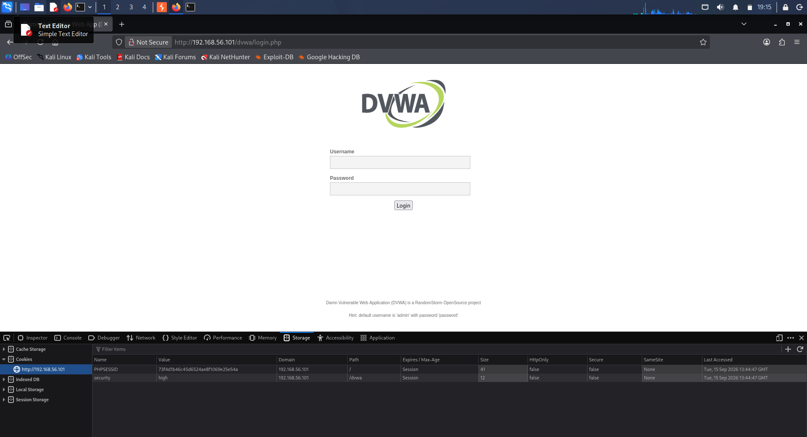
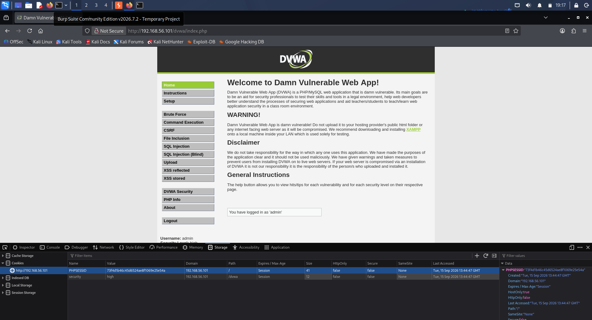
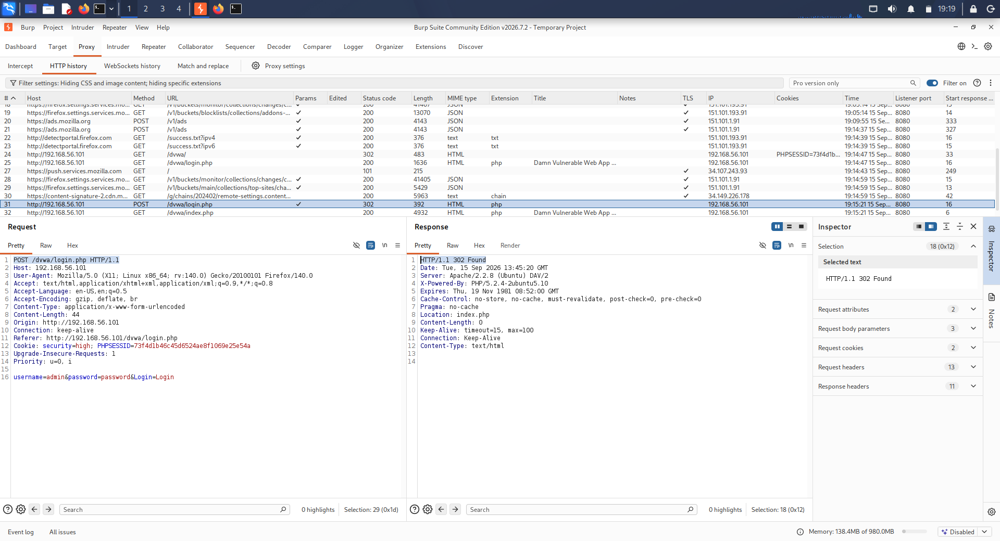
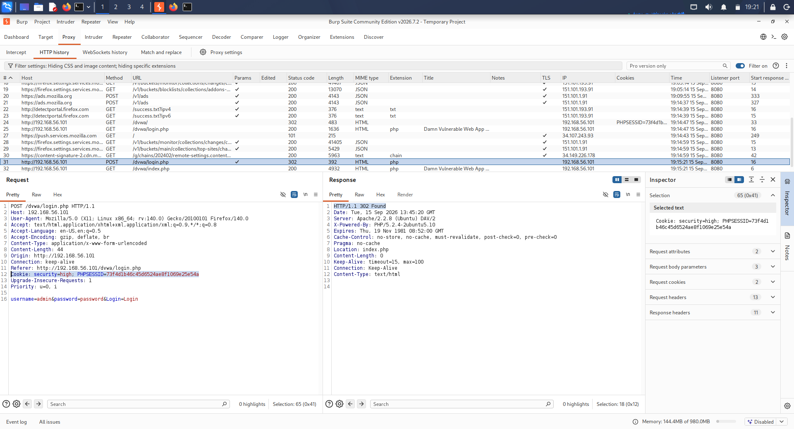

# Day 15 – Authentication Testing Report

## Trios Cyber Internship

**Student:** Yuvaraj S  
**Internship:** Trios Cyber  
**Day:** 15  
**Assessment:** Authentication Testing Lab  
**Date:** 15 September 2026  
**Status:** Completed

---

## 1. Executive Summary

This assessment focused on observing and documenting authentication and session-management behavior within an authorized local DVWA laboratory environment. Burp Suite was used to inspect the HTTP authentication workflow and compare the session cookie before and after successful authentication.

The login request was observed as a `POST` request to `/dvwa/login.php` and returned an `HTTP/1.1 302 Found` response following successful authentication. A `PHPSESSID` cookie was observed before authentication and again after authentication.

The session identifier remained unchanged across the authentication event. This represents a session-management observation that may be relevant to session fixation risks and should be reviewed against the application's complete session lifecycle and security controls.

No production systems, unauthorized targets, credential attacks, or brute-force activity were involved.

---

## 2. Objectives

The objectives of this assessment were to:

- Observe the authentication request and response.
- Identify the authentication endpoint.
- Examine session-cookie behavior before authentication.
- Examine session-cookie behavior after successful authentication.
- Compare the pre-authentication and post-authentication session identifiers.
- Confirm cookie usage in an authenticated request.
- Document potential session-management security considerations.
- Preserve professional evidence using screenshots and an evidence log.

---

## 3. Authorized Scope

| Item | Details |
|---|---|
| Application | Damn Vulnerable Web Application (DVWA) |
| Environment | Authorized local VirtualBox laboratory |
| Target | `192.168.56.101` |
| Application URL | `http://192.168.56.101/dvwa/` |
| Testing Tool | Burp Suite |
| Testing Type | Authentication and session-management observation |

Testing was restricted to the intentionally vulnerable local DVWA environment.

---

## 4. Tools Used

### Burp Suite

Burp Suite was used to intercept and inspect HTTP requests and responses associated with the authentication workflow.

### Firefox Developer Tools

Firefox Developer Tools were used to inspect the session cookie before and after authentication.

### DVWA

DVWA provided the intentionally vulnerable local web application used for the assessment.

---

## 5. Methodology

The assessment followed a controlled authentication-testing workflow:

1. Access the authorized local DVWA application.
2. Observe the session cookie before authentication.
3. Perform a legitimate login to the local test application.
4. Capture the authentication request and response using Burp Suite.
5. Observe the session cookie after successful authentication.
6. Compare the pre-authentication and post-authentication session identifiers.
7. Inspect a subsequent authenticated request.
8. Document the security observation and recommendations.
9. Preserve supporting screenshots and an evidence log.

Only the authorized local laboratory was used during testing.

---

## 6. Authentication Request

The authentication request observed in Burp Suite was:

    POST /dvwa/login.php HTTP/1.1

No passwords or sensitive credential values are reproduced in this report.

---

## 7. Authentication Response

The authentication response observed in Burp Suite was:

    HTTP/1.1 302 Found

The `302 Found` response indicated that the application redirected the browser following the authentication request.

The authentication request and response were preserved as supporting evidence in the Day 15 screenshot set.

---

## 8. Session Cookie Analysis

### 8.1 Before Authentication

A `PHPSESSID` cookie was observed before authentication.

The cookie value itself is intentionally omitted from this report to prevent disclosure of session information.

**Evidence:** `01-pre-authentication-cookie.png`

### 8.2 After Authentication

Following successful authentication, a `PHPSESSID` cookie was observed again.

The actual cookie value is intentionally omitted from the report.

**Evidence:** `02-post-authentication-cookie.png`

### 8.3 Session Identifier Comparison

The pre-authentication and post-authentication observations showed that the `PHPSESSID` value remained unchanged across the authentication event.

| Test Stage | Cookie | Observation |
|---|---|---|
| Before authentication | `PHPSESSID` | Session identifier observed |
| After authentication | `PHPSESSID` | Same session identifier observed |
| Comparison | `PHPSESSID` | No session-ID regeneration observed |

This is an important session-management observation because secure applications commonly regenerate session identifiers when a user transitions from an unauthenticated state to an authenticated state.

---

## 9. Authenticated Request

A subsequent authenticated request was inspected using Burp Suite.

The request contained a `Cookie` header carrying the `PHPSESSID` session cookie, confirming that the session identifier continued to be used after authentication.

The actual session-cookie value is intentionally excluded from this report.

**Evidence:** `04-authenticated-request-cookie.png`

---

## 10. Security Observation

The tested DVWA authentication flow did not regenerate the session identifier when authentication occurred.

Maintaining the same session identifier across authentication can be relevant to **session fixation** risks because, under certain application conditions, an attacker could attempt to cause a victim to authenticate using a session identifier known to the attacker.

However, the observation alone does **not** establish that a complete session-fixation attack is exploitable. Exploitability depends on the application's complete session lifecycle, including how session identifiers are created, accepted, protected, and invalidated.

Therefore, this assessment records the result as a **session-management weakness requiring further review**, rather than claiming a confirmed exploitable vulnerability.

---

## 11. Burp Suite Evidence

The authentication request and response were inspected using Burp Suite.

The captured authentication transaction showed:

- `POST /dvwa/login.php`
- HTTP authentication response: `302 Found`
- Successful authentication workflow
- Session cookie usage associated with the authenticated session

**Evidence:** `03-burp-authentication-request-response.png`

---

## 12. Security Recommendations

The following controls are recommended for secure authentication implementations:

1. **Regenerate the session identifier after successful authentication.**
2. **Invalidate the previous pre-authentication session identifier** where appropriate.
3. Configure session cookies with appropriate security attributes, including:
   - `Secure`
   - `HttpOnly`
   - Appropriate `SameSite` policy
4. Implement appropriate session expiration and timeout controls.
5. Invalidate the authenticated session during logout.
6. Avoid exposing session identifiers in URLs or other unnecessary client-visible locations.
7. Monitor and protect authentication-related session transitions.
8. Test the complete session lifecycle during security assessments.

---

## 13. Evidence Summary

| # | Evidence | Description |
|---|---|---|
| 1 | `01-pre-authentication-cookie.png` | PHPSESSID observed before authentication |
| 2 | `02-post-authentication-cookie.png` | PHPSESSID observed after authentication |
| 3 | `03-burp-authentication-request-response.png` | Burp Suite authentication request and 302 response |
| 4 | `04-authenticated-request-cookie.png` | PHPSESSID usage in an authenticated request |

---

## 14. Evidence Screenshots

### 14.1 Pre-Authentication Cookie

### 14.2 Post-Authentication Cookie

### 14.3 Burp Authentication Request and Response

### 14.4 Authenticated Request Cookie

---

## 15. Safety and Scope

Testing was performed exclusively against the authorized local DVWA laboratory.

No production systems, unauthorized targets, real user accounts, credential attacks, or brute-force attacks were used.

Sensitive authentication information, including passwords and actual session-cookie values, has intentionally been excluded from this report.

---

## 16. Learning Outcomes

This assessment provided practical experience with:

- Authentication request and response analysis.
- HTTP status-code interpretation.
- Burp Suite HTTP traffic inspection.
- Browser cookie inspection.
- Pre- and post-authentication session comparison.
- Identification of session-management weaknesses.
- Understanding the security relevance of session regeneration.
- Professional evidence collection and security documentation.

---

## 17. Conclusion

The Day 15 authentication assessment was successfully completed in the authorized DVWA laboratory using Burp Suite and Firefox Developer Tools.

The authentication workflow was identified as a `POST` request to `/dvwa/login.php`, followed by an `HTTP/1.1 302 Found` response. A `PHPSESSID` cookie was observed before and after authentication, and the session identifier remained unchanged across the authentication event.

The result was documented as a session-management observation with potential relevance to session fixation. The assessment does not claim exploitability based solely on the observed behavior.

The authentication workflow, session behavior, authenticated request, security observation, recommendations, and supporting evidence were documented for professional review.

---

**Assessment Status:** Completed  
**Environment:** Authorized Local DVWA Laboratory  
**Primary Tool:** Burp Suite  
**Evidence Set:** 4 screenshots + evidence log
