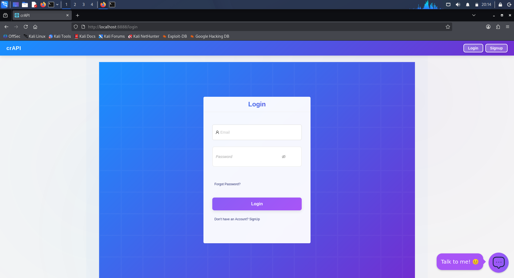
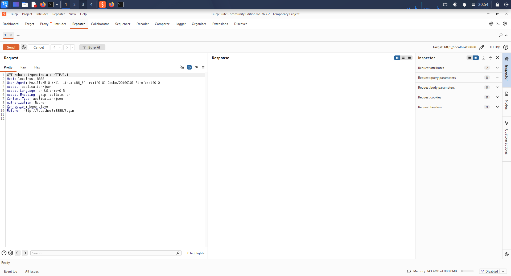
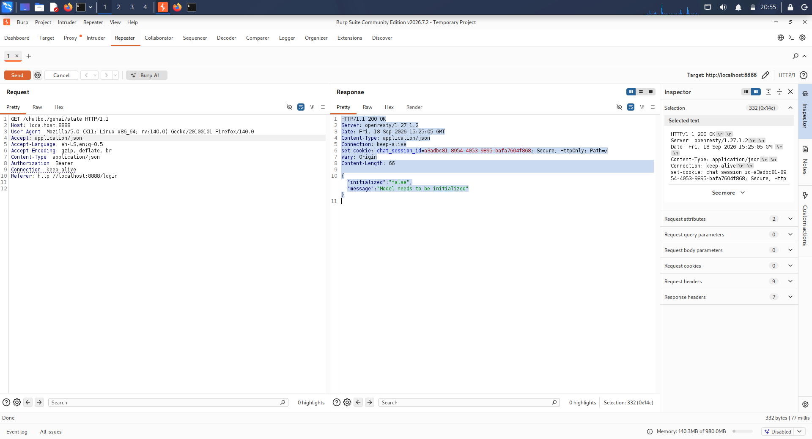
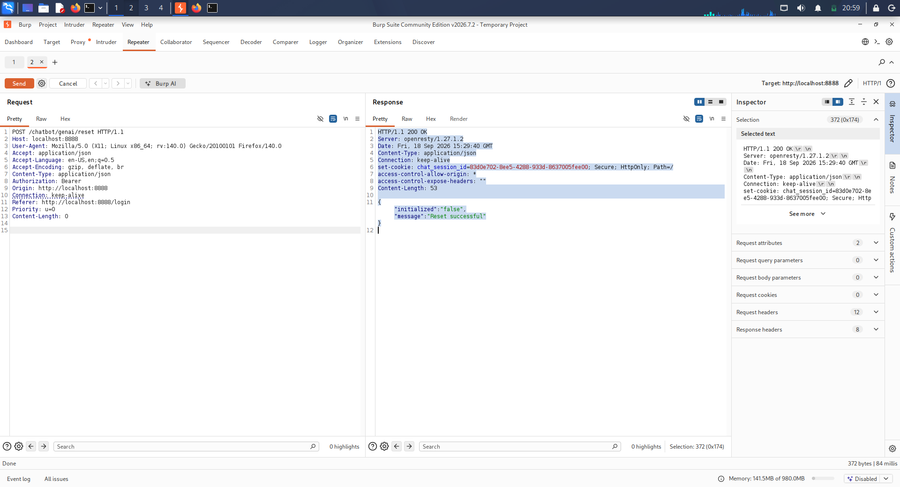
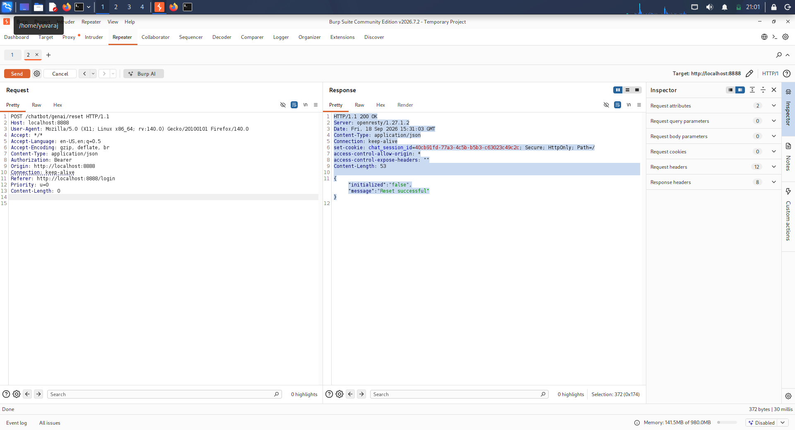

# Day 18 – API Testing Basics

**Organization:** Trios Cyber  
**Internship:** Cybersecurity Internship  
**Day:** 18  
**Date:** 18 September 2026  
**Task:** API Testing Basics  
**Tool:** Burp Suite  
**Lab Environment:** OWASP crAPI – Local Deliberately Vulnerable API

---

## 1. Objective

The objective of Day 18 was to perform basic API testing against a deliberately vulnerable API application using Burp Suite.

The testing focused on:

- Intercepting API traffic generated by the application.
- Identifying GET and POST API requests.
- Sending API requests through Burp Suite Repeater.
- Establishing baseline responses.
- Making safe changes to request headers.
- Comparing the resulting responses.
- Documenting observations with screenshots and an evidence log.

All testing was performed against a locally hosted OWASP crAPI training environment.

---

## 2. Lab Environment

| Component | Details |
|---|---|
| Application | OWASP crAPI |
| Purpose | Deliberately vulnerable API training |
| URL | `http://localhost:8888` |
| Testing Tool | Burp Suite |
| Browser | Mozilla Firefox |
| Testing Location | Local Kali Linux environment |

The crAPI application was hosted locally and accessed through Firefox. Burp Suite was configured as the interception proxy so that application API traffic could be inspected and replayed.

### Initial Application Evidence

**Figure 1:** Locally hosted crAPI application.

---

## 3. Burp Suite API Traffic Inspection

Burp Suite Proxy was used to observe HTTP traffic generated by the crAPI application.

During the initial inspection, Firefox background requests to external services were also visible. These were distinguished from the intended crAPI traffic by checking the destination host.

The relevant API requests were identified as requests to:

`localhost:8888`

The following endpoints were selected for controlled testing:

- GET `/chatbot/genai/state`
- POST `/chatbot/genai/reset`

---

## 4. GET Request Testing

### 4.1 Baseline GET Request

The following GET request was sent through Burp Suite Repeater without modification:

    GET /chatbot/genai/state HTTP/1.1
    Host: localhost:8888

The server returned:

    HTTP/1.1 200 OK
    Content-Type: application/json

Response:

    {"initialized":"false","message":"Model needs to be initialized"}

### Observation

The endpoint responded successfully with HTTP status `200 OK` and returned a JSON response describing the current chatbot state.

### Evidence

**Figure 2:** Baseline GET request and response in Burp Suite Repeater.

---

### 4.2 GET Request – Safe Header Modification

The `Accept` request header was changed as follows.

**Original:**

    Accept: */*

**Modified:**

    Accept: application/json

The request path and other request components were kept unchanged.

The server returned:

    HTTP/1.1 200 OK
    Content-Type: application/json

with the same JSON response:

    {"initialized":"false","message":"Model needs to be initialized"}

### Observation

The API accepted the modified `Accept` header and returned the same application-state response. No change in the HTTP status or response content was observed.

### Evidence

**Figure 3:** GET request after changing the `Accept` header.

---

## 5. POST Request Testing

### 5.1 Baseline POST Request

The following POST request was identified from crAPI traffic and sent through Burp Suite Repeater:

    POST /chatbot/genai/reset HTTP/1.1
    Host: localhost:8888
    Content-Type: application/json
    Content-Length: 0

The request contained no application data in the body.

The server returned:

    HTTP/1.1 200 OK
    Content-Type: application/json

Response:

    {"initialized":"false","message":"Reset successful"}

### Observation

The endpoint accepted the POST request and returned a successful JSON response.

### Evidence

**Figure 4:** Baseline POST request and response in Burp Suite Repeater.

---

### 5.2 POST Request – Safe Header Modification

The `Accept` request header was modified while leaving the request method, endpoint, and body unchanged.

**Original:**

    Accept: application/json

**Modified:**

    Accept: */*

The modified request returned:

    HTTP/1.1 200 OK
    Content-Type: application/json

Response:

    {"initialized":"false","message":"Reset successful"}

### Observation

The server accepted the modified `Accept` header and returned the same JSON response as the baseline request.

### Evidence

**Figure 5:** POST request after changing the `Accept` header.

---

## 6. GET and POST Comparison

| Test | Baseline | Safe Change | HTTP Result | Response Observation |
|---|---|---|---|---|
| GET `/chatbot/genai/state` | `Accept: */*` | `Accept: application/json` | `200 OK` | Same JSON response |
| POST `/chatbot/genai/reset` | `Accept: application/json` | `Accept: */*` | `200 OK` | Same JSON response |

The controlled header modifications did not produce a visible change in the application-level response for either tested endpoint.

---

## 7. Security Observations

The exercise demonstrated several fundamental API testing concepts:

1. **API traffic can be inspected through an intercepting proxy.** Burp Suite provided visibility into requests generated by the web application.

2. **HTTP methods identify the intended request operation.** GET and POST requests were observed and tested separately.

3. **Request headers can influence client-server communication.** The `Accept` header was modified safely to observe whether the response changed.

4. **Baseline comparison is important during API testing.** Establishing the original request and response provides a reference point for evaluating controlled changes.

5. **HTTP status codes provide useful response information.** Both tested requests returned `200 OK` during the controlled comparisons.

6. **Response content should also be compared.** In these tests, changing the `Accept` header did not change the returned JSON application response.

---

## 8. Testing Methodology

The testing followed a controlled workflow:

Application
↓
Firefox
↓
Burp Suite Proxy
↓
HTTP History
↓
Identify API Request
↓
Send to Repeater
↓
Baseline Request
↓
Safe Header Modification
↓
Compare Responses

Only safe request-header modifications were performed during the comparison tests. No destructive API operation was intentionally performed.

---

## 9. Evidence Inventory

| Evidence | Description |
|---|---|
| `01-crapi-initial-page.png` | Initial crAPI application |
| `02-get-request-baseline.png` | GET baseline request and response |
| `03-get-request-header-change.png` | GET request after safe header modification |
| `04-post-request-baseline.png` | POST baseline request and response |
| `05-post-request-header-change.png` | POST request after safe header modification |
| `logs/day18-evidence.txt` | Raw Day 18 testing evidence and observations |

---

## 10. Conclusion

Day 18 API Testing Basics was completed using Burp Suite against a locally hosted OWASP crAPI training environment.

The exercise demonstrated the process of identifying API traffic, sending GET and POST requests through Burp Suite Repeater, establishing baseline responses, performing safe request-header modifications, and comparing the resulting responses.

The tested GET and POST requests both returned `200 OK` after the controlled header changes, and their JSON response content remained unchanged.

The activity provided practical experience with basic API request inspection, HTTP methods, request headers, response analysis, and controlled API testing.

---

## 11. Ethical and Scope Statement

All testing documented in this report was performed against a deliberately vulnerable application hosted locally for cybersecurity training.

No unauthorized external systems were targeted. Testing was limited to the local OWASP crAPI environment and used controlled, non-destructive request modifications.

---

**Status:** Completed  
**Day 18:** API Testing Basics  
**Tool:** Burp Suite  
**Environment:** OWASP crAPI – Local Training Lab
