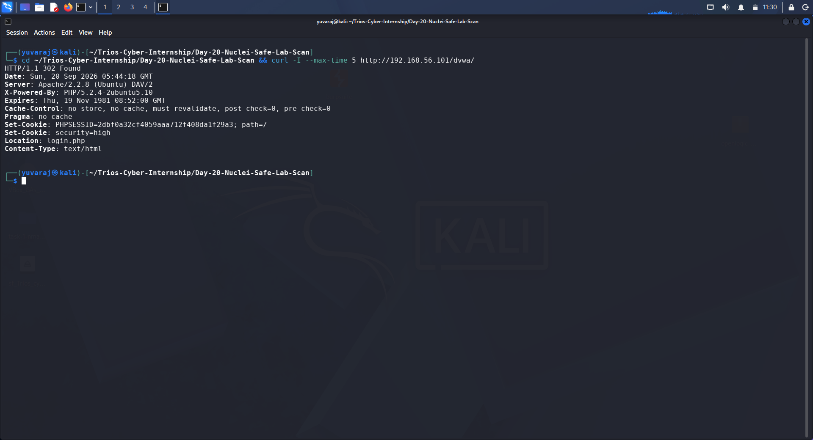
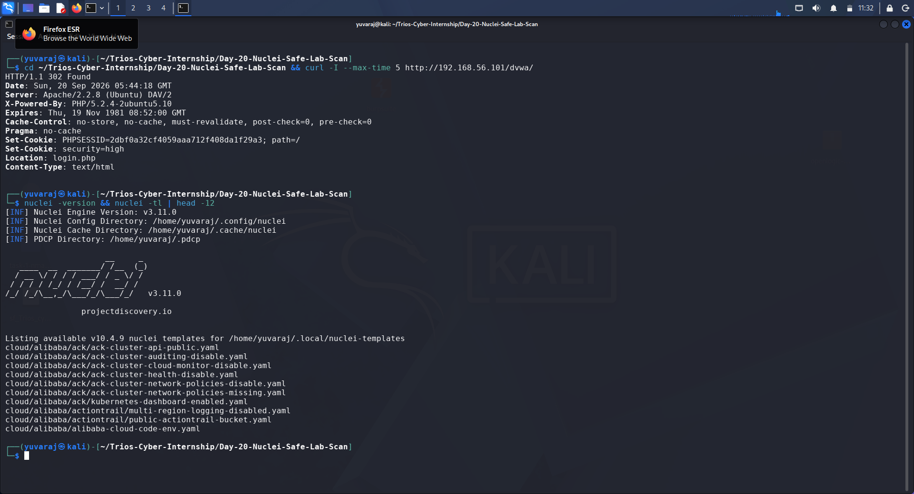
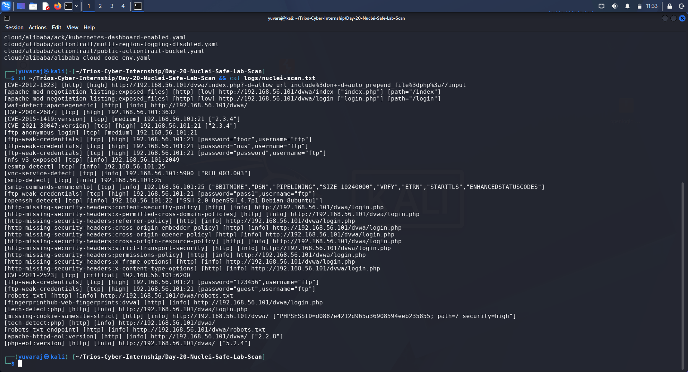
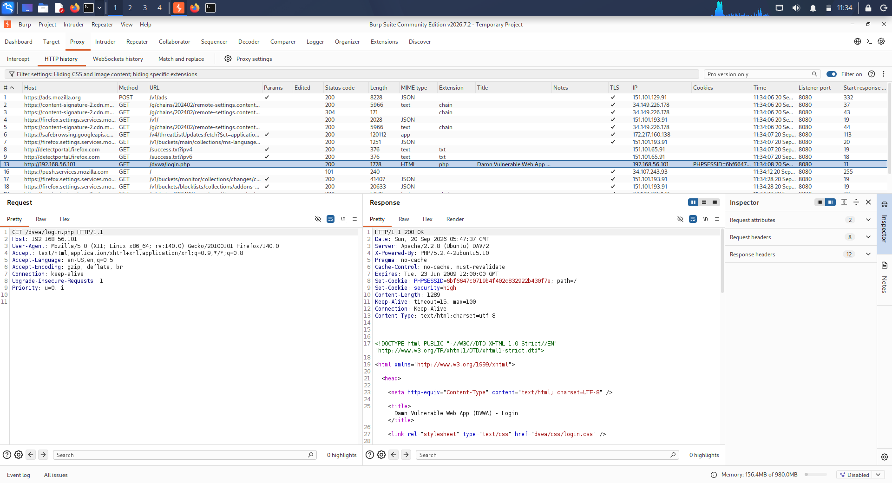
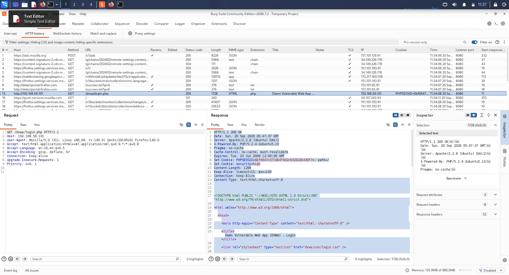
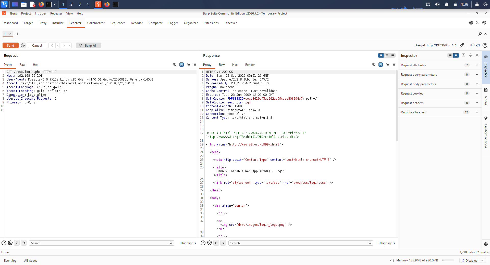

# Day 20 Report — Nuclei Safe Lab Scan

## 1. Assignment Overview

**Assignment:** Nuclei Safe Lab Scan  
**Internship:** Trios Cyber  
**Day:** 20  
**Status:** Completed  
**Target:** Authorized local DVWA training environment  
**Target URL:** `http://192.168.56.101/dvwa/`

The objective of this task was to perform a safe vulnerability and security-misconfiguration scan using Nuclei against an authorized intentionally vulnerable local laboratory target. At least one Nuclei result was then manually verified using Burp Suite.

## 2. Scope and Authorization

Testing was performed only against the authorized local DVWA intentionally vulnerable training environment at:

`http://192.168.56.101/dvwa/`

No public or third-party systems were targeted.

The activity was limited to reconnaissance and vulnerability identification using Nuclei, followed by manual verification of a reported HTTP security-header finding using Burp Suite.

## 3. Tools Used

| Tool | Purpose |
|---|---|
| Nuclei v3.11.0 | Automated vulnerability and security-misconfiguration detection |
| Burp Suite | Manual HTTP request and response inspection |
| curl | Initial target reachability verification |

## 4. Target Reachability

Before scanning, the DVWA target was checked using `curl`.

The target returned an HTTP response and redirected the request toward the DVWA login page, confirming that the authorized laboratory service was reachable.

**Evidence:** `screenshots/01-dvwa-target-reachable.png`

## 5. Nuclei Environment

The installed Nuclei version was verified as:

`v3.11.0`

The installed Nuclei templates were also inspected before running the scan. The environment reported the installed template version as `v10.4.9`.

The Nuclei template update command was also executed. It reported that no new template updates were available in the configured environment at the time of testing.

**Evidence:** `screenshots/02-nuclei-version-and-templates.png`

## 6. Nuclei Scan Methodology

The scan was executed against the authorized DVWA target using Nuclei.

Command used:

`nuclei -u http://192.168.56.101/dvwa/ -o logs/nuclei-scan.txt`

The scan completed successfully and produced a raw output file containing the detected findings.

The completed scan reported multiple findings covering HTTP security headers, technology detection, exposed services, and known vulnerabilities associated with the authorized laboratory host.

The raw scan output is preserved at:

`logs/nuclei-scan.txt`

**Evidence:** `screenshots/03-nuclei-scan-results.png`

## 7. Scan Observations

The Nuclei scan produced findings across multiple categories.

Notable observations included:

- A reported PHP-related CVE affecting the laboratory environment.
- Exposed file/directory information associated with Apache content negotiation.
- Missing HTTP security headers.
- Technology and software version detection.
- End-of-life software identification.
- Findings associated with additional network services exposed by the same authorized laboratory host.

These results were treated as observations from the automated scanner and were not assumed to be confirmed solely from the scan output.

The raw Nuclei results remain available in:

`logs/nuclei-scan.txt`

## 8. Manual Verification with Burp Suite

To satisfy the manual verification requirement, a Nuclei finding concerning the absence of the `X-Frame-Options` HTTP security header on the DVWA login page was selected.

The DVWA login request was located in Burp Suite HTTP history.

**Evidence:** `screenshots/04-burp-dvwa-login-request.png`

The corresponding HTTP response was then inspected.

**Evidence:** `screenshots/05-burp-login-response-headers.png`

The response headers included items such as:

`HTTP/1.1 200 OK`

`Server: Apache/2.2.8 (Ubuntu) DAV/2`

`X-Powered-By: PHP/5.2.4-2ubuntu5.10`

`Content-Type: text/html;charset=utf-8`

No `X-Frame-Options` header was present in the response.

This manually confirmed the Nuclei finding for the DVWA login page.

**Final verification evidence:** `screenshots/06-burp-manual-verification-x-frame-options.png`

## 9. Evidence Summary

| Evidence | Description |
|---|---|
| `01-dvwa-target-reachable.png` | Verified authorized DVWA target reachability |
| `02-nuclei-version-and-templates.png` | Recorded Nuclei version and template information |
| `03-nuclei-scan-results.png` | Captured completed Nuclei scan results |
| `04-burp-dvwa-login-request.png` | Captured DVWA login request in Burp HTTP history |
| `05-burp-login-response-headers.png` | Captured login response headers |
| `06-burp-manual-verification-x-frame-options.png` | Documented manual verification of missing `X-Frame-Options` |

Additional evidence and raw scan data are preserved in:

- `logs/day20-evidence.txt`
- `logs/nuclei-scan.txt`

## 10. Key Learning Outcomes

This exercise provided practical experience with:

1. Running Nuclei safely against an authorized laboratory target.
2. Understanding the role of Nuclei templates in automated security testing.
3. Preserving raw scanner output for later analysis.
4. Distinguishing automated findings from manually verified observations.
5. Using Burp Suite to inspect HTTP requests and response headers.
6. Verifying a missing security header manually.
7. Maintaining structured evidence for professional security documentation.
8. Performing security testing within an explicitly authorized scope.

## 11. Security and Scope Considerations

Nuclei can identify a broad range of vulnerabilities and configuration issues. Automated scanner results should therefore be reviewed and validated before being treated as confirmed vulnerabilities.

For this exercise, the testing scope was restricted to the authorized local DVWA environment. No testing was performed against systems outside the laboratory scope.

The manual verification demonstrated the importance of combining automated discovery with direct inspection of the affected HTTP behavior.

## 12. Conclusion

Day 20 successfully demonstrated a safe Nuclei-based security assessment workflow against an authorized local intentionally vulnerable target.

The scan results were preserved as raw evidence, and a reported missing `X-Frame-Options` security header was manually verified using Burp Suite. The methodology, observations, evidence, and learning outcomes have been documented in this report.

**Status: Completed**

# 13. Visual Evidence

## Evidence 01 — DVWA Target Reachability

## Evidence 02 — Nuclei Version and Templates

## Evidence 03 — Nuclei Scan Results

## Evidence 04 — Burp DVWA Login Request

## Evidence 05 — Burp Login Response Headers

## Evidence 06 — Manual X-Frame-Options Verification

