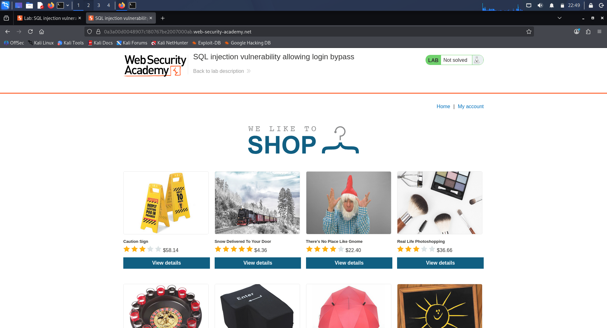
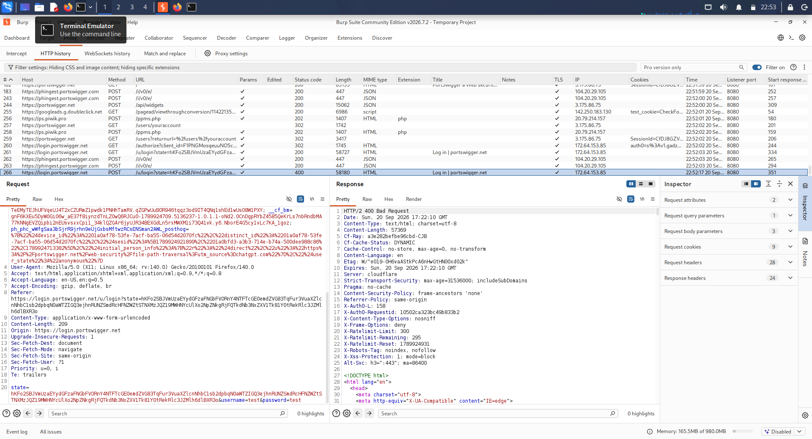
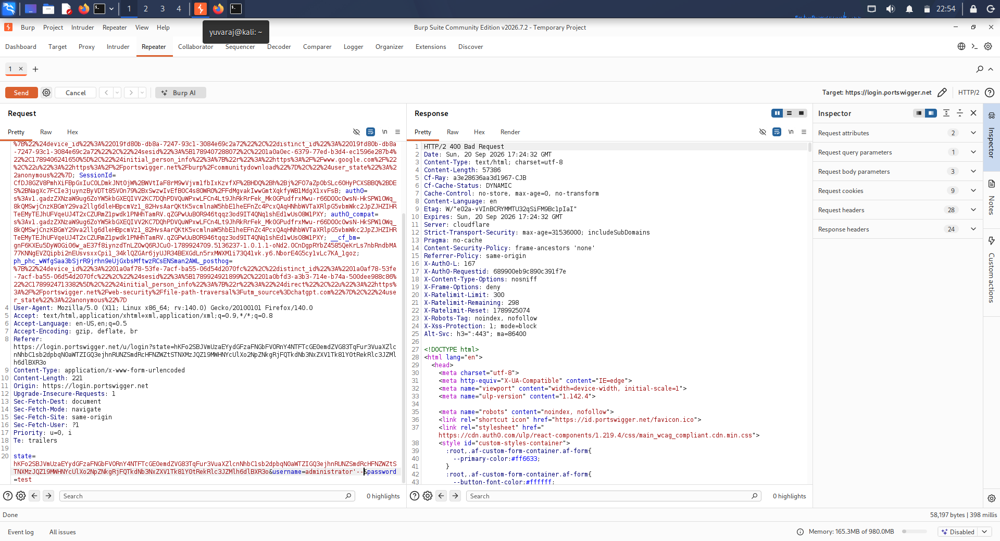
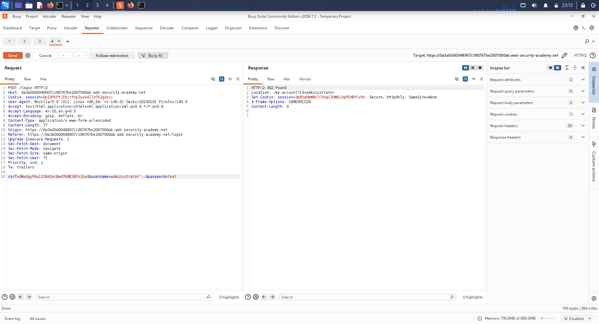

# Day 21 – PortSwigger SQL Injection Lab

## 1. Assignment Information

| Item | Details |
|---|---|
| Internship | Trios Cyber |
| Day | 21 |
| Assignment | PortSwigger SQLi Lab |
| Vulnerability | SQL Injection |
| Scenario | Authentication / Login Bypass |
| Platform | PortSwigger Web Security Academy |
| Tool | Burp Suite |
| Environment | Authorized Security Training Laboratory |
| Target | PortSwigger Web Security Academy SQL injection lab |

---

## 2. Objective

The objective of this exercise was to complete a beginner-level SQL injection laboratory and document the testing process using Burp Suite.

The exercise focused on identifying the login request, locating the username parameter, modifying the parameter with a SQL injection test payload, and analyzing the resulting HTTP response.

The activity was performed only against the authorized PortSwigger Web Security Academy training environment.

---

## 3. Scope

The testing scope was limited to the intentionally vulnerable PortSwigger Web Security Academy SQL injection laboratory.

The following activities were performed:

- Opened the assigned SQL injection lab.
- Submitted a normal login request.
- Captured the request using Burp Suite.
- Forwarded the request to Burp Repeater.
- Identified the `username` parameter.
- Tested the SQL injection payload `administrator'--`.
- Examined the resulting HTTP response.
- Preserved screenshots and raw testing notes.

No unauthorized systems were targeted.

---

## 4. SQL Injection Background

SQL injection is a web application vulnerability that can occur when user-controlled input is incorporated into SQL queries without appropriate parameterization or validation.

When an application constructs authentication queries unsafely, specially crafted input may alter the intended SQL logic. In vulnerable authentication implementations, this can result in authentication-bypass behavior.

This laboratory provided a controlled environment for observing this type of behavior using Burp Suite.

---

## 5. Tools and Environment

### Tool Used

**Burp Suite**

Burp Suite was used to:

- Intercept the login request.
- Inspect request parameters.
- Send the request to Repeater.
- Modify the `username` parameter.
- Send the modified request.
- Analyze the HTTP response.

### Training Platform

**PortSwigger Web Security Academy**

The exercise was conducted against the assigned intentionally vulnerable SQL injection training laboratory.
---

## 6. Methodology

### 6.1 Opened the SQL Injection Lab

The assigned SQL injection laboratory was opened in the browser and verified as the PortSwigger Web Security Academy training environment.

The lab contained an intentionally vulnerable login functionality for practicing SQL injection.

**Evidence:** `01-portswigger-sqli-lab-open.png`

### 6.2 Captured a Normal Login Request

A normal login attempt was submitted through the application's login form.

Burp Suite was used to capture and inspect the resulting HTTP request.

The captured request provided the structure required for controlled testing of the login parameters.

**Evidence:** `02-burp-normal-login-request.png`

### 6.3 Sent the Request to Burp Repeater

The captured request was forwarded to Burp Repeater.

Repeater allowed the request to be modified and resent while keeping the rest of the request structure under controlled conditions.

The `username` parameter was identified as the parameter selected for the SQL injection test.

### 6.4 Modified the Username Parameter

The `username` parameter was modified using the following test payload:

    administrator'--

The payload was entered only within the authorized training laboratory.

**Evidence:** `03-burp-sqli-login-bypass.png`

### 6.5 Sent and Analyzed the Modified Request

The modified request was sent from Burp Repeater.

The resulting HTTP response was inspected for changes in status code, redirect location, and session information.

---

## 7. Observed HTTP Response

The modified request produced the following significant HTTP response:

    HTTP/2 302 Found
    Location: /my-account?id=administrator
    Set-Cookie: session=<session-value>; Secure; HttpOnly; SameSite=None

The significant observation was the redirect:

    /my-account?id=administrator

The response therefore showed HTTP-level behavior consistent with the tested login-bypass condition.

**Evidence:** `04-burp-sqli-success-response.png`

Actual session-cookie values are intentionally not reproduced in this report.

---

## 8. Vulnerable Parameter

The parameter tested during the exercise was:

    username

The SQL injection test payload was:

    administrator'--

The password parameter was not used to carry the SQL injection payload.

The testing demonstrated why user-controlled authentication parameters must not be incorporated into SQL queries through unsafe string construction.

---

## 9. Evidence Summary

| Evidence | Description |
|---|---|
| `01-portswigger-sqli-lab-open.png` | PortSwigger SQL injection lab opened |
| `02-burp-normal-login-request.png` | Normal login request captured in Burp Suite |
| `03-burp-sqli-login-bypass.png` | Modified request containing the SQL injection test |
| `04-burp-sqli-success-response.png` | HTTP response showing administrator redirect |

---

## 10. Observations

The main observations from the exercise were:

1. The login functionality accepted a user-controlled `username` parameter.
2. The parameter could be modified through Burp Repeater.
3. The SQL injection test payload produced a different authentication-related response.
4. The server returned `HTTP/2 302 Found`.
5. The response redirected to `/my-account?id=administrator`.
6. A session cookie was returned by the application.
7. These observations provided HTTP-level evidence consistent with the intended SQL injection login-bypass behavior.

---

## 11. Security Impact

If similar SQL injection behavior existed in a real application, an attacker could potentially manipulate authentication-related database queries.

Depending on the application's query structure, successful exploitation could result in:

- Authentication bypass
- Unauthorized account access
- Access to privileged functionality
- Exposure or modification of application data

The actual impact depends on the application's database queries, privileges, authentication design, and other security controls.

---

## 12. Defensive Measures

The following controls can reduce the risk of SQL injection:

### 12.1 Parameterized Queries

Use prepared statements and parameterized queries instead of constructing SQL statements through string concatenation.

### 12.2 Input Validation

Validate input according to the expected format and application requirements.

### 12.3 Least-Privilege Database Access

The application's database account should have only the permissions required for its legitimate operations.

### 12.4 Secure Authentication Logic

Authentication queries should use parameterized database operations and should not directly incorporate untrusted user input into SQL statements.

### 12.5 Security Testing

Applications should be regularly tested for injection vulnerabilities using authorized security testing methods.

---

## 13. Ethical and Legal Scope

All testing documented in this report was performed against an intentionally vulnerable PortSwigger Web Security Academy training environment.

No unauthorized third-party systems were targeted.

The techniques documented here should only be used against systems for which explicit authorization has been provided.

---

## 14. Lab Completion Status

During final verification, the PortSwigger Academy interface continued to display:

**Not solved**

Therefore, this report does not claim that the Academy recorded the exercise as successfully completed.

The report documents the HTTP behavior observed through Burp Suite, the testing methodology, and the supporting evidence collected during the authorized exercise.

---

## 15. Conclusion

This exercise provided practical experience with SQL injection testing against an intentionally vulnerable authentication function.

Using Burp Suite, the login request was captured, the `username` parameter was modified, and the resulting HTTP response was analyzed.

The observed `302 Found` response and redirect to the administrator account endpoint provided useful evidence for understanding the login-bypass behavior.

The exercise also reinforced the importance of parameterized queries, secure authentication design, input handling, and authorized security testing.

The PortSwigger Academy completion indicator remained **Not solved** during final verification and is therefore explicitly recorded as a limitation of this documentation.

---

## 16. Evidence and Supporting Files

### Screenshots

The following screenshots were collected as supporting evidence:

- `01-portswigger-sqli-lab-open.png` — SQL injection lab opened

- `02-burp-normal-login-request.png` — Normal login request captured

- `03-burp-sqli-login-bypass.png` — Modified SQL injection request

- `04-burp-sqli-success-response.png` — HTTP response showing administrator redirect

### Raw Evidence Log

`logs/sqli-login-bypass.txt`

### Documentation Files

- `README.md`
- `DAY-21-REPORT.md`
- `DAY-21-REPORT.pdf`

---

## 17. Status

**Documentation:** Completed

**Evidence Collection:** Completed

**Burp Suite Testing:** Completed

**Raw Evidence Log:** Completed

**Academy Lab Completion:** Not solved during final verification

**Testing Scope:** Authorized training environment only
