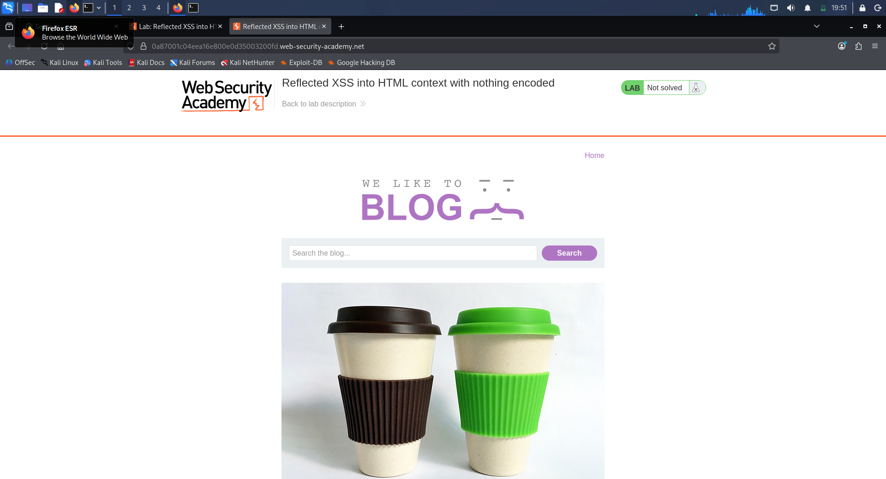
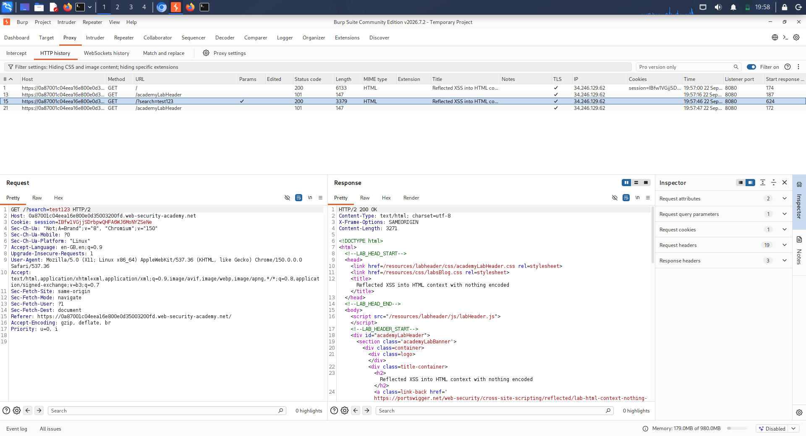
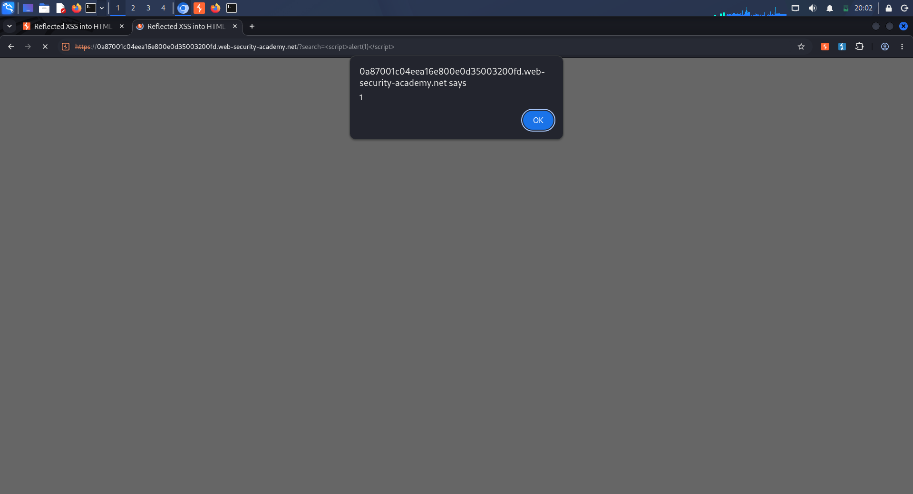
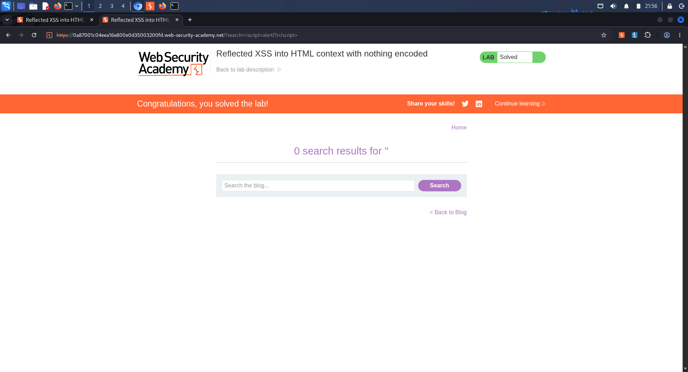

# Day 22 – PortSwigger XSS Lab Report

**Organization:** Trios Cyber  
**Assignment:** PortSwigger XSS Lab | Day 22  
**Lab:** Reflected XSS into HTML context with nothing encoded  
**Tool:** Burp Suite  
**Testing Environment:** PortSwigger Web Security Academy  
**Date:** 22 September 2026  
**Status:** Testing and documentation completed

---

## 1. Assignment Information

The Day 22 Trios Cyber assignment required completion of one beginner Cross-Site Scripting (XSS) lab using Burp Suite. The task focused on identifying the injection context and preserving evidence of successful JavaScript execution and final lab-status verification.

The selected PortSwigger Web Security Academy lab was:

**Reflected XSS into HTML context with nothing encoded**

---

## 2. Objective

The objectives of this exercise were to:

- Understand reflected Cross-Site Scripting.
- Capture a normal search request using Burp Suite.
- Identify where user-controlled input is reflected in the response.
- Determine the HTML injection context.
- Test a controlled XSS proof-of-concept payload.
- Verify JavaScript execution in the authorized training environment.
- Preserve screenshots and raw testing notes.
- Record the final PortSwigger Academy lab status accurately.

---

## 3. Scope

Testing was limited to the assigned PortSwigger Web Security Academy training laboratory.

No unauthorized systems, third-party applications, or external targets were tested.

---

## 4. Cross-Site Scripting Background

Cross-Site Scripting (XSS) is a web application vulnerability in which attacker-controlled input is interpreted as executable content by a victim's browser.

Reflected XSS occurs when user-controlled input supplied through an HTTP request is returned in the application's immediate response without appropriate output encoding or other protections.

The security impact depends on the application context and the privileges available to the affected user.

---

## 5. Tools and Environment

### Tool

**Burp Suite**

The following Burp Suite features were used:

- Proxy
- HTTP history
- Repeater
- Browser-based response verification

### Target

Authorized PortSwigger Web Security Academy training lab.

### Lab

**Reflected XSS into HTML context with nothing encoded**

---

## 6. Methodology

### 6.1 Open the Lab

The assigned PortSwigger Web Security Academy lab was opened using its unique authorized training-lab URL.

**Evidence:**  
`01-portswigger-xss-lab-open.png`

### 6.2 Perform a Normal Search

A harmless search value was submitted:

`test123`

The request was captured through Burp Suite HTTP history.

**Evidence:**  
`02-burp-normal-search-request.png`

### 6.3 Send the Request to Repeater

The captured search request was sent to Burp Repeater for controlled modification and response inspection.

### 6.4 Identify the Reflection Context

The server response reflected the supplied search value in the following HTML:

    <h1>0 search results for 'test123'</h1>

This established that the `search` parameter was reflected directly inside an HTML body context within an `<h1>` element.

### 6.5 Test the XSS Payload

The search value was replaced with the controlled proof-of-concept payload:

    

The modified request was sent through Burp Repeater.

### 6.6 Verify JavaScript Execution

The response was rendered through the Burp browser environment. The injected JavaScript executed and displayed an alert dialog containing the value `1`.

**Evidence:**  
`03-xss-alert-execution.png`

---

## 7. Injection Context Analysis

The tested input was reflected into the HTML response as:

    <h1>0 search results for '[USER INPUT]'</h1>

The important characteristics of this context were:

- The input was inside the HTML document body.
- The input was located inside an `<h1>` element.
- The supplied characters were not HTML-encoded.
- HTML markup supplied through the search parameter could therefore be interpreted by the browser.

The successful execution of the proof-of-concept payload demonstrated that the reflected input could introduce executable JavaScript in this authorized training environment.

---

## 8. Payload

The proof-of-concept payload used was:

    

This payload was used exclusively against the authorized PortSwigger Web Security Academy laboratory.

---

## 9. Observed HTTP Response

The modified response returned:

    HTTP/2 200 OK
    Content-Type: text/html; charset=utf-8

The relevant reflected content was:

    <h1>0 search results for ''</h1>

This demonstrated that the supplied payload was returned without HTML encoding.

The response initially displayed the Academy lab status as:

    LAB
    Not solved

The HTTP response and browser execution were therefore treated separately from the Academy completion indicator.

---

## 10. JavaScript Execution Evidence

The rendered response caused the supplied JavaScript to execute successfully.

The browser displayed the expected `alert(1)` dialog.

This provided direct evidence that the browser interpreted the reflected `<script>` element as executable JavaScript.

**Evidence:**  
`03-xss-alert-execution.png`

---

## 11. Security Impact

Reflected XSS can allow attacker-controlled JavaScript to execute in the security context of a vulnerable web application.

Depending on the application's functionality and security controls, potential consequences can include:

- Unauthorized actions performed through a victim's browser.
- Exposure of information available to the victim's session.
- Manipulation of page content.
- Phishing or deceptive interface injection.
- Abuse of application functionality available to the affected user.

The actual impact depends on application design, user privileges, browser protections, and other security controls.

---

## 12. Defensive Measures

Recommended defensive measures include:

### Context-Appropriate Output Encoding

User-controlled data should be encoded according to the context in which it is inserted, including HTML, attribute, JavaScript, CSS, and URL contexts.

### Safe Templating

Applications should use templating systems and frameworks that provide automatic contextual escaping where appropriate.

### Input Validation

Applications should validate user input according to expected formats and business requirements. Validation should not be treated as a replacement for output encoding.

### Content Security Policy

A properly configured Content Security Policy can provide an additional layer of defense against certain XSS exploitation scenarios.

### Secure Development Practices

Developers should avoid directly inserting untrusted input into HTML and should review all locations where user-controlled data reaches browser-interpreted contexts.

---

## 13. Ethical and Legal Scope

All testing documented in this report was performed against the authorized PortSwigger Web Security Academy training environment.

The techniques and payload were not used against unauthorized systems.

The exercise was conducted for cybersecurity education and internship training.

---

## 14. Evidence Summary

The following evidence was collected:

| Evidence | Description |
|---|---|
| `01-portswigger-xss-lab-open.png` | PortSwigger XSS lab opened |
| `02-burp-normal-search-request.png` | Normal search request captured in Burp |
| `03-xss-alert-execution.png` | Successful JavaScript alert execution |
| `04-portswigger-xss-lab-solved.png` | Final Academy lab-status evidence |

### Evidence Screenshots

#### Evidence 1 — PortSwigger XSS Lab

#### Evidence 2 — Normal Search Request in Burp Suite

#### Evidence 3 — JavaScript Alert Execution

#### Evidence 4 — Final Academy Lab Status

Raw testing notes:

`logs/xss-reflected-input.txt`

---

## 15. Lab Completion Status

The technical XSS proof of concept executed successfully in the authorized training environment.

The final Academy status must be interpreted from the captured final screenshot. During testing, the Academy interface was observed displaying **Not solved** despite successful JavaScript execution.

Therefore, this report does **not** claim successful Academy completion unless the final evidence screenshot visibly confirms the lab as solved.

**Academy Completion:** Not confirmed as solved during final verification.

---

## 16. Key Security Concepts Learned

This exercise demonstrated:

- Reflected XSS.
- HTML injection context identification.
- User-controlled input reflection.
- Burp Suite HTTP history.
- Burp Repeater.
- Browser-based XSS verification.
- Importance of context-aware output encoding.
- Separation of technical vulnerability verification from platform completion status.

---

## 17. Conclusion

The Day 22 exercise successfully demonstrated a reflected Cross-Site Scripting condition in the authorized PortSwigger Web Security Academy environment.

The `search` parameter was reflected directly inside an HTML `<h1>` element without appropriate HTML encoding. The controlled proof-of-concept payload executed JavaScript in the browser and produced the expected alert.

The testing evidence, screenshots, and raw notes were preserved for internship documentation.

The PortSwigger Academy completion status is recorded separately and conservatively based on the observed final verification state.

---

## 18. Supporting Files

### Screenshots

- `screenshots/01-portswigger-xss-lab-open.png`
- `screenshots/02-burp-normal-search-request.png`
- `screenshots/03-xss-alert-execution.png`
- `screenshots/04-portswigger-xss-lab-solved.png`

### Raw Evidence

- `logs/xss-reflected-input.txt`

### Documentation

- `README.md`
- `DAY-22-REPORT.md`
- `DAY-22-REPORT.pdf`

---

## 19. Final Status

**Testing:** Completed

**XSS Proof of Concept:** Successfully executed

**Injection Context:** HTML body context inside `<h1>`

**Evidence Collection:** Completed

**Raw Evidence Log:** Completed

**Report:** Completed

**PDF:** Pending validation

**Academy Lab Completion:** Not confirmed as solved during final verification

**Testing Scope:** Authorized PortSwigger Web Security Academy training environment only
