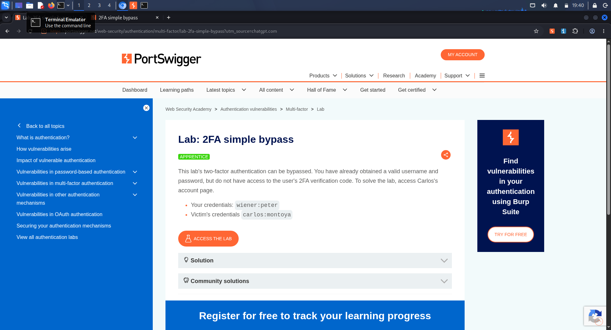
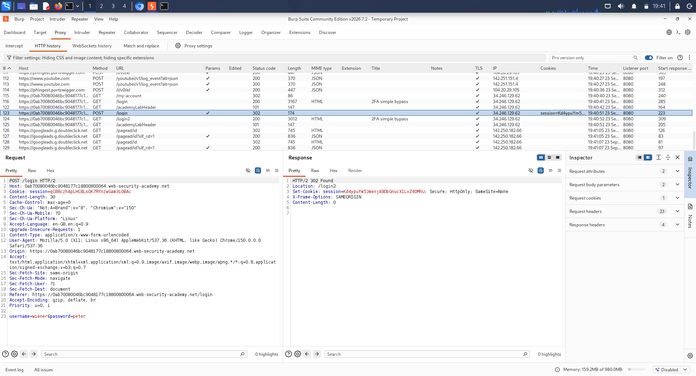
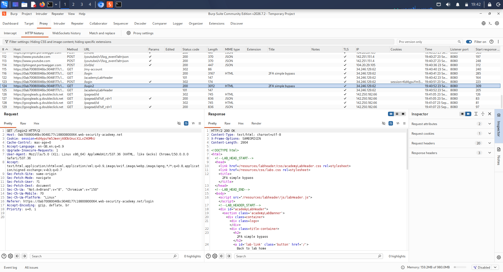
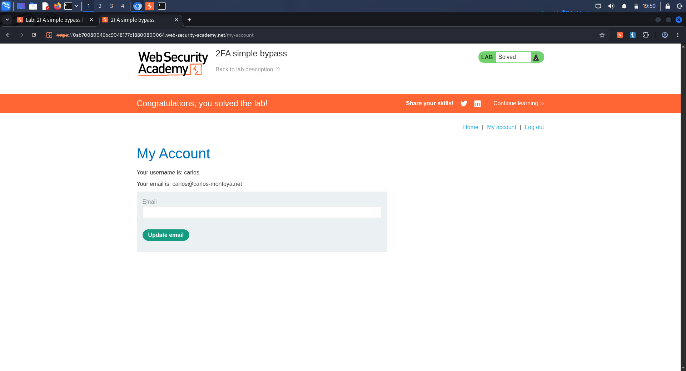

# Day 23 Report — PortSwigger Authentication Lab

## Trios Cyber Internship

**Assignment:** PortSwigger Authentication Lab  
**Lab:** 2FA simple bypass  
**Platform:** PortSwigger Web Security Academy  
**Tool:** Burp Suite  
**Environment:** Kali Linux  
**Status:** Completed  
**Result:** Lab Solved

---

## 1. Assignment Overview

The Day 23 assignment required completing a beginner-level authentication security lab and documenting relevant login and session requests using Burp Suite.

The selected PortSwigger Web Security Academy lab was **2FA simple bypass**, an intentionally vulnerable authentication training environment designed to demonstrate improper enforcement of multi-factor authentication.

---

## 2. Objective

The objectives of this exercise were:

1. Understand the normal username/password authentication flow.
2. Observe the transition to the two-factor authentication stage.
3. Capture relevant authentication requests using Burp Suite.
4. Test whether access to the protected account page required completion of the second authentication factor.
5. Document the observed authentication weakness and its security implications.

---

## 3. Lab Environment

| Item | Details |
|---|---|
| Operating System | Kali Linux |
| Web Security Tool | Burp Suite |
| Browser | Burp Suite built-in browser |
| Training Platform | PortSwigger Web Security Academy |
| Lab | 2FA simple bypass |
| Authentication Category | Multi-Factor Authentication |
| Target | Authorized PortSwigger training lab |

All testing was conducted exclusively against the intentionally vulnerable PortSwigger Web Security Academy environment.

---

## 4. Lab Description

The lab demonstrates a weakness in the enforcement of a two-factor authentication process.

The application first accepts valid username/password credentials and then redirects the user to a second-factor verification page.

The security test was to determine whether the authenticated session could access the account page directly without completing the required 2FA step.

---

## 5. Authentication Flow Analysis

The normal authentication flow observed through Burp Suite was:

    POST /login
          |
          v
    302 Found
          |
          v
    GET /login2
          |
          v
    4-digit 2FA code requested

The initial login request used the lab-provided Wiener credentials:

    username=wiener&password=peter

The server responded with a redirect to:

    /login2

The /login2 page displayed a form requesting a 4-digit security code.

This established that the application expected a second authentication factor after the initial username/password authentication.

---

## 6. Burp Suite Request Evidence

### 6.1 Initial Login Request

The initial authentication request was captured in Burp Suite HTTP history:

    POST /login HTTP/2
    Host: <authorized PortSwigger lab host>

    username=wiener&password=peter

The server returned:

    HTTP/2 302 Found
    Location: /login2

This demonstrated the transition from primary authentication to the second-factor stage.

### 6.2 Two-Factor Authentication Stage

The following request was observed:

    GET /login2 HTTP/2
    Host: <authorized PortSwigger lab host>

The response displayed a 4-digit MFA code input using the mfa-code parameter.

This confirmed that the application had moved the user into the 2FA stage.

---

## 7. Carlos Account Authentication

The lab supplied a separate training account for the victim user:

    Username: carlos
    Password: montoya

After authenticating with these credentials, the application again presented the /login2 2FA verification page.

At this point, the second authentication factor had not been completed.

No attempt was made to obtain, guess, or bypass the security code itself.

---

## 8. Direct Account-Page Access Test

The key security test was performed by requesting the account page directly without submitting a 2FA code:

    GET /my-account

Instead of requiring completion of the /login2 stage, the application allowed access to the authenticated account page.

The PortSwigger Web Security Academy subsequently displayed the lab as Solved.

This confirmed that the second authentication factor was not being adequately enforced before access to the protected account resource.

---

## 9. Vulnerability Analysis

The observed behavior represents a **2FA bypass caused by insufficient server-side enforcement of the second authentication factor**.

The application correctly displayed a 2FA step during the normal login flow, but access control for the protected account page did not sufficiently verify that the second authentication factor had been completed.

In practical terms, successful completion of the first authentication step was sufficient to reach a protected resource that should have required completion of the second factor.

---

## 10. Security Impact

If a similar weakness existed in a real-world application, an attacker who obtained valid primary authentication credentials could potentially access resources intended to be protected by multi-factor authentication.

This could reduce the security benefit provided by 2FA and potentially expose authenticated account functionality.

The actual impact in a production application would depend on the resources protected by the affected authentication mechanism.

---

## 11. Recommended Mitigation

Applications implementing multi-factor authentication should enforce the second authentication factor on the server side before granting access to protected resources.

Recommended controls include:

- Maintain a server-side authentication state indicating whether MFA has been successfully completed.
- Require the MFA-completed state before serving protected account pages.
- Do not rely solely on client-side redirects or the visible /login2 page.
- Validate authorization requirements on every protected endpoint.
- Invalidate or restrict partially authenticated sessions appropriately.
- Test direct access to protected endpoints during authentication security assessments.

---

## 12. Evidence Collected

| Evidence | Purpose |
|---|---|
| 01-authentication-lab-open.png | Documents the selected authentication lab |
| 02-login-request-burp.png | Shows the primary login request in Burp |
| 03-login2-mfa-stage.png | Shows the 2FA verification stage |
| 04-authentication-bypass.png | Shows successful direct account access and solved lab |

Raw request-flow documentation was preserved in:

    logs/authentication-session-flow.txt

---

## 13. Evidence Screenshots

### 13.1 Authentication Lab

### 13.2 Login Request in Burp Suite

### 13.3 Two-Factor Authentication Stage

### 13.4 Successful Authentication Bypass

---

## 14. Key Learning Outcomes

This exercise demonstrated:

1. How username/password authentication can transition into an MFA stage.
2. How Burp Suite HTTP history can be used to inspect authentication requests.
3. The difference between displaying an MFA challenge and actually enforcing MFA.
4. Why protected endpoints must independently validate authentication state.
5. How direct endpoint testing can reveal authentication enforcement weaknesses.
6. The importance of documenting both normal authentication behavior and security-test results.

---

## 15. Conclusion

The PortSwigger **2FA simple bypass** lab was successfully completed using Burp Suite.

The assessment identified that the application allowed direct access to the protected account page without completing the required 2FA step. The PortSwigger Academy confirmed the result by marking the lab as Solved.

The exercise provided practical experience in analyzing authentication flows, inspecting HTTP requests, and identifying weaknesses in server-side multi-factor authentication enforcement.

---

## 16. Scope and Authorization

All testing described in this report was performed exclusively against the intentionally vulnerable PortSwigger Web Security Academy training environment.

No unauthorized systems, services, or real-world accounts were targeted.
