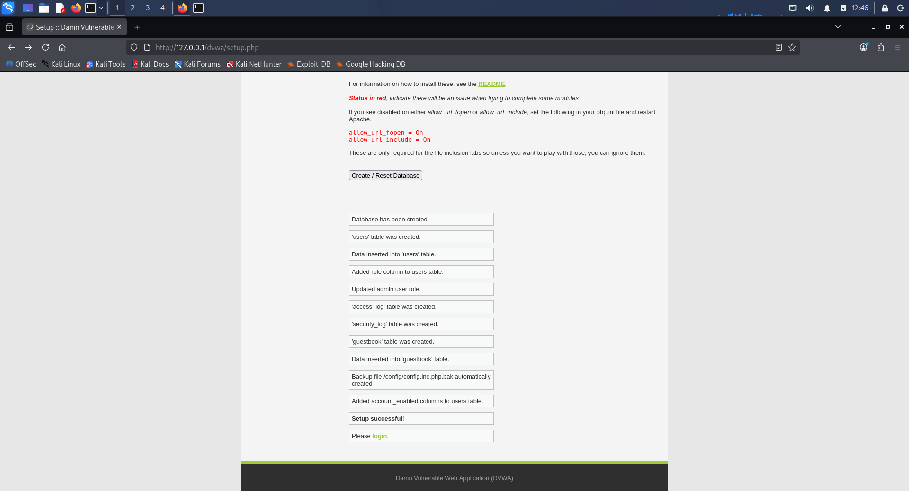
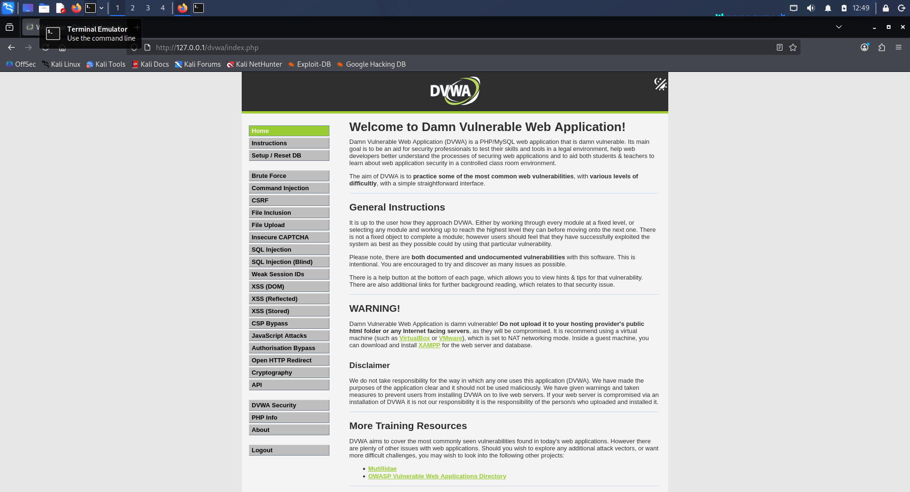
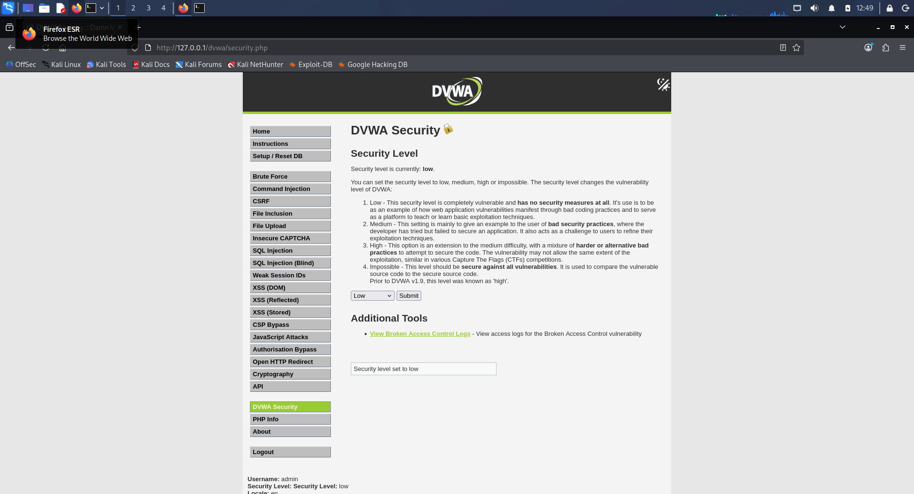
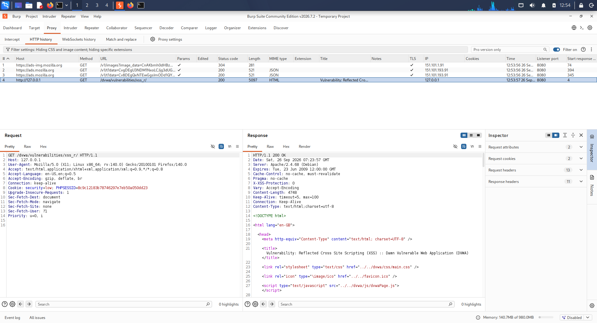
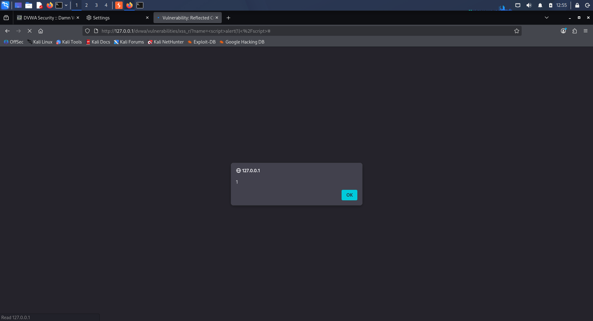

# Trios Cyber Internship — Day 26 Report

## WebGoat or DVWA Practice

**Internship:** Trios Cyber Internship  
**Day:** 26  
**Lab:** Damn Vulnerable Web Application (DVWA)  
**Exercise:** Reflected Cross-Site Scripting (XSS)  
**Environment:** Kali Linux, Apache, MariaDB, PHP, Firefox, Burp Suite  
**Target:** Local DVWA instance (`127.0.0.1`)  
**Security Level:** Low  
**Status:** Completed

## 1. Objective

The objective of Day 26 was to select a beginner-level WebGoat or DVWA lesson and complete the exercise by identifying the endpoint, performing the required testing steps, and documenting a clear success indicator. DVWA was selected as the intentionally vulnerable local training application, and the Reflected Cross-Site Scripting (XSS) lesson was completed using Firefox and Burp Suite.

## 2. Lab Environment

The exercise was performed against a locally hosted DVWA installation using Kali Linux, Apache HTTP Server, MariaDB, PHP, Firefox, and Burp Suite. The target was the local address 127.0.0.1 and DVWA Security was configured to Low. All testing was restricted to the intentionally vulnerable local DVWA environment.

## 3. DVWA Setup

The DVWA environment was prepared locally by starting Apache and MariaDB, installing the required PHP extensions, cloning the DVWA application, deploying it under /var/www/html/dvwa, creating the dvwa database, creating the dedicated dvwa database account, configuring the DVWA database connection, using the DVWA setup page to create/reset the application database, and logging into the local DVWA application. Evidence of successful database creation is stored in 01-dvwa-database-created.png.

## 4. DVWA Security Configuration

The DVWA security level was configured to Low for the beginner vulnerability exercise. This configuration allows the intentionally vulnerable training application to demonstrate the behavior of the selected lesson. Evidence of the security configuration is stored in 03-dvwa-security-low.png.

## 5. Reflected XSS Exercise

The selected lesson was Reflected Cross-Site Scripting (XSS). The relevant endpoint was http://127.0.0.1/dvwa/vulnerabilities/xss_r/. Firefox was configured to use Burp Suite through 127.0.0.1:8080, and the HTTP request generated by the DVWA XSS page was intercepted and inspected in Burp Suite. The captured request demonstrated the target endpoint and the user-controlled name parameter. Evidence of the intercepted request is stored in 04-dvwa-xss-request.png.

## 6. Controlled XSS Test

A controlled test payload, , was submitted through the vulnerable name parameter. The payload was used only against the local DVWA training application. Because the application was configured at the Low security level, the input was reflected without effective sanitization.

## 7. Success Indicator

The test resulted in a JavaScript alert displaying 1. The visible browser alert served as the success indicator that the supplied script had been interpreted by the application. Evidence of the successful test is stored in 05-dvwa-xss-success.png.

## 8. Evidence Summary

The Day 26 evidence consists of 01-dvwa-database-created.png for DVWA database creation, 02-dvwa-local-page.png for the local DVWA application page, 03-dvwa-security-low.png for the Low security configuration, 04-dvwa-xss-request.png for the Reflected XSS request captured in Burp Suite, and 05-dvwa-xss-success.png for the successful JavaScript alert.

## 9. Result

The Reflected XSS lesson was successfully completed against the local DVWA environment. The exercise demonstrated the practical workflow of identifying a vulnerable endpoint, intercepting and inspecting an HTTP request, testing controlled user input, observing reflected script execution, and verifying the result through a visible success indicator.

## 10. Security Learning

This exercise provided practical experience with identifying vulnerable web application endpoints, understanding HTTP parameters, using Burp Suite to intercept and inspect web requests, understanding reflected input behavior, demonstrating the impact of insufficient input handling, and recognizing how client-side script execution can occur when untrusted input is reflected without appropriate output encoding. In production applications, user-controlled data should be properly validated and contextually output-encoded to reduce the risk of XSS.

## 11. Safety and Authorization

All testing was performed against the locally hosted DVWA application at 127.0.0.1. DVWA is intentionally designed as a vulnerable training application, and no external systems or unauthorized targets were tested.

## 12. Evidence Screenshots

### Screenshot 1 — DVWA Database Created

### Screenshot 2 — DVWA Local Page

### Screenshot 3 — DVWA Security Low

### Screenshot 4 — Reflected XSS Request in Burp Suite

### Screenshot 5 — Reflected XSS Success Indicator

## 12. Conclusion

Day 26 provided practical experience with a beginner web application vulnerability using DVWA and Burp Suite. The exercise covered endpoint identification, HTTP request inspection, controlled Reflected XSS testing, and verification through a visible success indicator. The required evidence and raw notes were preserved in the Day 26 project directory for internship submission and future reference.

**Day 26 Status: Completed**
