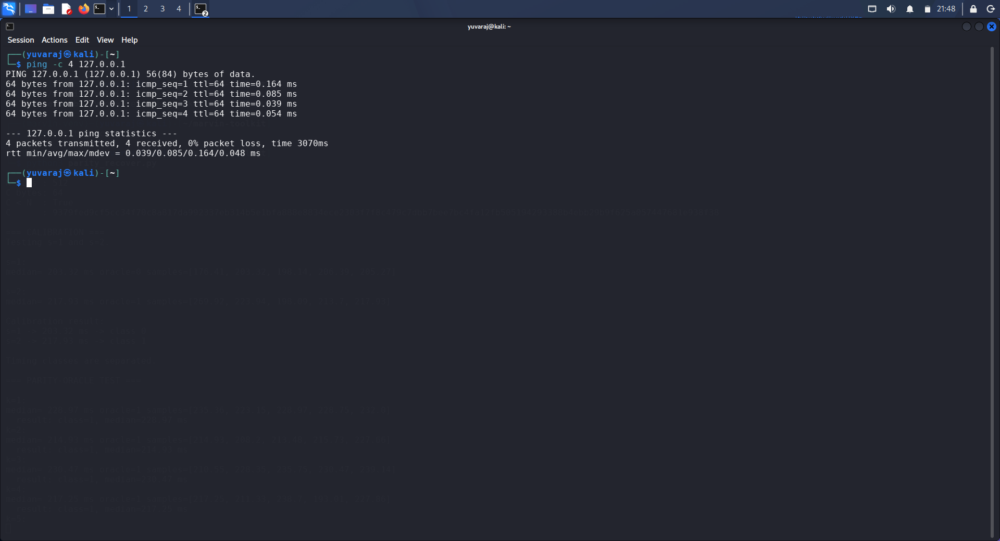
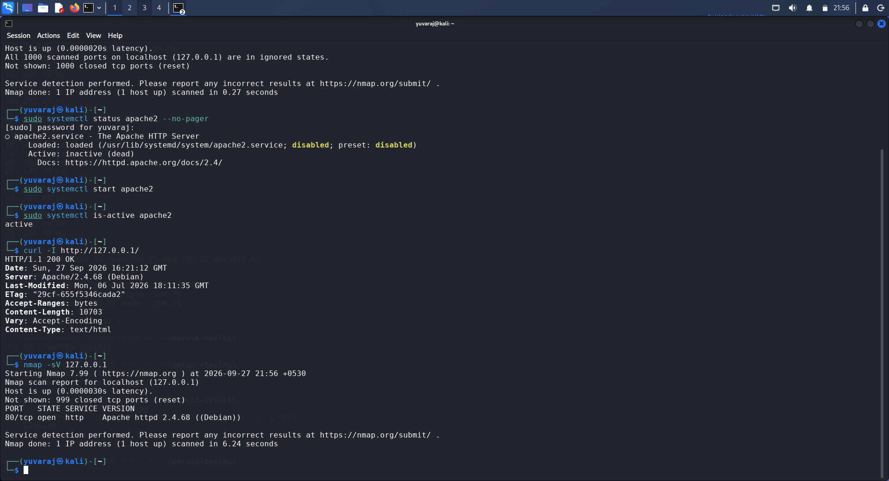
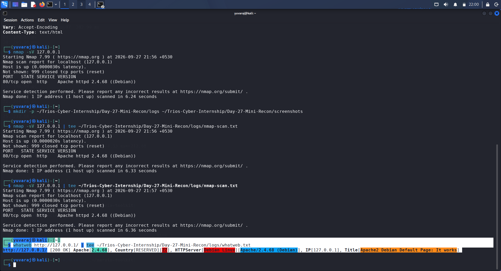
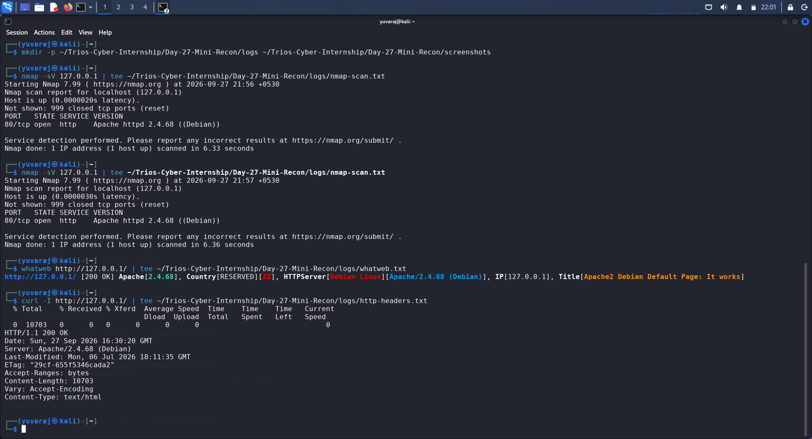
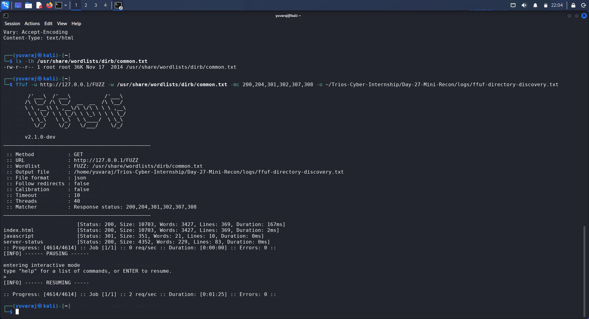

# Trios Cyber Internship — Day 27 Report

## Mini Recon Workflow

**Date:** 27 September 2026  
**Target:** `127.0.0.1`  
**Environment:** Kali Linux local lab  
**Status:** Completed

---

## 1. Objective

The objective of Day 27 was to perform a basic reconnaissance workflow against one authorized lab target. The workflow included connectivity verification, Nmap service enumeration, web technology and HTTP header review, and directory discovery using FFUF.

All reconnaissance activity was performed against the locally hosted target `127.0.0.1`.

---

## 2. Lab Environment

| Item | Details |
|---|---|
| Operating System | Kali Linux |
| Target | `127.0.0.1` |
| Web Server | Apache HTTP Server |
| Web Server Version | `2.4.68` |
| Platform | Debian Linux |
| Tools | Ping, Curl, Nmap, WhatWeb, FFUF |
| Authorization | Local controlled lab environment |

---

## 3. Connectivity Check

The target was first tested using ICMP:

```text
ping -c 4 127.0.0.1
cat > Day-27-Mini-Recon/DAY-27-REPORT.md <<'EOF'
# Trios Cyber Internship — Day 27 Report

## Mini Recon Workflow

**Date:** 27 September 2026  
**Target:** `127.0.0.1`  
**Environment:** Kali Linux local lab  
**Status:** Completed

---

## 1. Objective

The objective of Day 27 was to perform a basic reconnaissance workflow against one authorized lab target. The workflow included connectivity verification, Nmap service enumeration, web technology and HTTP header review, and directory discovery using FFUF. All reconnaissance activity was performed against the locally controlled target `127.0.0.1`.

---

## 2. Lab Environment

| Item | Details |
|---|---|
| Operating System | Kali Linux |
| Target | `127.0.0.1` |
| Web Server | Apache HTTP Server |
| Web Server Version | `2.4.68` |
| Platform | Debian Linux |
| Tools | Ping, Curl, Nmap, WhatWeb, FFUF |
| Authorization | Local controlled lab environment |

---

## 3. Connectivity Check

The target was tested using ICMP with `ping -c 4 127.0.0.1`.

The test produced 4 packets transmitted, 4 packets received, and 0% packet loss. The average round-trip time was 0.085 ms. The target was therefore reachable and suitable for further reconnaissance.

---

## 4. Nmap Service Enumeration

Nmap service-version detection was performed using `nmap -sV 127.0.0.1`.

The final scan identified the following service:

| Port | State | Service | Version |
|---|---|---|---|
| 80/tcp | Open | HTTP | Apache httpd 2.4.68 (Debian) |

Nmap reported the host as up and identified HTTP as the only open TCP service among the default 1,000 scanned ports. The remaining 999 scanned ports were closed.

During the assessment, an initial Nmap scan was performed while Apache was stopped and consequently showed no open ports. Apache was then started and verified as active before the final Nmap scan was repeated. This demonstrated the importance of validating service availability before interpreting enumeration results.

---

## 5. WhatWeb Technology Review

WhatWeb was used to fingerprint the HTTP service at `http://127.0.0.1/`.

The results identified an HTTP `200 OK` response, Apache version `2.4.68`, Debian Linux, the HTTP server identification `Apache/2.4.68 (Debian)`, the IP address `127.0.0.1`, and the page title `Apache2 Debian Default Page: It works`.

The root URL served the default Apache Debian page rather than an application-specific page.

---

## 6. HTTP Header Review

HTTP response headers were reviewed using `curl -I http://127.0.0.1/`.

The following headers were observed:

| Header | Value |
|---|---|
| Status | `200 OK` |
| Server | `Apache/2.4.68 (Debian)` |
| Last-Modified | `Mon, 06 Jul 2026 18:11:35 GMT` |
| ETag | `"29cf-655f5346cada2"` |
| Accept-Ranges | `bytes` |
| Content-Length | `10703` |
| Vary | `Accept-Encoding` |
| Content-Type | `text/html` |

The response confirmed that the web server was accessible and disclosed its Apache version and Debian platform through the `Server` header.

---

## 7. Directory Discovery with FFUF

FFUF was used for content discovery against `http://127.0.0.1/FUZZ` with the standard Kali DIRB common wordlist containing 4,614 entries.

The scan identified the following paths:

| Path | Status | Size | Observation |
|---|---:|---:|---|
| `/` | 200 | 10,703 B | Apache default page |
| `/index.html` | 200 | 10,703 B | Default index page |
| `/javascript` | 301 | 351 B | Redirect response |
| `/server-status` | 200 | 4,352 B | Apache status endpoint |

The `/server-status` endpoint was identified during content discovery and documented as a reconnaissance finding only. No further interaction or exploitation was performed.

The scan processed all 4,614 entries and reported 0 errors.

---

## 8. Consolidated Reconnaissance Summary

| Category | Finding |
|---|---|
| Target | `127.0.0.1` |
| Connectivity | Reachable, 0% packet loss |
| Open TCP port | `80/tcp` |
| Service | HTTP |
| Web server | Apache `2.4.68` |
| Platform | Debian Linux |
| HTTP status | `200 OK` |
| Root page | Apache Debian Default Page |
| Discovered content | `/index.html`, `/javascript`, `/server-status` |
| FFUF entries tested | 4,614 |
| FFUF errors | 0 |

The reconnaissance established that the local target exposes an Apache HTTP service on TCP port 80. Technology fingerprinting and HTTP header review confirmed the Apache/Debian environment. FFUF identified several accessible paths, including the Apache `server-status` endpoint.

---

## 9. Security Observations

The reconnaissance produced several useful observations. First, the HTTP service exposes the Apache version and operating-system platform through the `Server` header. Second, the default Apache page is accessible from the root path. Third, the `/server-status` endpoint is accessible and was discovered through content enumeration. Fourth, service enumeration results depend on the current state of the target service, as the initial scan showed no open ports because Apache was stopped. Finally, directory discovery can reveal additional web resources that are not immediately visible from the main page.

These observations are reconnaissance findings and do not by themselves establish a vulnerability.

---

## 10. Tools Used

**Nmap:** Used for service and version enumeration.

**WhatWeb:** Used for web technology fingerprinting.

**Curl:** Used for connectivity verification and HTTP header review.

**FFUF:** Used for directory and content discovery.

---

## 11. Evidence Files

Raw command outputs are stored in the `logs/` directory:

- `ffuf-directory-discovery.txt`
- `http-headers.txt`
- `nmap-scan.txt`
- `whatweb.txt`

---

## 12. Evidence Screenshots

### Screenshot 1 — Connectivity Check



### Screenshot 2 — Nmap Service Scan



### Screenshot 3 — WhatWeb Technology Review



### Screenshot 4 — HTTP Header Review



### Screenshot 5 — FFUF Directory Discovery



---

## 13. Safety and Authorization

All reconnaissance activity was performed exclusively against `127.0.0.1`, a locally controlled lab environment. No external systems or unauthorized targets were scanned. The `/server-status` finding was documented as part of reconnaissance and was not further exploited.

---

## 14. Conclusion

The Day 27 Mini Recon Workflow was completed successfully. The authorized local target was verified as reachable, its HTTP service was enumerated with Nmap, web technologies and response headers were reviewed using WhatWeb and Curl, and accessible web paths were identified using FFUF. The results, raw command logs, screenshots, and consolidated analysis are included as part of the Day 27 evidence package.
