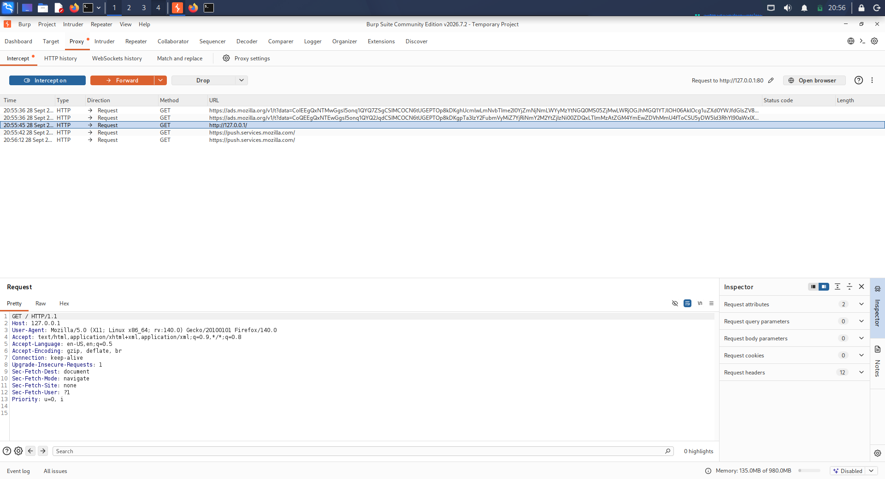
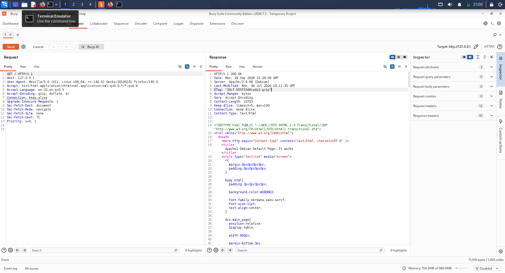
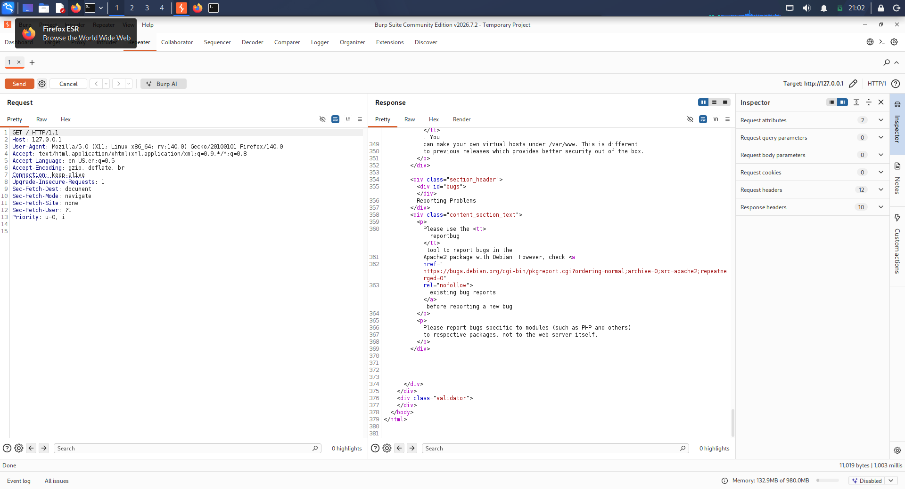
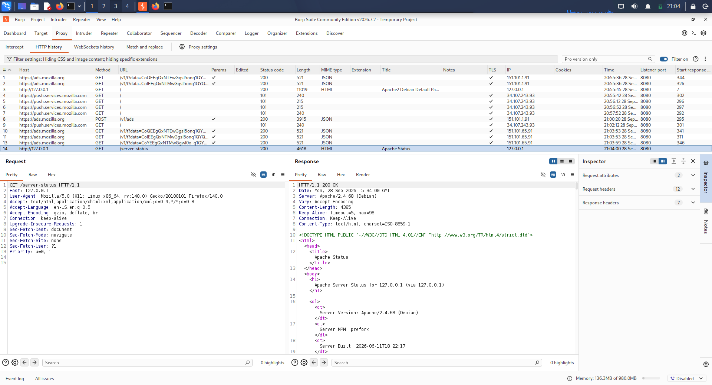

# Day 28 — Automated vs Manual Comparison

## 1. Overview

**Internship:** Trios Cyber  
**Task:** Automated vs Manual Comparison  
**Target:** `http://127.0.0.1/`  
**Environment:** Authorized local lab  
**Automated Tool:** Nikto 2.6.0  
**Manual Validation Tool:** Burp Suite  
**Status:** Completed

## 2. Objective

The objective of this task was to compare automated web security scanning with manual verification. The workflow consisted of running an approved automated Nikto scan against the authorized local lab target, reviewing the automated findings, selecting at least three findings for manual inspection, using Burp Suite to manually verify each selected observation, classifying each finding based on the available evidence, and preserving raw logs and screenshots as supporting evidence.

## 3. Scope and Authorization

Testing was restricted to the authorized local lab target:

`http://127.0.0.1/`

No external systems or unauthorized hosts were tested.

## 4. Automated Scan

Nikto 2.6.0 was used to perform the automated assessment against the local Apache web server. The scan identified several observations, including potential ETag/inode information disclosure, missing security headers, an accessible `/server-status` endpoint, and allowed HTTP methods. The raw scanner output is preserved in `logs/nikto-scan.txt`. The Nikto scan was interrupted after the relevant findings had been collected; therefore, this report does not claim that the scanner completed every available test.

## 5. Manual Verification

### Finding 1 — ETag / Inode Information Disclosure

**Automated observation:** Nikto reported that the ETag response may expose inode-related information.

**Manual verification:** The HTTP response was inspected in Burp Suite and an ETag header was observed.

**Classification:** Confirmed

**Assessment:** The automated observation was manually reproduced. The presence of an ETag alone does not establish practical exploitability; it is documented as an information-disclosure observation requiring contextual assessment.

**Evidence:** `screenshots/02-burp-etag-response.png`

### Finding 2 — Missing Security Headers

**Automated observation:** Nikto reported missing `Strict-Transport-Security`, `Referrer-Policy`, `X-Content-Type-Options`, `Content-Security-Policy`, and `Permissions-Policy` headers.

**Manual verification:** The HTTP response headers were inspected in Burp Suite and the reported security headers were absent from the captured response.

**Classification:** Confirmed

**Assessment:** The automated observation was manually reproduced as a security-header configuration issue. The finding documents the absence of defensive headers and does not by itself demonstrate an exploitable vulnerability.

**Evidence:** `screenshots/03-burp-security-headers.png`

### Finding 3 — Apache Server Status Exposed

**Automated observation:** Nikto identified `/server-status` as an accessible Apache status endpoint.

**Manual verification:** A `GET /server-status` request successfully returned the Apache Server Status page. The response exposed operational information including Apache server version, server uptime, request statistics, worker/process information, client address, and active request information.

**Classification:** Confirmed

**Assessment:** The automated observation was manually reproduced. The endpoint exposes operational information that can provide additional server and request-context details.

**Evidence:** `screenshots/04-burp-server-status.png`

## 6. Automated vs Manual Comparison

| # | Automated Finding | Manual Verification | Classification |
|---|---|---|---|
| 1 | ETag/inode information disclosure | ETag observed in Burp response | Confirmed |
| 2 | Missing security headers | Reported headers absent from Burp response | Confirmed |
| 3 | `/server-status` exposed | Apache Server Status page accessible | Confirmed |

The three selected automated observations were reproduced manually in Burp Suite.

## 7. Evidence

### Automated Evidence

`logs/nikto-scan.txt`

### Manual Evidence

#### Burp Suite — Intercepted Request

#### Burp Suite — ETag Response

#### Burp Suite — Security Headers

#### Burp Suite — Apache Server Status

### Manual Verification Notes

`logs/manual-verification.txt`

## 8. Key Learning Outcomes

This exercise demonstrated the difference between automated scanning and manual validation. Automated scanners efficiently identify potential security issues, but scanner output should not automatically be treated as a confirmed vulnerability. Manual inspection provides additional context for determining whether an automated observation is reproducible. Burp Suite can be used to inspect HTTP requests and responses in detail. Findings should be classified based on observed evidence, while raw logs and screenshots provide traceable evidence for security assessment reporting.

## 9. Conclusion

The Day 28 Automated vs Manual Comparison exercise was completed against the authorized local lab target. Nikto was used for automated discovery and Burp Suite was used for manual verification. Three automated observations were selected and manually inspected, and all three were confirmed in the tested lab configuration. The raw scanner output, manual verification notes, screenshots, and this report are preserved in the Day 28 project directory for reproducibility and review.

**Status: Completed**
