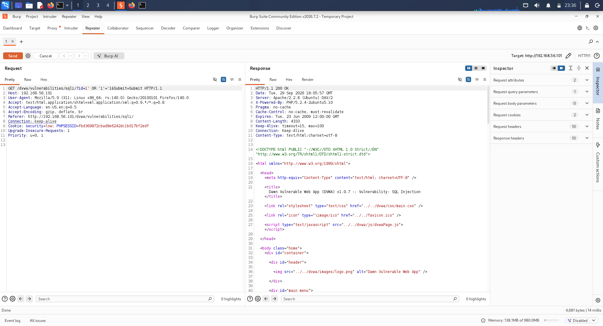
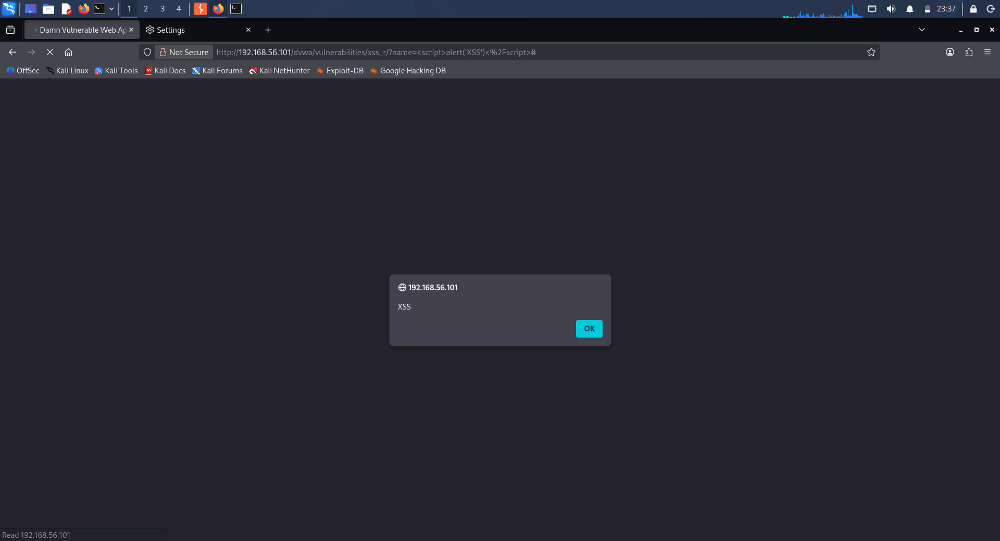

# Final Practical VAPT Report — Day 30

## Trios Cyber Internship

**Assessment Type:** Web Application Vulnerability Assessment  
**Application:** DVWA  
**Environment:** Authorized Local Laboratory  
**Assessment Basis:** Day 29 Mini Web VAPT Assessment

---

## 1. Executive Summary

A scoped vulnerability assessment was conducted against an intentionally vulnerable web application in an authorized laboratory environment.

The assessment covered reconnaissance, service enumeration, HTTP inspection, endpoint discovery, automated vulnerability scanning, manual security testing, evidence collection, risk analysis, and remediation planning.

Two manual security findings were documented during the Day 29 assessment:

- **VAPT-01 — SQL Injection**
- **VAPT-02 — Reflected Cross-Site Scripting (XSS)**

The Day 29 documentation identifies these findings and their associated evidence screenshots. Detailed endpoint, parameter, payload, observed response, and final severity information was not recorded in the supplied Day 29 report and is therefore not invented in this report.

---

## 2. Assessment Objective

The objectives of the assessment were to:

- Identify exposed web services
- Discover application endpoints
- Perform basic vulnerability scanning
- Conduct manual security testing
- Document security findings and evidence
- Assess potential security impact
- Provide practical remediation recommendations

---

## 3. Scope

| Item | Details |
|---|---|
| Target IP | Not documented in Day 29 report |
| Target URL | Not documented in Day 29 report |
| Application | DVWA |
| Environment | Authorized local laboratory |
| Assessment Type | Scoped Web VAPT |

The assessment was limited to the authorized laboratory environment.

---

## 4. Methodology

The following methodology was documented during the Day 29 assessment:

1. Reconnaissance
2. Nmap service enumeration
3. Burp Suite HTTP inspection
4. FFUF endpoint discovery
5. Nikto/Nuclei vulnerability scanning
6. Manual vulnerability testing
7. Evidence collection
8. Risk analysis
9. Remediation planning

---

## 5. Tools Used

| Tool | Purpose |
|---|---|
| Nmap | Service and port enumeration |
| Burp Suite | HTTP request/response inspection |
| FFUF | Web endpoint discovery |
| Nikto | Web server vulnerability scanning |
| Nuclei | Template-based vulnerability scanning |
| cURL | HTTP request testing and verification |

---

## 6. Reconnaissance and Enumeration

The Day 29 assessment included reconnaissance and service enumeration to identify the target's exposed web services and supporting information.

Nmap was used to identify relevant network services.

The detailed Nmap output and final target IP were not included in the supplied Day 29 report.

---

## 7. Endpoint Discovery

FFUF and manual browsing were used to identify application endpoints.

The Day 29 methodology specifically included endpoint discovery and identified this activity as part of the assessment workflow.

The supplied Day 29 report does not contain the complete endpoint-discovery output.

---

## 8. Automated Security Testing

Automated testing included:

- Nmap
- Nikto
- Nuclei

The Day 29 report states that these tools were used or planned as part of the assessment methodology, but it does not provide the detailed automated scan results.

No additional automated findings are therefore asserted in this final report.

---

# 9. Manual Security Findings

## VAPT-01 — SQL Injection

### Finding

SQL Injection was identified as a manual security finding during the Day 29 assessment.

### Severity

**Not documented in the Day 29 source report.**

The original Day 29 findings table marked the severity as `TBD`.

### Endpoint

Not documented.

### Parameter

Not documented.

### Test Input

Not documented.

### Observed Behavior

The Day 29 report identifies SQL Injection as a manual finding but does not document the exact input, application response, or database behavior observed during testing.

### Evidence

`06-manual-test-01.png`

### Potential Impact

SQL Injection can occur when untrusted input is incorporated into database queries without adequate protection.

Potential consequences can include unauthorized database access, manipulation of application data, or disclosure of information. The exact impact demonstrated during this assessment cannot be determined from the supplied Day 29 documentation.

### Remediation

Recommended controls include:

- Use parameterized queries or prepared statements.
- Avoid constructing SQL queries through direct concatenation of user-controlled input.
- Apply appropriate server-side input validation.
- Use database accounts with the minimum privileges required by the application.
- Review database-access code for other injection-prone parameters.

---

## VAPT-02 — Reflected Cross-Site Scripting (XSS)

### Finding

Reflected Cross-Site Scripting (XSS) was identified as a manual security finding during the Day 29 assessment.

### Severity

**Not documented in the Day 29 source report.**

The original Day 29 findings table marked the severity as `TBD`.

### Endpoint

Not documented.

### Parameter

Not documented.

### Test Payload

Not documented.

### Observed Behavior

The Day 29 report identifies Reflected XSS as a manual finding but does not document the exact payload or application response.

### Evidence

`07-manual-test-02.png`

### Potential Impact

Reflected XSS can occur when user-controlled input is returned in an HTTP response without appropriate output encoding.

Depending on the affected application context, successful exploitation may allow attacker-controlled script content to execute in a victim's browser.

The exact impact demonstrated during this assessment cannot be determined from the supplied Day 29 documentation.

### Remediation

Recommended controls include:

- Apply context-appropriate output encoding.
- Validate untrusted input where appropriate.
- Avoid inserting untrusted data directly into executable browser contexts.
- Implement a suitable Content Security Policy as an additional defense.
- Review other parameters for similar reflection behavior.

---

## 10. Findings Summary

| ID | Finding | Severity | Evidence | Status |
|---|---|---|---|---|
| VAPT-01 | SQL Injection | TBD / Not documented | `06-manual-test-01.png` | Documented |
| VAPT-02 | Reflected XSS | TBD / Not documented | `07-manual-test-02.png` | Documented |

**Severity note:** The Day 29 source report explicitly left both severity values as `TBD`. No unsupported severity rating has been assigned in this consolidated report.

---

## 11. Remediation Summary

| Finding | Primary Remediation |
|---|---|
| SQL Injection | Use prepared statements/parameterized queries, validate input, avoid SQL string concatenation, and enforce least-privilege database access. |
| Reflected XSS | Apply context-aware output encoding, validate input where appropriate, and use Content Security Policy as an additional security layer. |

---

## 12. Evidence Register

The Day 29 report references the following manual-testing evidence:

| Evidence | Associated Finding |
|---|---|
| `06-manual-test-01.png` | VAPT-01 — SQL Injection |
| `07-manual-test-02.png` | VAPT-02 — Reflected XSS |

The screenshots are referenced as evidence from the Day 29 assessment but are not embedded in this Day 30 report.

---

## 13. Limitations

This final practical report was consolidated from the supplied Day 29 assessment documentation.

The following information was not documented in the supplied source:

- Target IP
- Target URL
- Specific vulnerable endpoints
- Parameters tested
- SQL Injection test input
- XSS test payload
- Detailed observed application behavior
- Final severity ratings
- Detailed Nmap results
- Detailed Nikto results
- Detailed Nuclei results
- Complete FFUF endpoint-discovery results

These limitations are explicitly recorded to avoid introducing unsupported technical claims into the final assessment report.

---

## 14. Conclusion

The Day 29 assessment demonstrated a structured web application VAPT methodology against DVWA in an authorized local laboratory environment.

The documented workflow included reconnaissance, service enumeration, HTTP inspection, endpoint discovery, automated scanning, manual vulnerability testing, evidence collection, risk analysis, and remediation planning.

Two manual findings were documented:

1. **SQL Injection**
2. **Reflected Cross-Site Scripting (XSS)**

The corresponding evidence files were recorded in the Day 29 report.

This Day 30 report consolidates the documented assessment results into a concise professional VAPT report while preserving the limitations of the original source documentation.

**Assessment Documentation Status: Final Consolidated Report**
